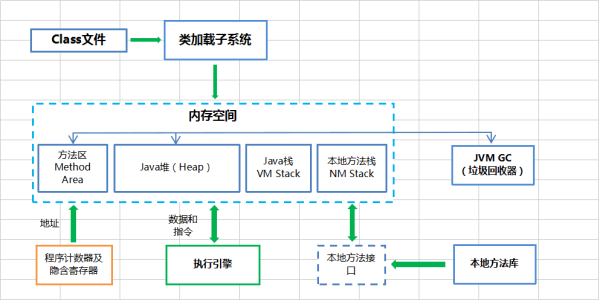

javap math.class >math.txt
反汇编

https://www.bilibili.com/video/av45497157?from=search&seid=10098719170838094425

JVM

https://zhuanlan.zhihu.com/p/25713880

# JVM原理最全、清晰、通俗讲解，五天40小时吐血整理

https://blog.csdn.net/csdnliuxin123524/article/details/81303711

https://blog.csdn.net/witsmakemen/article/details/28600127

# 反射调用

# [java深浅克隆https://www.cnblogs.com/wuyudong/p/4399180.html](https://www.cnblogs.com/wuyudong/p/4399180.html)

https://www.zhihu.com/question/23031215

浅克隆不会克隆原对象中的引用类型，仅仅拷贝了引用类型的指向。深克隆则拷贝了所有。也就是说深克隆能够做到原对象和新对象之间完全没有影响。
https://blog.csdn.net/jeffleo/article/details/76737560
而深克隆的实现就是在引用类型所在的类实现*Cloneable*接口，并使用*public*访问修饰符重写*clone*方法。

## 总结：

1.浅克隆：只复制基本类型的数据，引用类型的数据只复制了引用的地址，引用的对象并没有复制，在新的对象中修改引用类型的数据会影响原对象中的引用。  
2.深克隆：是在引用类型的类中也实现了clone，是clone的嵌套，复制后的对象与原对象之间完全不会影响。  
3.使用序列化也能完成深复制的功能：对象序列化后写入流中，此时也就不存在引用什么的概念了，再从流中读取，生成新的对象，新对象和原对象之间也是完全互不影响的。  
4.使用clone实现的深克隆其实是浅克隆中嵌套了浅克隆，与toString方法类似

