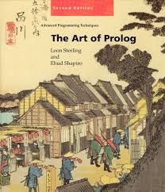

https://blog.csdn.net/ria4com/article/details/37785425

https://blog.csdn.net/u012143360/article/details/50530332


csdn教程1-16https://blog.csdn.net/mwsong/article/details/1765871


# 书
国外有用教程：www.pathwayslms.com/swipltuts/
https://mitpress.ublish.com/book/art-prolog


the art of prolog

Clocksin的Programming in Prolog

lpn.swi-prolog.org/lpnpage.php?pageid=online  在线书本真的有用呀

《Prolog programming for AI》[4th edition]注意： 以上这几本书都有较多篇幅讲 logic-based inductive learning，这是 Prolog 的最高级境界，也叫 inductive logic programming (ILP)。 还有很值得一提的，是一本 1973 年的书《Symbolic Logic and Mechanical Theorem Proving》作者是台湾籍的 computer scientists Chang Chin-Liang 和 Richard Lee Chia-Tung :

作者：甄景贤
链接：https://www.zhihu.com/question/61530585/answer/188667818
来源：知乎
著作权归作者所有。商业转载请联系作者获得授权，非商业转载请注明出处。
这本书写得很浅，是我当年学 AI logic （例如 resolution 理论）的入门书。 最近的新方向是 relational logic learning，Bayesian logic networks 那些。  但即使这些「新」东西也可能会受到 deep learning 的革命性的影响。 如果你现在还想用 SWI-prolog 做某些应用的项目，似乎很过时了

作者：甄景贤
链接：https://www.zhihu.com/question/61530585/answer/188667818
来源：知乎
著作权归作者所有。商业转载请联系作者获得授权，非商业转载请注明出处。


声https://blog.csdn.net/houmou/article/details/41845595明式编程语言
www.cnblogs.com/magialmoon/p/3330711.html


穷举不是好办法，指数增长不算好算法
https://www.zhihu.com/question/31895071
另外， 
@鹏飞
 的答案有个显然的错误 ——利用 pattern matching and rewriting rules 是一种颇为常见的实现Turing-complete计算的方法 —— 而且并非“穷举”，而是 pattern matching。除了Prolog，另一个很典型的语言是 Mathematica Core 语言。我2015年在Palo Alto弄一个叫Scaled Inference的创业公司。我当时是这个公司的 Research Head。我们的工作是用 Mathematica core language 来编程做各种算法实验，选择好的算法，请 engineering team 用 Go 语言写 production code。我们的一个 50 行的 Mathematica 程序，用 Go 语言写出来要 1500 行。虽然 Scaled Inference 没有做大，但是它因为有“利用独到的技术快速迭代技术”的能力，所以估值并不低。在硅谷，这样的公司有很多，并不需要像今日头条这样暴涨用户量才能生存。我理解在 AI 需要落地制造业的时代，在中国也会出现这样”具有特种专业技能“的高盈利率的小公司才对。

-------------------------------------------------------------------------------


rolog 以數學家的講話方式，操縱規則表及數據表，SQL以大眾英語的講話方式，只操縱二維的數據表，功能較弱。但兩者相比，更多人能理解縱橫二維的數據表，更多人會說大眾英語，高中畢業生或商業主管要文科秘書查個數據，用SQL英文就能和機器對話，這是最早的科幻，最早的人工智慧。人和機器機溝通永遠是最大的難題，讓機器聽懂人話是最大的成功，prolog 不死，只是凋零，被 SQL取代。

作者：石松
链接：https://www.zhihu.com/question/31895071/answer/265545948
来源：知乎
著作权归作者所有。商业转载请联系作者获得授权，非商业转载请注明出处。


 
 加载脚本的例子
```
consult('E:/Prolog/prolog-rands-master/crime.pl'). 
murderer(X).t
```


Programming in Prolog

作者：William F. Clocksin / Christopher S. Mellish

副书名：Using the ISO Standard

出版日期：September 10, 2003

页数：308

ISBN：3540006788

本书永久链接：http://www.ppurl.com/2011/08/programming-in-prolog.html

共享用户信息


https://blog.csdn.net/u012143360/article/details/51906840   真的假的。


www.doc88.com/p-580425621566.html   教材

教程精简版https://blog.csdn.net/qq_38237214/article/details/73613903
https://www.zhihu.com/question/294663171     关注

https://zhuanlan.zhihu.com/p/19945892

Datalog[CGT89] 是一种轻量级推演数据库系统，是许多规则语言的核心，是最接近带有递归视图的关系数据库。这里介绍的是RuleML中的Datalog。

(Function-free)Horn logic子语言
SQL和Prolog语言的交集https://www.zhihu.com/question/31895071?sort=created
程序逻辑能够代表关系数据库中信息，包括（递归的）视图
(fact)事实：关系数据库中的表的行
(rule)规则：用视图隐含表的定义
Datalog 的Horn logic (function-free)子语言是RuleML的语义基础。Datalog是SQL与Prolog的交集的语言。因此，它被看作是程序逻辑能够代表关系数据库中信息，包括（递归的）视图。也就是说，在Datalog中，我们可以定义事实，对应明确的关系数据库中的表的行（客观事实的定义），以及规则，对应于用视图（内在的定义）隐含表的定义。


www.cnblogs.com/elvisqi/p/3536685.html


案例
科研，八皇后，推理小问题，逻辑思考问题
Hanoi汉诺塔，魔方4色图数独。。。。。。
hanoi(N):- ove(N,left,center,right)
move(0,_,_,_):-!.
move(N,A,B,C)
    N is N-1,
    move(M,A,C,B),
    inform(A,B)
    move(M,C,B,A)
inform(x,y):-write('move from'),write(X),write('to'),write(Y),write('.'),nl.


https://www.jianshu.com/p/fc21571d1549


学术情况
https://www.ixueshu.com/document/3ef1836e2d414588.html


# ？？
？？？？？？？？？？？？？？？？？？？//内核到底是不是穷举？到底基于什么数学逻辑？是不是定理证明的最优化求解方案？
？？？
软件是基于什么原理表写出来的？最底层基于的逻辑思路是什么？真的是好用的人工智能，机电自动控制之类的新玩法吗？
？？？？？？？？？？？？？？？？？？//

prolog的逻辑根源到底在哪儿？合理性有数学逻辑证明保证吗？是不是可以通过什么东西是实现？？/


# 一阶谓词逻辑的Horn 子句集为语法，以Robinson的消解原理为工具，加上深度优先的控制策略而形成的人工智能通用程序设计语言 


https://www.zhihu.com/question/31883447  为什么不火起来？

教程
fengdidi.github.io/blog/2011/11/15/di-1zhang-pei-zhi-kai-fa-huan-jing/


Prolog是与人工智能和计算语言学相关的通用逻辑编程语言。


Prolog的根源是一阶逻辑——一种形式逻辑，且与许多其他编程语言不同的是，Prolog是声明式的。

程序逻辑用关系来表达，用事实和规则来表现。通过对这些关系运行查询来启动计算。
www.ailab.cn/develop/prolog/


tieba.baidu.com/p/3163889024
这部教程假设读者有一定的英文基础，却不需要读者有半点的编程基础，反而，之前有过编程基础的朋友反而会发现学习起来有一定的吃力，因为Prolog的思考方式和其他的程序语言完全不同，所以你在写程序的时候需要时时刻刻地转换你的思维。
fengdidi.github.io/blog/archives/


https://wenku.baidu.com/view/00464e4be45c3b3567ec8b2e.html
耐心开完就入门
中山大学人工智能Prolog语言(耐心看完_你就入门了)


项目案例
https://blog.csdn.net/tb176/article/details/48372793


阮一峰教程


write('Hello,'), nl, write('world').

首先介绍一个学习swi-prolog 和amzi-prolog很靠谱的中文网站：http://hyry.dip.jp/tech/book/page/prolog/search_game_maxmin.html

然后介绍一下我在学习时发现的prolog和其他编程语言的不同之处。

prolog是逻辑编程语言，在解决逻辑推理问题是有很明显的优势。

它的解决问题的策略是基于枚举法的，所以返回结果很可能不唯一。

进行prolog编程时重要的是把问题描述清楚，这样才能得到一个有效的解决方案。

swi-prolog和amzi-prolog是prolog语言的两种实现。（我认为挺好用的，可以从官网下载）。

swi-prolog：http://www.swi-prolog.org/download/stable

amzi-prolog：http://www.amzi.com/AmziOpenSource/downloads.php

最后开始我的学习笔记。

1 prolog 参数类型

   整数: 绝对值小于某一个数的正数或负数。

   原子: 通常是字母和数字组成，开头的字符必须是小写字母。例如：  'hello tt'  hello

   变量: 由大写字母或下划线_开头。例如：X  _x

   结构: 例如列表[A|B], [  ].

2  数据类型

    整形，浮点型，字符串

3  简单的语法部分

    知识表达：

    %寻找Nani
    room(kitchen).  %%知识表达---原子
    room(office).
    room(hall).
    room('dining room').
    room(cellar).

    location(desk,office).                %%知识表达---结构
    location(apple,kitchen).
    location(flashlight,desk).
    location('washing machine',cellar).
    location(nani,'washing machine').
    location(broccoli,kitchen).
    location(crackers,kitchen).
    location(computer,office).


    door(office,hall).
    door(kitchen,office).
    door(hall,'dinning room').
    door(kitchen,cellar).
    door('dinning room',kitchen).


    edible(apple).
    edible(crackers).
    tastes_yucky(broccoli).


    turned_off(flashlight).
    here(kithen).
    where_food(X,Y):-location(X,Y),edible(X).              %%知识表达----谓词（重点）
    list_things(Place):-location(X,Place),tab(2),write(X),nl,fail.

    以上为知识库的内容用NotePad以XX.pl的形式保存起来，运行swiprolog里的consult命令，然后就可以对知识库进行提问了。

    询问语句

    简单查询

    ?- room(X).                                     %单变量

    ?-location(Thing, kitchen).          %固定一个变量

    ?- location(Thing, Place).            %两个变量

    关联查询

    ?- location(X, kitchen), edible(X).    %厨房里有什么是可以吃的

    ?- door(kitchen,R),location(T,R).      %和厨房相连的房间里有什么

    运用内部的函数查询

    ?- location(X,kitchen),write(X),nl,fail. 

    %write()    %显示查询结果
    %nl         %换行，输出一个回车键

     注意
    Prolog子句中的变量全部都是局部变量
    Prolog中没有全局变量
    asserts和retracts就是控制这些全局数据的工具
    Prolog的变量是没有数据类型之分的

    先到这里，关于列表，内置谓词，数值计算，控制语句，操作符的内容，我们下一篇再介绍

    文章主要参考：http://hyry.dip.jp/tech/book/page/prolog/search_game_maxmin.html


--------------------- 
作者：GinWn 
来源：CSDN 
原文：https://blog.csdn.net/JingwenCai/article/details/71128929 
版权声明：本文为博主原创文章，转载请附上博文链接！


#  基础理论，数学逻辑，软件实现原理

入门装逼非常容易，进阶写出能用的系统非常难，因为那些奇技淫巧没有多少人懂，除了The Craft of Prolog以外，也没有多少介绍这些奇技淫巧的书。。。是一种你需要去读一堆20世纪80年代的paper来学好的变态语言。。。除了读TCOP以外，还要加入SWI的mailing list，每天去跪Jan Wielemaker老师是必须的。你问个问题的话他老人家会分分钟给你回，不信你CET半夜问一下试试

作者：王四哥达家码
链接：https://www.zhihu.com/question/19880657/answer/39985435
来源：知乎
著作权归作者所有。商业转载请联系作者获得授权，非商业转载请注明出处。
如果有谓词演算、一阶逻辑及函数式编程的理论基础的话，编程思想就容易理解（入门的关键在于Prolog的编程思想和Java/C之类的完全不一样），Prolog入门就很简单。我们正在学人工智能的课，教授讲到这个语言，个人感觉想写好的话还是需要很多练习的，递归函数的用法变换方式多种多样。等这学期结束，做项目时计划研究下Prolog写个东西。

作者：杨凯
链接：https://www.zhihu.com/question/19880657/answer/24956087
来源：知乎
著作权归作者所有。商业转载请联系作者获得授权，非商业转载请注明出处。

Prolog在逻辑问题求解上的优秀，在于提供了规则声明式的编程语言（v大说的优雅）通过消解，取得逻辑结果及真值产生时的解的集合。而在这基础之上又发展出了clpfd，clpqr之类的基于约束的扩展库，这直接提高了对于未知解集合的求解能力。通过sql的反复回溯确实能达到类似的结果，但是这种做法和用C语言写一个bool函数指针链表的回溯过程没有任何区别。语言本身都是工具但Prolog提供了更高的抽象能力。

作者：炜伟
链接：https://www.zhihu.com/question/43627575/answer/99426567
来源：知乎
著作权归作者所有。商业转载请联系作者获得授权，非商业转载请注明出处。


从理论基础上讲，两者的理论基础是完全不一样的。

prolog的理论基础是谓词逻辑，有严格数学证明，但在理论继续深化之前，也受限于此。

数据库一般指关系型数据库，其理论基础是笛卡尔乘积，是一种最典型的暴力穷举算法。

两者完全不是一回事

prolog作为通用语言已经几乎没有意义，但可以在求解一些约束问题的时候当DSL用，总的来说不至于完全没用但用途也极小。对编程语言感兴趣的话可以学，毕竟是一种极其独特的编程范式lisp主要是学习函数式编程，以及一些它独有的特点，比如continuation、极其强大的宏等，增进对其他编程语言尤其是函数式语言的理解。lisp的某些方言有一定的实用价值（如clojure，实际开发中不少人使用，但热门程度和haskell scala等还有些差距），但跟人工智能没啥关系这两门语言现在和人工智能已经几乎没有关系，现在搞人工智能建议学习python和caffe theano等相关框架（其实本来和编程语言没啥关系，主要都是数学，编程方面挑最简单的解决方案来学就行了）

作者：匿名用户
链接：https://www.zhihu.com/question/65546243/answer/245879569
来源：知乎
著作权归作者所有。商业转载请联系作者获得授权，非商业转载请注明出处。


Oracle Database Firewall的内核是Prolog写的。
飞机票定价系统和推荐系统底层算法逻辑用的是prolog


