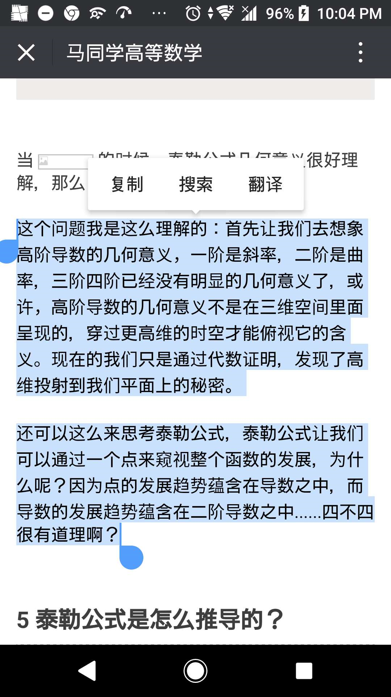

# 我的世界观方法论------自然科学
如果说冥冥之中有一种真理----自然世界的运作规律=真理=自然科学，致敬牛顿的那本著名的几何书，我会把它叫做“自然哲学”。
------------------分割线-------------------------------以下我说的每句话，都蕴涵着我自己的生活经历，看到那些文字，我会想起一些事，可能读者你不同的生活经验不一样，不能产生共鸣，但是，我会尽量在我记得来源的情况下，给个链接或者《书名》或者学科背景知识联想，知识爆炸时代，很多知识，你需要的知识自己思考，提问，然后印证自己的思考。

这些年来，我在思考，我在反思，我在琢磨自己的道路，我也在想世界万物的原理数学，是对自然哲学的规律的抽象语言，对实际问题建模，就是数学建模，而物理，恰恰是用数学语言去总结描述自然科学的一门学科，所以你会发现，大学的物理就像在学数学，而大学的数学，就像是在学逻辑学！之前一些学霸调侃的梗，我非常地喜欢，数学是火，点亮物理的灯；物理是灯，照亮化学的路，化学是路，引向生物的坑，生物是坑，埋葬理科生。虽说只是俏皮话，但是我们不难明白，其实这个世界的运作规律就是如此，各种自然科学的分类，在我看来，只是不同层级下的对“自然哲学（或者说冥冥中的真理，世界万物的运作规律）”，在不同层级的描述，你在研究生物的时候，你可以把各种理化反应假设为“公理”，在此之上研究规律。其实，世界上的各种学科，都是在不同学科已经证明的“公理假设”的层面上，进行研究的。因为研究化学的情况下，你可以把原子分子之间的：”反应“，理解为一种”公理假设“，在上面研究。为了说明白生物上的一些生理现象，如果抽象到物理本质，世界本源去研究就太过分了，没有必要，这就是学科分工的来源。作为领先世界100年的学科，数学物理绝对是最接近自然哲学的学科。在我看来，没有”理论数学“和“应用数学”所有数学都是“描述自然的，实用的！”！理论数学没有实际用途，不是没有，而是不会用，是“暂时没用”。

数学最本质的公理，定义，是**发现**了那些想当然就正确的的自然现象中抽象提炼出来的“**定义**=描述方法”，在此之上，经过“正确的”（数学分析等教会我们，最最最基本的知识是基于什么样的假设的，需要怎么做才能做本质地触及根本的自然规律？什么样的计算推演是符合最基本的假设的，而不是在瞎算！算理很重要，不满足理论空间最基本的假设，实在瞎算，就像康德定义出实数，数论，区间套定理等等严谨的理论体系之前，人们（即使是欧拉大神的手稿也有错的，也许不是错而是另外体系的数字乱入，比如1+2#+4.。。。+inf=-0.5什么的，在这个抽象知识体系里明显是错的，但是在另外一种抽象方式观点下，确实合理的（因为两者最底层研究的定义假设抽象方式，描述层级，研究层面不一样））都是“瞎算”。数学分析，分析学，大分析部分，学会如何思考才是正确的，什么样的抽象是合理的，自洽的，正确的，学会“为什么而不仅仅是怎么做”，你值得拥有！）数学逻辑推演形成的“数学二级结论，三级结论，高级结论，，，，，”其实只是在几种“从简单现象中抽象提炼的严谨正确的数学公理定义”推演出来的结论！所以，黎曼几何甚至领先于相对论出现百年！但是，不同的认知条件下，抽象出来的定义证明公理约定，是进化的，必须满足实验的要求。比如牛顿发现并且假设（或者说定义为）三大定律；，假设这个是对的，是不需要i证明就正确（不证自明）的情况下，建立了牛顿力学。麦克斯韦发现众多的电磁现象公式定理，可以化简，抽象为4大基本假设，然后1生2，2生3，3生万物推演出了电磁学！物理学家爱因斯坦假设了时空曲面，解释超光速新的“实验检验条件下的不言自明看起来很正确的知识，定义为“公理””。为了统一电磁力，强力，弱力，又有科学家假设“各种对称性”，提出“标准理论”。然后为了整合4中基本力，物理学家又提出“超对称性弦”的假设，，，，，，，物理学家们抽丝剥茧，只为减少各种**人为定义**的“**不言自明的假设**”，越来越接近那个最本质上面的“真理=自然哲学”。因为科学是相通的，是“自洽的”，是满足抽象层面的“对称的”。
“实验”，是检验真理（一定社会阶段下认识到的自然哲学，描述自然哲学的一种抽象认为的数学物理模型）的唯一标准。
计算机，在我看来，是一种人造的“仿生”，是一种对自然模拟的结果的“仿真实验室”（检测为了描述自然现象而抽象出来数学物理模型，的描述效果=正确性），所以利用描述自然哲学运作规律的数学物理语言，我们可以用计算机模拟，做“实验”，可以观察我们对自然的抽象描述---是否正确。。当然，需要满足计算机条件，会在一定的当下社会认识能力的条件下做出让步，比如数值积分，计算方法等。当然，因为计算机似乎把现实模拟仿真得太好了，有点像脱缰的野马，有好有坏，说起来又是长篇大论了，歇笔不谈，有想法就在另外一篇长文里谈好了。【】（计算机，让分享变得更加方便，让世界更美好，究极得仿真，人工智能。）

数学上，物理上，只要是“实验检验真理”考验下没能通过考验的，对现实自然哲学=真理=自然现象运作规律 的仿真模型就不对！就必须更改假设，更改定义，拓宽假设。甚至往更高的角度上进军，把定义公理更加抽象化，类比推演向高维空间，**扩展定义**。
举个例子，同样是“向量”，牛顿的向量，和线性代数里的向量是不一样的。同样是“空间”，不同学科中的空间是不一样的。同样是展开式，实数定义在下e的展开，和复数定义下e的意义是不一样的！！！！！！！！！！
还有就是你会发现二元函数跟复数很像。向量，可以把定义更加抽象化，然后，把它看作“二维张量”。复数也是，求**解这条方程**（复分析可视化）的时候，你会发现如果把二维简单平面的连续严谨地定义为处处可导的时候，你会发现不够用了，所以就会想办法去定义一种“解析函数”。其实很多数学领域的研究对象是极其特殊的情况，更多的情况下，你写不出一条曲线的函数（已经证明连续的曲线一定能写出函数，哪怕是无穷项的泰勒傅里叶展开等等方法，但是现实生活中更多特例，所以我们学习分析学，明白什么情况下，这个定理能用，什么情况下不能用。）很多数学研究的对象，是极其特殊情况下的特例，因为现实实在是太复杂了，所以我们一般选择先简单的入手研究，假设出比较简单的模型。

宏观得认知知识感性上面得剧透，，但你利用知识自己开始推演证明，你会发现一些以后会学到的知识，你会很自然地想到，你也能“重走长征路”，学习，其实重走大牛的路，去发现，去探索，去证明得一种“你自己探索描绘自然哲学的科学”。《计算机原理》书中作者说的一句话我非常地喜欢：你不能说理解了大概的原貌是怎么回事明白了这门学科，只有深入细节，你才能加深自己的理解，而不只是浅层的理解认知。说“我已经懂了宏观的意义了，所以技术细节我不管，这是一种不负责任的借口。”举个例子，只有当你实际亲笔跟着计算链接复变函数的“欧拉公式”，你在能真正地理解，甚至得出自己的看法，我认为欧拉公式是笛卡尔坐标系和圆坐标系两种不同抽象方式的必然转化公式，欧拉其实是“发现了”，而不是发明了，欧拉公式。数学物理的公式定理，更多情况下其实只是我们对现实的一种抽象，我们人类为了揭示自然规律而进行的一种“逻辑抽象”，数学就是这样“逻辑抽象出来，为了描述自然哲学语言”
因为只要是线性无关组的假设基向量，一定能够推演，张成相同的“知识空间”，所以B,E可以作为描述电磁定律的基本假设的同时，取他们散度得到的ab同样能够描述磁场世界的自然规律。用什么，只是因为科学家大牛发现的历史遗留问题。甚至根据“磁场是电场力的相对论效果！”，我们可以用B描述E,或者用E推出B.

# 自然哲学中的数学原理

如果我们改变运动方向矩形变成平行四边形因此面积也会相应改变（为了描述这样的物理现象（也可能是力矩或者角动量，反正我感觉叉乘就是为了描述类似右手定则的自然规律而定义出来的一种数学运算），定义出叉乘这个数学运算，其实我感觉翻译成数学方言中的普通话"代数"就是类似行列式的运算）
理解数学，说到底其实就是只有几条路，从小孩子认识世界或者说是大牛描述世界最开始的建模方式出发，从定义本身出发找这个数学语言描述的“自然物理世界中的具体体现”，找到这个定义最本质是从哪儿来的，这样定义是为了方便还是只是一种约定而已，毕竟现在的科学语言的表述很多都是历史遗留问题。还有的就是“翻译”，把代数翻译成几何，把几何翻译成分析之类的。比如画个图形象理解线性代数，比如计算机画出来具体向量场解释旋度散度梯度之类的。或者用3维向量表述出来复变场。
（代数矩阵运算）用矩阵表示一种变换，（几何向量运算拓扑微分流形）用算子表示一种变换，（分析符号运算函数泛函复分析积分微分方程）用函数求微分等梯度表是一种操作，（用用统计学概率论线性回归最小二乘法计算方法数值分析机器学习元胞自动机等等仿生的手段也不得不让人拍手称绝）用计算机各种语言描述的世界还是很多的毕竟世界因为是为的不同而美丽，四元数可能是描述世界最好的工具也不一定。同样的道理而已。人工产生的\lambdda倒是有趣得很/。机器进化也许能赶上人的速度也不一定

https://www.douban.com/note/246430462/

我其实非常喜欢数学，因为数学是生动形象的，数学描绘的是现实生活中的事物，就像当我高数的时候学到了其实是因为单纯地喜欢。但是，可能，这就是一个门外汉好高骛远，眼高手低，偷窥数学大厦的美的门外汉吧。我有些总与有一天能够登堂入室，进去数学殿堂的憧憬。可能是处于同样的原因，看过有人说的一句话，计算机的人都习惯性跪舔学数学的人，深以为然。可能不是爱敲代码的Ie工程师不是好的数学家吧

扩展定义，面向对象，“找不到对象”Objecton可以是研究对象里面很多的翻译，因为月抽象高级，预热需要相信的语言一样，数学见们新创建了了一些词，或者旧词新义扩展定义

Gitbook我的生命哲学，中英。究极人工智能聪明病小说。被窝历险记。上传各种B站视频。Haskell因而学lamnda表达式演算。MC游戏录屏做动画片，ppt析出mp4动画，超低成本做动画，想法是最重要的。程序员们已经贴心滴为你铺好了路。你可以通过各种软件做学习视频。比如用火星游戏录屏做的剧情的火星剧情简介。比如用游戏建模介绍物理电磁学4公式。比起用MC做的我的三体。比如用python自己撸代码出来视频的3b1b，甚至是MIT课程各种mathematics析出的数学物理笔记本，马同学等利用数学绘图软件做的公众号动图，比如学渣乐园用的绘图板。或者说是乐学高考，的大电影，看广告式的学习视频，，，，，，。教育事业是一块大蛋糕，已经很多人在做了，联手大思教育超强记忆术做个教学漫画之类的。

有些时候，可能不是找不到饭撤，而是价值观不对，精神足够的物质没有得到满足而已。谁不想发财？可是有些事真的不挣钱，一些搞基础科学的，领先时代太久，太抽象，没有实际工程应用挣不了钱，也还是没办法的。高铭《天才在左疯子在右》说过一个观点，人类社会运作像一个蚂蚁群，整体可以看做一个生物，每个人类个体都只是一个细胞。我们都有自己的价值体现，哪怕是(;东野圭吾笔下的恶女，也在传递着自己的价值观)

比如阿狸教我神奇的矩阵，玄度散度梯度的pdf和那个台湾人讲授的博客

因为很多时候在一下数学群能看到一些人学习的时候怀着和我相同的疑问，总是觉呃很开心

有时候看书自己思考比问大牛好，跟比听课灌输知识强。高人点波，才是最难能可贵的

只有你做出一点事情，让别人看到你的利用价值，世界才会待你温柔。当然，初学者敢于当伸手党也是合理的

好的政治制度，应该是让每个人都有私心，并且在趋利避害的谋利过程中互惠互利

到时候，可能每个人在！！！用中学！！！才是最有限的学习方法，需要什么知识学什么知识，触手可得。这样，如果大家都发挥自己的主观能动性，积极做好自己的贡献，未尝不是一个人类命运共同体的(工作细胞)

实体大学，可能就不存在了，只有幕课，在线深入浅出触及知识本质的云上资料

感觉其他学科在线知识共享还不够，也许等程序员们做出更方便你们懂数学，懂物理的各个学科的人，能想上面所说的各种知识传播方式一样，把只是传播给更多的人手里。那时候，可能学习成本会下降很多，知识也不存在壁垒，更多人能随心所欲学习东西的时代会来临

感谢开源知识分享，比如最近看到的一个动手学深度学习的项目，真是让我深有感触，牛逼哄哄糊我一脸

为什么像疯子一样原创开源？因为github真是一个完美的网站。可能是因为刚好跟计算机熟悉，所以你会发现计算机方面的在线教程要多少有多少，而且要多精美又多精美，什么菜鸟教程，博客选csdn.W3cschool.实验楼，源码，而且写框架的，造轮子的大佬要多少有多少，而我们应该做的就是在前人的脚步后奋发图强，不断超越

对了，基于离散的计算机和连续可微的自然不一样，但是可以通过很小的差分分当做微分来用（这算不算一个个量子，，，鬼扯），其实是因为，美妙的数值积分，积分变换，计算方法等理论。至于想哲学一样的实分析，陶哲轩告诉我们，其实是在用最严谨，最正确的思维方式告诉我们为什么那些数学定理是对的，有什么假设条件，如何正确认识数学从逻辑学层面上讲的合理性。难怪我最敬佩的褚铭数学老师告诉我说，数学好的仅仅代表他逻辑推理严密，和其他情商智商无关。至于奥数刷题什么的，我自己的观点来看，其实是一种跳脱高考外的新途径选拔人才吧。虽然也有一些有条件的人上奥数补习班刷真题学套路什么的。但是，数学研究，计算的算理明白，计算直觉可能就是这样做题刷出来的呢。因为有些运算，真是手熟而已。;数学，能动笔计算的人真的牛逼。

为什么没有三元数而有四元数？坦白说，我不知道。克莱因说黎曼那种物理数学大一统的互相辅助学习才是真正的学习方法。

正是因为降维自恰，学数学越往上学越发现原有的定理只是更好等级的数学的抽象降维截面，比如复变函数实轴截面就是实数，再比如复数区间内处处=解析函数，可以对应着傅里叶变化或者高斯变换的用同族曲线作为最基本的向量去表示其曲线，就是三维想二维塌缩，濡化，就像是三体里面的…二向箔攻击，笑。:解析函数无穷区间内处处可积分对应着积分对应的其实是实变函数所描述的几何里面的泰勒展开公式！！！而欧拉公式链接着复变函数和实变函数的桥梁，其实就是因为滴卡尔坐标系描述自然所用的数学语言，和轴坐标系下描述的数学语言之间必然的转化关系。于是有的大牛干脆搞个复数，i代表旋转90°，用和谐的二元数来表示高维空间，其实我觉得完全可以把复数看作是一个二元向量，1，i分别是他的单位正交线性无关向量组，因此，物理描述磁电场，描述几何图形变换的数学语言非他莫属，(复分析可视化)，了解一下。在这，如果真的喜欢，还可以看看(趣味数学相关的知识，数学其实是一种现实抽象出来的语言，用来描述真真切切的真实世界自然哲理)。比如三大数学常数中等，e蕴含着的无穷分割区间没固定速率自增的规律也是对应着很有意思的自然哲学。数学很多研究的东西都是:发现:！而不是创造。只是发现了自然哲学而已！！！但是，威力无穷

学习理所应当接受已有结论把他记住，是一种高效率的考试技巧，但是不能不说，专研一下知识来源，真的有意思，理所应当的没妙不可言。《欧姆社学习漫画》好书！

3b1b,马同学，，，，，，，越来越多人更加地传递他们学到的知识，技术爆炸，知识膨胀的时代，可能现在知识越来越透明了，越来越多人传播着这个希望。学习数学这事儿有多么地有意思

让你看到数学真真切切描述自然哲学的美妙，当然，有个PDF我觉得讲的很好的。还有就是，推荐一个Pdf讲解散度旋度的。统计就更加有意思了，现实生活中基本用得最多的就是统计了，统计之都了解一下。

让你在真真切切地知道这是什么现实实物问题抽象出来的数学概念

黎曼的数学物理大统一学习是真的有趣，比如学校高超的课程设计，让我们在学习物理电磁学的时候接触到数学里面的旋度，散度

最有趣的是什么呢？看过一篇文章，利用数学建模学习自然哲学，虽然槽点满满，但是数学建模的确是一个好东西。实际问题抽象提炼，用数学语言描述，落实到已知的模型算法，从而借助计算机解决实际问题。其实，科学工程项目的解决，可以说都是，数学建模吧

因为数学是描述自然的抽象化语言，物理，则是利用数学语言描述自然哲学的规律。而计算机，拉近你我，计算机的模拟可以说是以光速做实验，比如matlab的数学实验，看到mathamatica画的物理图，python等编程机器需要实现解决现实问题。

数学大厦博大精深，我只能说自己是兴趣广泛的求道者，跨学科一方面是优势一方面也是劣势。

学的好的成绩不是一定会100分，但是100分的一定不会学得差，起码说明那是聪明人，懂用什么学什么，更有适应性，更努力，努力也知道正确的方向，而不是看到什么平均着力拼命死磕为什么。也许，筛选出来才是最适应的。考试，其实相对公平，不完美，但是是现在的方案里面相对而言最可行的

注意，极致功利主义些这个说法没有任何贬义的意思，反而是懂得学到什么程度为当下阶段足够用！这说法，其实是表达我心中的佩服钦敬！！。懂什么时候停下来，才是不会陷进去数学的深渊的里面，不可自拔，痛并快乐着。但是陷入数学深林挣扎，被数学们按在地上摩擦也很快乐，自己推到结论也酣畅淋漓，感觉自己在做真正的“创造”，当我不再创造的时候，我不是在学习。

为什么cnki不要求源码？算法固然重要，语言只是工具。但是细节不影响加深认知呀，更方便改进反思。我建议论文要贴源码仓库，方便学术界做出来的轮子让企业界用，否则这个不能带来财富的“领先百年的学科之母数学”在市场调节的大手影响不会有好发展的！

我想，不是因为数学完美诠释自然哲学而美不胜收吗？
知乎有回答说只有新手强调数学美，高手觉得理所应当。
其实我不同意这个观点的，理所当然地从自然中抽象出来，描述自然的数学语言，不是很强大吗？不是很美吗？书中自有颜如玉，说的应该就是，数学公式本质上其实是一个很好的具体事物的抽象。逻辑数学抽象下的数学语言，代数==几何，知识抽象的角度不一样而已，所以欧高黎嘉陈中的陈景生先生说，数形结合翅膀双飞
《高中数理化》《高中数学》《江苏那本杂志都是好东西》，如果喜欢的话。
多半时间里面，大概率看书学习最快，只有看书和圣人聊天，仿佛面提耳命，是最有用的，其实自己只有自己算过一遍，去体悟才有收获。

碎片话知识让你看到别的总结精华误以为自己懂了，想做的太多

都只是谋生村，太难了，时间有限，什么都想学？怎么办？只能做出舍弃一部分

没人关系知识本身是什么，那意味着$_$钱，好工作而已。

我发现越是没文化，如我妈，越看重考试成绩

知乎微信也是程序员改变世界的利益，李小龙，知乎上面主动搜索能得到有价值的认识答案

或者物理科普达人写得各种书，刘昌海的物理博客bala，美翻了

数学和应用数学介绍网站[数学分支branches](https://zhuanlan.zhihu.com/p/41806331?utm_source=qq&utm_medium=social&utm_oi=78440304738304)
2018-9-6 By Tridu33

# 计算机带来的职业冲击
islides能导出视频，然后就能做简单的动画片，然后做平面建议动画的人，**就没饭吃了**；画漫画的更新慢死了，如果想要3D模型和仿真背景组件搭建，截图渲染出来漫画，是不是就会有漫画效果量产，一周更新玩一部小说，
现在的画师只需要更多的完成自己想要修正，截下来构图，**就没饭吃了**，就像大部分电脑画师如同相机发明了之后，变成手工画师找不工作的现象。
然后建模师因为有了3D扫描，和各种底层更加简单模块化的小模型（小到原子层面，）拼接的新模型，结合物理定理在Unity等游戏里面的应用班，实现新的模块化，建模师也**找不到饭吃了**。然后之后独创的画画艺术家，画出来各种世界上从没有出现的新事物的原创建模师傅，画师有饭吃。但是python根据机器学习实现世界名画的自动模拟生成，用计算机做各种类比，比人类的自己的想法累计画的要快，究极的仿真的，

**人的原创和机器的原创，有区别吗？？不都是旧的输入信息经过联想，加工处理出来的吗？批量化，以光速进行联想，穷举各种证明方法的计算机，真的比人类少数的几个天才要苯吗？**

一个量产便宜质量不一定差，但是****那些大部分没什么太高效率的联想能力，或者联想创新不****够计算机快的原创性工作者**又没饭吃了----这仿佛是必然？**。自动驾驶汽车也是，司机也**要没饭吃了**。现在制造业里的机械手，自动化生产，一堆工人又没有饭吃了。因为网络，慕课，VR虚拟课堂，虚拟设计，虚拟装配，然后，那些只会念PPT的教师培训师又**找不到饭吃了**。

## 总之，只要是ctrl+cv的职业，很快就找不到饭撤了。人的创新，不就是他独特的人生经历的积累的“信息输入”，带来的输出吗？
**联想**才是改变世界的本质动力，没有输入就没有输出。如果人工智能更加深入地做到仿的的话，哪怕是人靠自己的积累和灵感创作的事物，都能通过人工智能实现。到时候，可能靠原创的人也会**找不到饭吃了**。

毫无利用价值的人类在机器面前到底会变成什么？没有利用价值，还有存在的必要吗？社会关系的总和，人与人之间那根利益相互联系的枢纽，又在哪里？
因为网络技术，信息爆炸和技术共享，以后做东西只会越来越容易，计算机技术人员其实是为了给有想法的人搭建平台，然他们的想法更加高效率分享，想起了------斯坦福公开了，mathematica讲解数学物理等，想起了python这种越来越接近人类语言的简单的编程语言（只是工具，基础知识，算法和建模思维才是真正能力），3b1b用python做出来传播非常美的视频想法，《矩阵可视化》《复分析可视化》《微积分等空间意义也可以由真正学明白的技术大家来讲解》，比如国内的乐学看电影一样的教学视频，比如是学渣乐园里面创意非凡的想法，H5也是变成很简单的搭建网页的存在。现在，做网站，做小程序，做APP等重复性的工作都已经有现成的轮子，框架越来愈简单易用，知识现在膨胀，触手可得，已经可以实现新兴的制造了。以前**靠搬砖的低级码农也没饭吃了**

！各种知识模板！知识轮子！让世界有想法的人更好表达出来！真正的高手不应该反复造轮子，虽然他们会造，但是他们会找Bug,会让世界变得更好！静下来，干大事，而不是在小圈子里卖弄靠倒卖信息，倒卖资源，把自己学到一半的东西ctr+cv出来装牛逼，挣钱。每个人都有他让世界变得更好的能力！就像Hexo模板，然技术说平不够高的小白也能给你拥有自己的博客，不断深入进去才能学的快，学会着真正有用的高效技术方家教程，知识付费很正常，但是不是现在这样各种低端信息倒卖的知识共享，而应该是真正的原创！为世界谋福利，网络只会让这东西更加透明，更加无所遁形。

想起了“曾博”的博学，现在付费的知识一般大部分都是垃圾。倒卖学术垃圾信息的学术流氓***也找不到饭吃了****，其实各种科普视频做的好的也是利用了现在伟大的软件，各种技术，怎么能不**感激开源！共享！每个人都能够有为世界进步而作出贡献的方式**呢？
利用bitcion的区块链技术，在每一个新原创文字，模型，想法，文化母体出现的时候，打上一个hash分布式的时间戳，这样子这个世界就没有什么那么多ctrl+cv抄袭的垃圾论文，垃圾技术博客了。当然，也有的博客集百家所长，精炼浓缩已有知识，但是所有知识来源，所引用的所有轮子都会通过ctrl+cv的过程之后保存下来，就像论文应用，能找出来原来的知识最本来的发展源头，从最本质的角度去思考理论的假设前提，使用范围，合理性。
### 现在数学物理研究范围大部分是不能带来经济价值的，这恰恰是阻碍发展他们的障碍。
，计算机，工程师实现这些知识，创造社会价值，才是未来职业导向。但是，肯定基础学科需要忍耐着心去做好用，有效的知识轮子。
#### 学习应该是很有趣的事情，因为他不是做题，而是学会认识世界的本质。很多人在做这方面的努力，徐小灿的动图，各种Github轮子源码托管，

#### 就这样联想一下，“mathhub,phytics-hub等Science-hub知识仓库”也存在
，那就是各种数学物理的网站，论文Sci-hub其实就是在知识平民化，免费化上面做出努力，数学物理计算机等知识本质托管才是真正有需要的存在。
互联网不应该ctrl+cv的存在，应该更多原创，分布式，像比特币一样复制了之后还是会有源地址的东西的存在，KK凯文凯利《必然》里面把所有文文化母体当作一种类似基因的存在，其实跟基因趋向繁殖复制不断传播发扬光大一样，各种文化母也在趋向ctr+cv.其实，这才是世界运作的规律！而利益，才是人类社会关系维系，运作的本质规律。这里的利益是广义的，不单单指的是心理利益，也不单单生理利益，而是《盲眼钟表匠》里面类似的利益，生物有利己主义，广义上的《必然》里面说的优秀文化母体，同样也有类似的利己主义！自私，是合理的，趋利避害性是这个世界各种文化母体的核心，延续下去的动力。

就像微信公众号不应该让转发大号挣到太多钱，但是个人原创的力量是邮箱的，所以需要论坛社区和知识聚类在一起的网站，这样，会搜集的人做出来的转发公众号大号才会那么多人关注，自己找难找，也会明珠蒙尘，酒香也怕巷子深，因为本质上相差的东西其实并不多。

被计算机搞到没饭吃的大部分人类又该怎么办？创造不了社会价值的人到底算什么？想起了《人类简史》里面被傲养不断繁殖的猪羊，想起了大护法里的猪猡。人，是社会关系的总和，人的利用价值，是维系社会关系唯一可靠的纽带。只有利益是永恒的。
人是一定会自私的，这是很合理的，是生物进化，隐藏在基因里的，帮助我们延续下去的本质，但是，我们到底的算得了什么？想起了动漫《心理测量者》的西比拉系统，如果同样以延续自身，复制是自身作为目的的话，《必然》KK说文化母体最需要的其实就是自我复制，人工只能会不会也产生利己主义**，像现在人类对待猪羊一样对待人类？机器绝对仿生的时候，和人类有区别吗？未来又是什么情况呢？**

靠**ctr+cv的工作只会越来越找不到饭吃，底层的类比联想也会找不到i饭吃**只有当你的工作室创造，无中生有的才是艺术家，而且不是单纯的类比，推到，模型。因为人工智能但这个也能画画，
比如抽象画画的那个python世界名画项目，

比如当年**大牛希尔伯格说给予一些公理下的证明，能够推演出数学大厦。但**是，不是靠伯努利一般的精神直觉，也不是靠欧拉一样的神计算，或者说搞死王子等天才，计算机可以自己暴力证明计算可解问题。然后图灵发明了图灵机解决问题，
里奇发明lamnda表达式的机器自动推演数学定理，穷举暴力证明公式定理。计算机连数学题目都能证明！大自然不认识123，那只是人类的约定习惯！

！计算机认识0，1，10，11，100，101，111.。。。。。，那就是计算机的思维习惯！

!!!lambda表达式里的123写作…^x.y.y  ^x.y.y    ^x.y.y   .....

**在自然哲学的眼中，这些东西是没有区别的！！！！！自然科学的很多知识，如果脱离了他的历史原因，很多公式定义换一种写法也是可以的。就像工程经济学里面的各种数学公式，是可以相互推导的**，
只要又最开始那几个公式，就可以互相推演出所有公式，那么问题来了，如果最开始我们先发现的，或者说在我们的脑子里最先理解的那几个公式是另外线性无关的几条呢？他们一样能够张成现有的向量空间，一样能够推导出一致的结论，就像学习数学时候会发现，很多公式是可以随着你的学习不断打通他们之间的关系的！！！

就像是数学大厦的基础定理换几条，最后发现是等价的！原因大概是因为，在最基本的定义假设的数学大厦的公理A，B，C,D,,,,等推导出来的数学体系（比如欧几里空间几何）中，其实任何A+B推出来的公式A+,也可以张成同一个空间。从逻辑学的角度看，A+,B，C,D，，，也能张成同一个空间！！！！！如此看来，A公理定义之所以是选他，只是因为最开始的科学家选择了他，后来的人就沿用的历史原因而已罢了！当然，也有不同的大牛用不同的线性无关的知识框架，前提假设去描述那些自然哲学的知识体系，。来抽象出他们口中的自然哲学，从而产生不同的只是理论罢了从而延伸出不同的知识而已。！举个例子，线性初等代数可以表示离散的运动，定义了内积外积之后，就能表述了连续运动！！！就能表示几何了！！！！这刚好有事微积分做的事！微积分也在描述连续的运动，几何！群论，离散数学也有一部分是在描述的那种关系！这居然跟我们古人研究的几何学如出一辙！黎曼数学不懂，但是感觉曲率张量和相关的知识，其实也是在描述更高维的自然哲学------4维相对论，11维的超弦理论，空间蜷曲-----恰巧高位的的高等代数也是在描述更高维的空间，也是在定义更加高为的空间里卖弄卷积的，蜷缩的几何！四元数balabal！！！其实黎曼创立黎曼几何的一个初衷就是希望能够把很多复杂的物理现象看成高维的非平凡的几何现象。
殊途同归，原来所有人都在研究几何，研究自然空间抽象出来的实体！！！

真巧！

再举个例子，量子力学有三个数学学的很好的大牛去去描述和其中的规律，有微积分学的好的狄拉克的原子公式！有现行代数学的好的？？？？建了矩阵力学，还有另外一个学得好几何的费曼用几张简单的图像去表述量子标准理论的规律！最后，狄拉克一个转身了，证明了三者是等价的！（就像里奇的lambda表达式和图灵机一样，同样解决了）！！！

---------因为他们知识大厦用到的脚手架是一样的！对自然哲学的一种抽象性描述！知识选用的是不用形式的线性无关的自然哲学罢了。
真巧
！类似的例子数不胜数，学数学很多时候会发现大部分知识是可以互相推导的，自洽的。

很多时候，我如果卡在一本数学书的证明推导下，会很自然地推导出后面的想法以及得出的结论，有的同学告诉我“别看那些看着高大上的高等代数，张量玄论之类的数学物理书----不考-----但是我怕没想明白，当你不知道矩阵相似具体到底代表什么几何含义，自然哲学的时候，你能忍住心中的好奇而不去找“邱维声前辈的高等代数2去看看诅i本质的证明？最底层抽象来源对应的自然哲学”，你能-我想起来了清华教授这篇文章（我们的学生聪明但是么有才华）----我倒是想起来一件事，当学不太明白知识本质的的学生当了老师，教出来的学生也只会做题，墨守成规，没有新的突破。但是，。做题是为了对知识加深理解，我不能闭着眼睛说自己缺乏联系做不出题目来，看到各种高级的别人的“理解”就说自己说动了这么科学的本质，因为，只有静静自己思考，的来的结论和大师的观点个相互印证，才是真的是的知识，只会！理解细节，熟悉细节，只会让你更加深入理解知识本质！

”真的，我编造了一个词形容这些同学，机制功利主义者！他们没有做错，屁股决定脑袋，利益才是永恒的，经济基础决定上层建筑，不先适应这个考核体制，混出个名堂谈什么理想？谈什么知识？

中国的学术界，也是要以吃饱饭为优先的。学习是一件耗费成本的东西！所以古代之后那些贵族吃饱没事版采取研究学术，饭都吃不饱，你不去搬砖真是活见鬼了，学习是一件需要投入成本资金却不宜规定短时间有经济回报的事情，因此，斯坦福+谷歌=知识+盈利，才是发展学术最本质的存在。有钱待遇好，科研经费足够的浙江大学，清北，用千万挖人才，假设你是吉林大学机械的大牛老师，为了更好的工资待遇，你去不去？有好老师，好资源，理应匹配好学生，所以高考是现行经济条件下筛选人才最最经济实惠的方法！！！！

尽管有一定的不合理性，但是这可能是社会阶层流动少有的机会了，虽然对一些不擅长“考试技能的人不公平”，但是为了考察那些“少数的不公平偏科天才”而花费的资源会更多，不值得！当然，这也是因为我不适合这种制度下才会去思考这些东西，仅仅是因为这符合我的”利益“，心理或者生理上的利益”！我当然不敢说，那个考试比我认真，刷题比我勤快，做题比我多，反应比我快，套路掌握得比我多，更适合考试的人不聪明！！！只能说，我佩服他，他比我更加适合考试，机制功利主义者也好，这不是一个贬义词，只是我“妒忌”心也不一定。

因为，每个人都有他为世界做出贡献的方式，大家竞争资源，同样是考试，我没有那么努力可以去练习，没有那么足够满足，贪心不足一口想吃个大胖子加上期末复习做的题目不够多，不够努力而已。我本质上还是很佩服成绩好的同学的，精致功利主义者，”功利““自私”不是贬义词，只是生物趋利避害性，每个人都在自己的原则和现有条件的妥协中找到最适合自己的生存方式而已---众生皆苦大概就是一个意思吧。就像企业招工，学术也是，很多时候不是非得某些人才能去做一些事，换哪个人就接受相同的训练去做也行。那为什么是他？因为当筛选规则里适应了规则，做出一定舍弃的他哄抢到那份机会而已。很多时候不是因为你能不能？，而是因为有些活儿还轮不到你做-----培养你干那活也是需要资本！时间精力，当然，没有相应的培养，你也不能说你“能”，因为一些事真的很难，需要1万小时，而你形势所迫，哪怕是想学，生活也有很多“搬砖的活儿”占据着你的时间精力！意志不坚定的人不一定能做好科研，要终身学习！！

！但是感觉当今中国人普遍的观点认为：人没有差别，后天决定先天，但是一个人的眼界视野，性格，研究精神，决定她是否符合科研。可惜，现在更多的人是在糊弄，应付任务，强行满足指标，绩点成绩整的很好看，实际却是个只会做题，不思考知识本身为什么而单纯重复<刻意练习>怎么做，去无脑刷题的“高端复读机”。

但是互联网信息爆炸可能让知识学习成本降低一些，让这一切变得更加透明，也许是为了让每个人都有可能去接受最先进知识，也许未来，大学的概念就会不存在，知识壁垒对普通人而言不会那么大，可能，人们才开始认识到

知识自由，开源分享，物资充足，人们都能吃饱饭有闲功夫做研究的大同世界才会来临吧，那时候，可能就不存在大学了，而是每个人都在家里做研究，而科研设施（像我看过的一个TED演讲里卖弄的想法一样，任何人都能租用，想做研究的人都能做研究，这样可能就是和谐社会，大同社会吧）慢慢的，我也发现了，高考时先有经济条件下人才筛选最最最经济实惠的相对公平的做法，虽然不完美，但是物资条件还不足以让他推翻（学习知识有三种犯法，1自己慢慢悟道2看书3听真正学会的人教你。知真可学会的大牛为什么教育你？非亲非故的，世界上那么多人，大牛没有时间手把手教你，所以才有争夺资源的考试制度，这种恩人才u选拔制度在现有的物质资料可谓有一定的合理性，当慕课盛行，一些高校里面水平不高的老师可能讲课还不如一个世界级大牛的视频录像讲的明白，还可可以倒带反复学习做笔记，学习知识的的成本因为互联网的分享变得愈来越低，会不会一些水平不高的老师会因此找不到饭吃？）---------------------------------------------------------------------分割线------------------------------------------------------------扯远了，说会来。
学习不单单是背公式，而是重走长征路，重走前任走过的坑，看到他们的证明从而明白知识的来源。
在我看来，学习其实推公式的过程是最有意思的，而不是做题，因为那是创造一门自己认识的自然哲学--------而像前面表述的一样，他们在逻辑上上随便那几条能张成相同的“自然哲学”等价的线性无关“向量”（类比抽象层面的）！！！

但是为什么呢？

因为科学不是玄学，他们那几条最基本的公式，定义，公理，假设全部都是不同的大牛在不同的角度上：对自然哲学的一种抽象迷描述！殊途同归贵，所以科学讲求的是“自恰”！新科学理论在降维之后一定要满足一致的理论！比如（相对论的理论在低维空间，时间维度影响不明显的低俗空间必须降维满足“牛顿理论算出来的结论”！！！！）所以，杨振宁之类的科学家的统一理论，超炫理论其实也要降维“自洽”已有的的理论！否则这个世界就会乱套！再说电磁学，麦克斯韦牛逼，总结出来最基本的一组E,B量来描述电磁规律，用几套公式去描述自然哲学中的电磁部分！（推荐youtude视屏电磁学）甚至连磁场都是电场的相对论效应（推荐欧姆社漫画电磁学）！哪怕是现在超炫理论假设的神的粒子，希格斯场之类的假设，都又是更高层级的特征而已！物理学家杨振宁说过，21世界是对称性的时代。
数学，是抽象出来描述自然的一种语言，物理则是利用数学语言，去表述那种规律性的自然这里的科学。生物学到底是化学，化学本质是物理，物理本质是利用数学语言去描述自然哲学，而大学数学，更像是逻辑学的一种东西，其实从现实生活中建模，抽象成数学语言，成为一种像数学一样高级的的是事物，这，才是逻辑学！！逻辑，是从自然中抽象出各种知识学学科！！！现有的各种知识框架，其实就是先辈们造的思维轮子，他们其实是为了描述自然哲学这么个东西，我们，站在他们的思维轮子上面研究，其实就是站在巨人的肩膀上（PS,我有没有一点点鄙视胡克巨人的意思，吐舌，，，）
大概因为这样，很多看似不相关的知识居然在描述上面，表达上面会有相类似的结果，比如那场在斯坦福两个物理学家完全不同研究领域居然“魔群月光会和统计量子物理在数字上有一场美丽的邂逅”！！（请原谅我用“自然哲学”这个词来表述自然究极的真理，大概是因为我对牛顿那本几何书的致敬）
量子力学给、给！逻辑上他，他们是等价的！ 抽出一条，跟他们本身是相同地位的！！**
今天的人是幸福的，站在巨人的肩膀认识世界，正是有那些学明白了的人，写的书，做的论文，发的视频教程讲座，才能有今天的人在短时间人知道知识本质的东西，但是不得不说，知识，真的很美！！也是因为**那些学明白的人不遗余力地把知识传递下来，我才能在看完书省去很多时间就能学明白，我们是站在巨人肩膀上接过科研接力棒一代一代薪火相传的人**！

ML,神经网络，深度学习，蚁群算法，退火算法，元胞自动机，人工智能，智能摄像头，VR,虚拟现实，Kinect等设备只会让仿生计算机更加借鉴人类能做的事情，人类会不会没有工作了！

深度学习，统计学习，利用数据之间的规律性，懒得找到内部规律，设定一种高层次高阶函数自己通过数据匹配，训练，自反馈，邮件都或者无监督学习实现吟唱在数据内部的自反馈调节，然后就是实现计算机网络识别的智能功能。-------谁又能说，我们脑袋不是用类似的计算方法在对事物的特征进行提炼，进行进一步的计算呢？深化求解得到最终的答案？

人工智能的最终方向==究极的放生
中间有会不会出现，混合型大脑？人脑志愿者死前捐献自己的脑袋给社会，接入电脑硬盘，数据储存交给电脑，数据一般的规律性处理，类比性延展，和判断交给电脑，人脑接入生物电流作为Api(数据传输IO接口),负责处理原创性的东西？什么叫死亡？脑死亡是为甚么？接入电脑的脑死亡能称之为死亡吗？

知识是储存，技能，认识；智慧思考方式等独创性的存在，如果把开车背书，做题等技能存贮在电脑上面给人脑接口调用，接入生物
电流，是不是就不用学习那些没用的东西？
两个人的意识接通在一起，变成混乱一片，能称之为死亡吗？到底什么是原来的船？一堆沙子是多少？
# 究极的仿真!!!!
3D建模软件模块化，人体骨架，每一块肌肉，重力仿真，感应，就能实现拼凑出来的人体模型。外景的，每一根花草，建筑砖头，哪怕我用计算机模拟出来的不同的“原子细胞大小”的计算机原子，把如今发现的每一种生物反应，化学反应，物理效应作为模拟的算法，进行仿真，加速，就能一定程度上预测未来。虽然量子力学的不确定性，和混沌的影响早就告诉我们牛顿的决定论是错的，但是？谁能肯定以后超学理论会不会有突破？起码一定的程度上是正确的就行。
像素游戏真有意思，他可能暗含的是量子化的思想，这个世界构成的基本粒子，能量可能就是一个个波包。当计算机的计算速度上来了，各种硬件技术跟上来了，各种人类认知不断发展，人类认识世界的脚步如果进一步加深，计算机**究极的仿生**未必是梦想。人工智能，未必很远，谁也不知道技术奇点是什么时候。到时候，可能能够通过加速时间维的世界预测未来。好吧，麦克斯韦妖，不确定理论，混沌学之类的早早就i否定了这一猜想。但是，**究极的仿生未必就不可能实现**.

