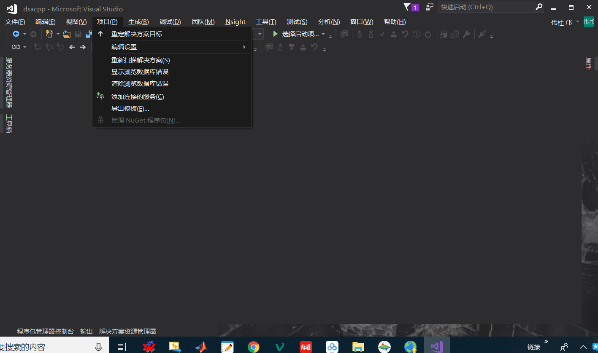
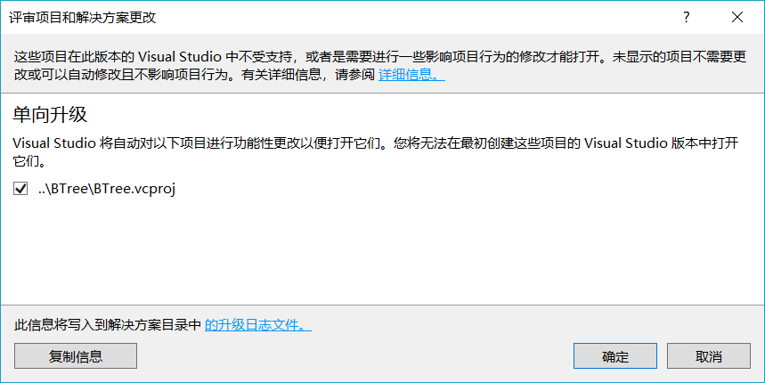
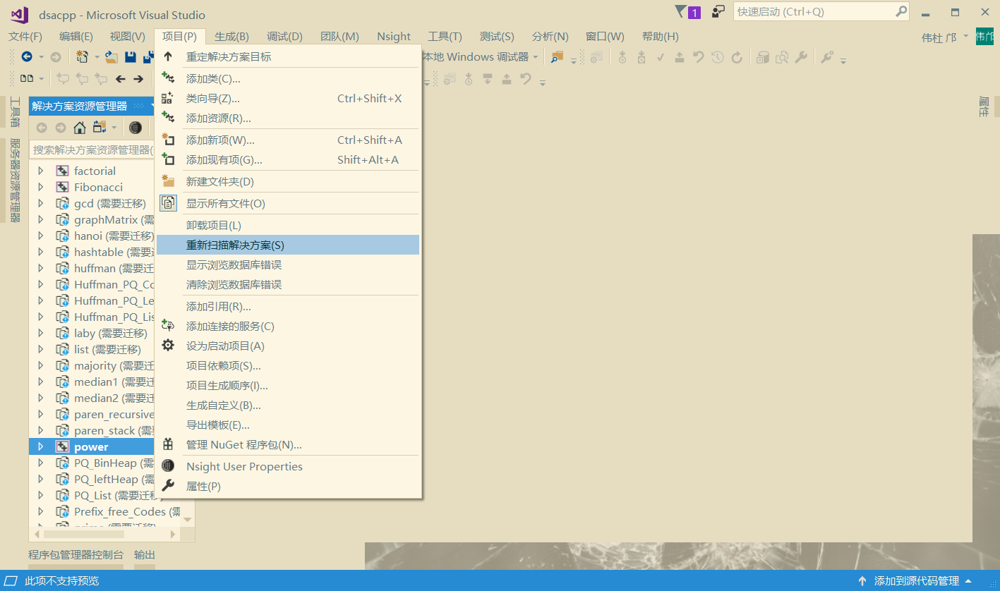
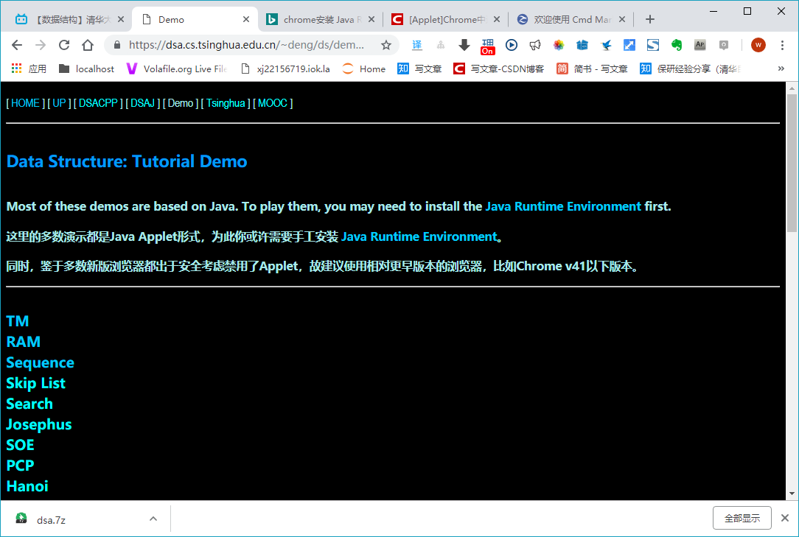
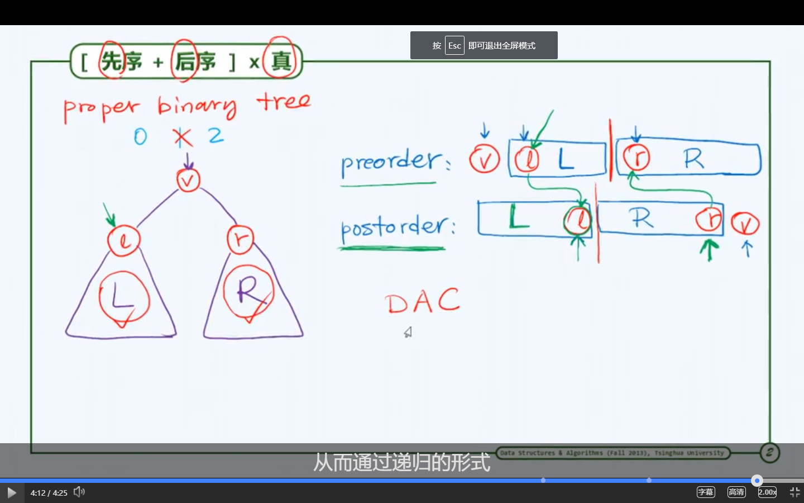

# C++MTATLAB_JS_JAVA数据结构与算法清华邓俊辉MIT等等大话数据结构

# 带头节点的双链表
https://blog.csdn.net/zgege/article/details/79830567

bbs.chinaunix.net/thread-1343046-1-1.html？这个问题我也不会。
 为什么初始化函数用的双重指针，简单的说只有一句话：就是在子函数中传递指针时，子函数的形参要用指针的地址，就是双重指针，也叫二级指针https://blog.csdn.net/liangxiaozhang/article/details/7083622。为什么链表初始化时，要用双重指针
https://blog.csdn.net/jmt330/article/details/80166752剑指offer链表添加，删除元素中传入的pHead为什么要是指向头指针的指针问题

## C++部分

[C++数据结构与算法](https://github.com/hehe520/Data-structure-and-algorithm)

**不说谁知道生成exe要在命令函单独传入参数，就像是*.bat传入参数的函数的exe程序，原来本质还是因为泰国成体系封装到实际在干什么都不止都的和箱子Windows骗,Linux的GCC或者用windows下Cmake才明白怎么回事，编程语言，只是人和RAM机沟通的语言，嵌入式单片机8086都没学这么明白**
提出这种问题的多半是因为被Windows黑箱子蒙骗昏头转向的VC6.0学习者------当年我也是为这个问题困惑了很久。
解决办法：
1. Windows+R调用cmd命令行就能输入: 绝对路径/ ***.exe 参数1 参数2.
2. 你也可以在文件浏览器的相对路径直接输入***.exe 参数1 参数2.
一样的效果。用过Gcc或者Cmake就明白这个。甚至说用过传参Windows下的BAT脚本也会懂
其实，编程语言是任何计算机交流的语言。*.exe就是RAM机能懂的二进制语言。学汇编单片机也能懂这个，搞寄存器，反汇编，程序逆向分析，反向编译的也很容易懂这个常识。

https://blog.csdn.net/mayue_web/article/details/84030056
https://blog.csdn.net/yangdashi888/article/details/73323419安装少了吗？C++添加文件
目录
https://jingyan.baidu.com/article/cdddd41c7c6b5353cb00e1ff.html靠左
https://blog.csdn.net/luoyu510183/article/details/83716226文件目录结构

''' 这几个

https://blog.csdn.net/sniper08/article/details/5506276
https://blog.csdn.net/myruo/article/details/79277817
https://blog.csdn.net/myruo/article/details/79277817
https://blog.csdn.net/lindexi_gd/article/details/79160408

修改安装吗https://blog.csdn.net/jfwzy109127/article/details/84190137
https://blog.csdn.net/jfwzy109127/article/details/84190137

怎么迁移？https://docs.microsoft.com/zh-cn/visualstudio/porting/port-migrate-and-upgrade-visual-studio-projects?view=vs-2017

https://docs.microsoft.com/zh-cn/visualstudio/extensibility/how-to-migrate-extensibility-projects-to-visual-studio-2017?view=vs-2017

https://blog.csdn.net/lindexi_gd/article/details/79160408

## 清华课程部分数据结构预与法
https://dsa.cs.tsinghua.edu.cn/oj/
清华OJ系统
https://dsa.cs.tsinghua.edu.cn/~deng/ds/demo/   演示代码，火狐能打开
学生评选精品课大概是因为老师好或者老师本身有水平能将明白吧

https://dsa.cs.tsinghua.edu.cn/~deng/ds/src_link   这儿全部的代码在线观察
https://dsa.cs.tsinghua.edu.cn/~deng/ds/src_link/vector/vector.h.htm  向量模板类所有代码

 
https://zhuanlan.zhihu.com/p/19833798 语言C++历史
斯大叔为了突破C语言的种种局限，还借鉴了其 他程序设计语言的优点，实践了编程界由来已久的“拿来主义”。例如：C++从Simula拿来了类的概念；从Algol68拿来了操作符重载、引用以及在 任何地方声明变量的能力；从BCPL拿来了“//”注释；从Ada拿来了模板、名字空间；从Ada、Clu和ML拿来了异常处理等。通过这一系列的拿来动 作，C++具备了多种程序设计语言的优秀基因，既系出名门，又博采众家之长，从而完成了从C到C++的进化。随着标准模板库（Standard Template Library，STL）的出现、泛型编程的发展，C++在2000年左右出现了其发展史上的一个高峰
如果说其中一个“+”号代表了C++比C语言多出 来的体现面向对象思想的类机制，那么另外一个“+”号则代表了C++全新添加的标准模板库
https://blog.csdn.net/chinaliping/article/details/9377793第一行代码C++
https://blog.csdn.net/qq_37791134/article/details/80005078数据结构与算法（邓俊辉清华大学2013版书）学习笔记1
https://blog.csdn.net/myvanguard/article/details/84106039原数据结构 pdf 电子书大全 百度云
https://blog.csdn.net/weixin_41854375/article/details/82019109《图解数据结构 使用c++》学习心得
1明白了数据结构这门学科是研究抽象数据类型，研究算法以达到提高程序的执行效率，减少内存的目的

2初步学习了c++语言的使用，学习了面向对象设计的基本概念和操作，以斐波那契数列和汉诺塔问题为例学习和练习递归算法，明白了以执行时间和所占内存空间为标准的程序评估方法

3进一步熟练和理解了数组，能够使用数组熟练进行矩阵的运算和稀疏矩阵、上三角和下三角矩阵的表示

4理解了链表和线性表的概念，线性表是数据的有序排列，链表是线性表的一种，链表元素为逻辑上相连而物理上不相连，属于动态数据结构，链表常用动态分配内存；与之对应的是数组、字符串为例的顺序表，属于静态数据结构，顺序表属于静态内存分配。动态分配内存和静态分配内存区别有以下：

动态分配内存，内存空间是灵活的，根据程序需求分配，节省空间；而静态内存分配，内存空间是固定的，即以最大可能需要分配一段连续的内从空间，内存太小可能不够，内存太大又会造成浪费
动态内存分配是程序执行时完成的，静态内存分配是编译时完成的；因此执行效率链表比顺序表略慢
动态内存分配，内存使用结束后需手动释放内存，否则可能会造成内存泄漏；静态分配内存，内存使用结束后自动释放，且不存在内存泄漏问题
5熟练掌握单向链表、环形链表、双向链表的概念和各种链表的建立、遍历、节点的插入和删除。能够使用链表进行多项式和稀疏矩阵的表示。

6巩固了堆栈和队列的概念，堆栈和队列都是相同数据类型数据的集合，堆栈和队列可以理解为一种特殊的优先队列，即优先规则：先入后出和先入先出。分别使用链表和数组进行堆栈和队列的操作，一般来讲，链表算法比顺序表算法复杂。学习了利用堆栈法和括号法进行算数表达式的前序、中序、后序的表示和前序、中序以及后序之间的转换以及各种表示方法的求值。学习了环形队列、双向队列和优先队列的概念

7学习了树状结构。树是一种分层的非线性结构，学习了度数、层数等基本概念，其中二叉树每个节点的度数小于等于2。二叉查找树每个树根的值大于左子树的值，小于右子树的值，熟练使用数组和链表建立二叉查找树，学习了二叉树前、中、后序遍历，节点的插入和删除，进行二叉运算树和数学表达式的转化和计算，如何将二叉树转化为线索二叉树，树、森林分别于和二叉树的相互转换以及树和森林的遍历，根据二叉树前序和中序，中序和后序确定唯一二叉树，了解了优化二叉查找树，平衡树，决策树，B树，二叉空间分割树，四叉树、八叉树等的概念
-------------------- 
作者：weixin_41854375 
来源：CSDN 
原文：https://blog.csdn.net/weixin_41854375/article/details/82019109 
版权声明：本文为博主原创文章，转载请附上博文链接！
https://xuetangx.com/courses/course-v1:TsinghuaX+30240184+sp/about清华邓俊辉
https://www.bilibili.com/video/av41572620?from=search&seid=17405318710638988031学习视频
Hailstone寿命成不不一定是算法
好算法：可读性，正确定，缉拿壮行，效率       
(Alorithm+Data Struvture)*Sfficienty=Computing

度量：成本，时间空间，计算成本

### 时间复杂度
https://www.jianshu.com/p/f4cca5ce055a十分钟搞定时间复杂度（算法的时间复杂度
封底计算与费米问题
封底计算与费米问题https://blog.csdn.net/iceshirley/article/details/5667066

#  线性筛法欧拉筛法

# 栈
栈混洗，卡特兰数证明
https://blog.csdn.net/cafuc46wingw/article/details/38538879
https://www.bbsmax.com/A/kmzLX8VNzG/
https://blog.csdn.net/cafuc46wingw/article/details/38538879
https://blog.csdn.net/ACdreamers/article/details/7628667
卡特兰数（好像很有用的说）https://blog.csdn.net/wu_tongtong/article/details/78161211

　　在<<计算机程序设计艺术>>，第三版，Donald E.Knuth著，苏运霖译，第一卷，508页，给出了证明:
　　问题大意是用S表示入栈，X表示出栈，那么合法的序列有多少个(S的个数为n)
　　显然有c(2n, n)个含S，X各n个的序列，剩下的是计算不允许的序列数(它包含正确个数的S和X，但是违背其它条件)。
　　在任何不允许的序列中，定出使得X的个数超过S的个数的第一个X的位置。然后在导致并包括这个X的部分序列中，以S代替所有的X并以X代表所有的S。结果是一个有(n+1)个S和(n-1)个X的序列。反过来，对一垢一种类型的每个序列，我们都能逆转这个过程，而且找出导致它的前一种类型的不允许序列。例如XXSXSSSXXSSS必然来自SSXSXXXXXSSS。这个对应说明，不允许的序列的个数是c(2n, n-1)，因此h(n )= c(2n, n) - c(2n, n-1)。

另类递推式：
　　h(n)=h(n-1)*(4*n-2)/(n+1)
　递推关系的解为：
　　h(n)=C(2n,n)/(n+1) (n=0,1,2,...)
　递推关系的另类解为：
　　h(n)=c(2n,n)-c(2n,n-1)(n=0,1,2,...)
   其前几项为 : 1, 1, 2, 5, 14, 42, 132, 429, 1430, 4862, 16796, 58786, 208012, 742900, 2674440, 9694845, 35357670, 129644790, 477638700, 1767263190, 6564120420, 24466267020, 91482563640, 343059613650, 1289904147324, 4861946401452, ...
 

# 树
https://blog.csdn.net/WJWFighting/article/details/81670229 讲最明白还是图示

前缀中缀后缀6种  https://blog.csdn.net/liujiayu1015/article/details/52535829

非递归 https://blog.csdn.net/zgaoq/article/details/79089819

二叉树遍历，给出前序中序，求后序的题目，有什么技巧
已知二叉树后序遍历序列是bfegcda,中序遍历序列是badefcg,它的前序遍历序列是
A) abcdefg
B) abdcefg
C) adbcfeg
D) abecdfg

参加几场笔试，几乎都遇到这种题目，每一次都要花接近10分钟一个一个尝试，感觉有点浪费时间，这种题目有没有一些比较技巧性的求法
后：bfegcda
中：badefcg

后序是出发点，它告诉我们根是a。

然后拿着a去中序分开左右子树为b 和 defcg。

然后拿着左右子树去后序里边找到对应的左右为b何fegcd，b是左子树根，d是右子树根。

拿着两个根又可以去中序里找左右啦。

