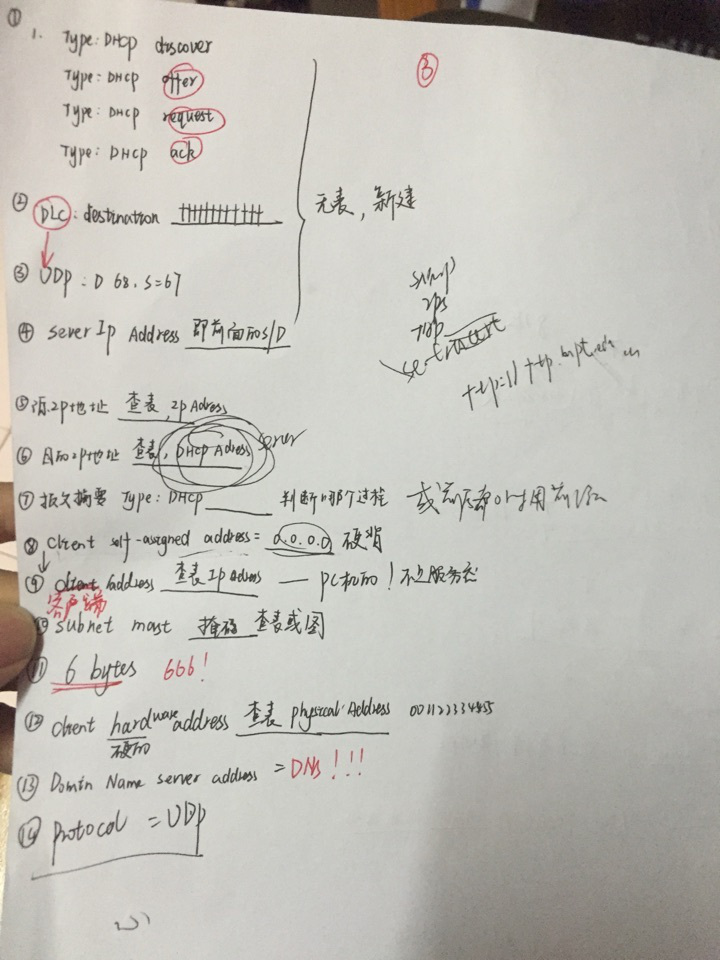
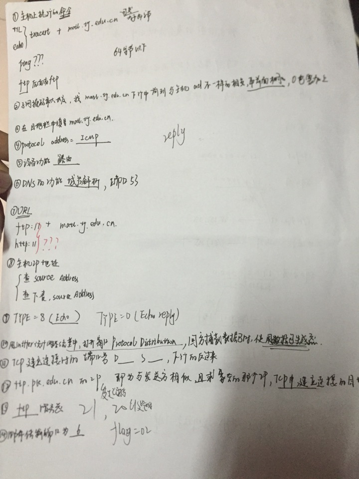
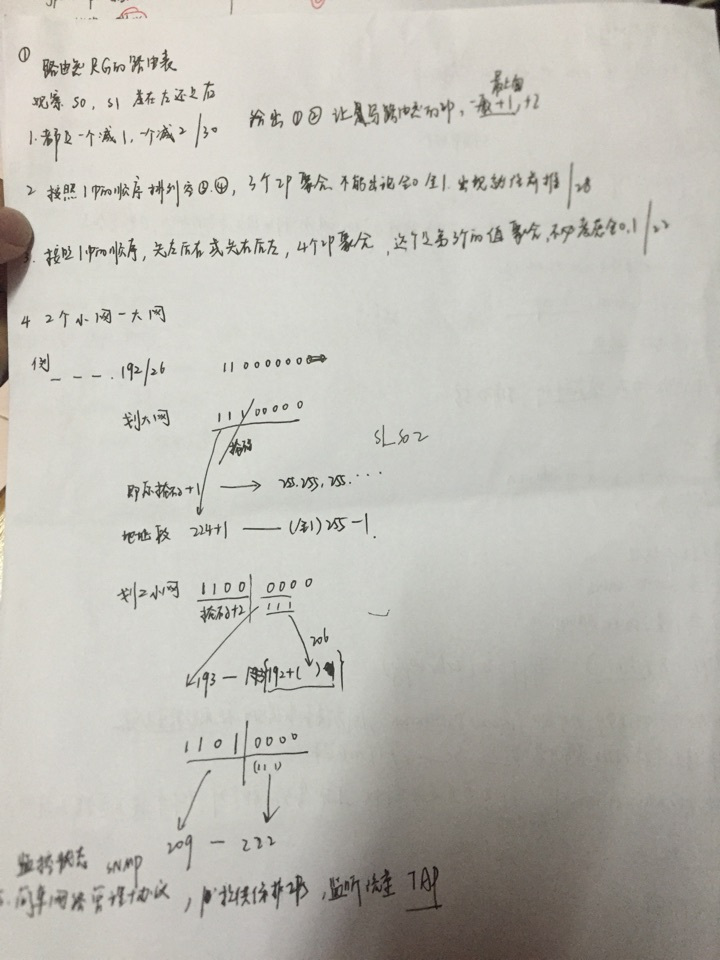

# 计算机网络三级

https://www.zhihu.com/question/22852816/answer/153480037

www.cnncre.com计算机等级考试网

https://www.zhihu.com/question/22852816/answer/153480037  良心学霸！！！看这个直呼问题差不多了
96ea5f9a.wiz03.com/share/s/2mWB-q0kLQ9B2ZqZt31C4U2z0nE7Tm03PAoR28IbN93qLZvQ

https://zhuanlan.zhihu.com/p/44627271  

E:\my_Gitbook\CS\20180821[三级网络技术考过指南.pdf](file:///E:/QQ_Files/20180821%E4%B8%89%E7%BA%A7%E7%BD%91%E7%BB%9C%E6%8A%80%E6%9C%AF%E8%80%83%E8%BF%87%E6%8C%87%E5%8D%97.pdf)

专攻题库。翻开题库，浏览一下前几份试卷，你会发现每套题目类型都一样，题目分布也一样。
不要去搞清楚为什么，不要去搞清楚为什么，不要去搞清楚为什么。重要的事情说三遍，因为这是浪费时间的行为。翻翻后面的题目，你会发现答案几乎就那几个，对，背下来。像研究数列一样背下来就可以了。最多二十分钟。

96ea5f9a.wiz03.com/share/s/2mWB-q0kLQ9B2ZqZt31C4U2z0nE7Tm03PAoR28IbN93qLZvQ超强笔记、

作者：long
链接：https://www.zhihu.com/question/22852816/answer/153480037
来源：知乎
著作权归作者所有。商业转载请联系作者获得授权，非商业转载请注明出处。

综合题1

给定了IP和子网掩码（还有一种是给主机号和第一个可用ip）求1.地址类别  A(0-127)B(128-192)C(193-224)这个记不住也可以算A类就是1000 0000B类1100 0000C类1110 0000转化为10进制就ok2.网络地址 将所给的ip和子网掩码转化01二进制对比，子网掩码对应的位数以后的全部置0，再转化为10进制即可得到。3.直接广播地址广播地址我的理解就是所有人都要知道，所以感觉很大，其实真的很大，就是把网络地址中置0的全变成1，一般形式为 . . .2554.主机号与网络地址相反的感觉，就是将子网掩码对应位数之前的置0，以后的不变，再转化为10进制即可。一般形式为0.0. .5.第一个（最后一个）可用ip地址第一个=网络地址+1  一般形式为 . . .1最后一个=广播地址-1  一般形式为 . . .254

综合题2

（后有配图总结感觉字太多看图）思路，这就是填空题，我把高频的填空整理了一下，不讲名称不讲原理，只有答案模版。1.带宽 bandwidth _____，10Gbps就是10000000（共8位，7个0）类推25Gbps等2.____ 32，这里填写crc，硬背！3.#pos____  ____，两种情况1.framing sdh    2.framing sonet4.#pos____,s1 s0 0/2 如果是sdh就是2，如果是sonet就是0（中间有空格注意）5.____area 0,如果有两个网络号，需要讲两个网络号聚合（交），聚合过后一般网络号还是第一个的，但是掩码数量变短了1。所以这里一般填写第一个网络号+掩码的反码（反码是变短1的反码）area 0_____,与上面一样的网络号+掩码！一般这个路由器是R3，它在一个一个校园网中，网中有一个或者两个ip加掩码个数6.缺省路由（默认路由），这个一般是校园网去访问Internet ，所以一般为r3#ip route ____ ____ ____，0.0.0.0 0.0.0.0 这个观察要去的internet路过的路由器的ip，一般和自己的差最后一位不一样7.静态路由，这个一般是r4去访问校园网。#ip route____ ____ ____,这个前两个空和5中第二个的答案一样，最后一个空加上路由器ip就行了。8.几个需要记着的命令或者说关键句。   no shutdown(打开端口)   async default IP address （配置异步串行接口命令）   router ospf （启动ospf进程）   lease 天 小时 分钟

综合题3

1.新建四个过程DHCP discover,DHCP offer,DHCP request,DHCP ack,(这些一般都小写，有些答案是大写)这里还有两种情况是续约和释放续约就是没有前两步，释放一般不会遇到

2.客户机 client ip地址，一种是有表（图）的，这个直接表中找IP address,没表的前面的代码中肯定会有 D目的地，S发送端，这个你看是什么过程判断是从客户机到服务器还是服务器到客户机

3.服务器ip，这个查询表中DHCP server，没表的话同上

4.client self-assigned address =答案1 0.0.0.0答案2 前面给的客户端ip，看题吧，如果前后都是0.0.0.0那么肯定不能还是0.0.0.0，如果前后有客户端ip那就填写客户端ip

5.Client hardware address 查询表中的physical address

6.新建过程中的ip源ip地址                          目的ip地址0.0.0.0                             255.255.255.255服务器ip                          255.255.255.2550.0.0.0                             255.255.255.255服务器ip                          255.255.255.255不难发现第一行第三行一样，第二行第四行一样

7.一些细节问题Protocol=UDPSubnet mast 掩码Domin name server address =DNS手打太累了～～～综合题4注：下列问题多次出现http://mail.tj.edu.cn，都是例子，具体看题目中发送的信息1.主机上执行的命令  tracert+http://mail.tj.edu.cn，出现关键词TTL，echo  ping+,这个很少，说的是小于64字节  ftp +，一般有个tcp三次握手，然后有ftp2.子网掩码最大长度找http://mail.tj.edu.cn下行中前列与发送端主机id不一样但是差不太多的那个，然后用这个id与发送端id进行2进制比较，找前面相同位3.URLftp://mail.tj.edu.cnhttp://目前遇到过这两个，有ftp就是第一行。4.DNS的功能—域名解析，端口53，硬背5.主机ip地址，两种情况1.直接看表第一行，source address下面第一个就是，如果没有，肯定会在下面那个表里有。6.protocol address=ICMP7.一些问题ftp端口21/20，一般都是21，21是发起连接邮件传输端口6TYPE=8（Echo)/=0(Echo reply)～～～～～～最后一题成绩出了再打吧，或者有空了，打字太累了。技巧，不要一套套的复习，很慢！很慢！很慢！分段复习，大题我看一道之后，将做后面的3套，感觉会了就不做了，感觉还是看到感觉陌生就往后继续。选择题也分段，我分成前10道，10-17道，25-40道这三段，中间配置问题果断放弃，很拖时间，不想看。基本上做每段都将后面的4-5套都看看，越看越熟悉，第一次看一定要克制住，会感觉太难了太多了，想退缩，退缩2天半就不稳了。

综合2

综合3

综合4

应用题

第一阶段：买书 自然是未来的书 下它家的软件 大概把书的知识体系过一遍 不必记住具体的 知道有那玩意儿就行第二阶段：先刷选择题 不是一套一套地刷 是在第一套做到某种题型 然后在其他套里面找这个类型的题目 做了几个一种类型的题目 总结原理 一般一套题二十个是可以总结出来的 考试时候基本就秒过去 还有十几个是碎的知识点 或者是那种英文命令第三阶段：单独刷大题 还是同一种类型一起做 不是一套一套地做 三级题库少 大题也就那么多 二进制这个练多了 看到192可以直接知道是1100 0000  224是1110 0000的那种 最后：拿新增题库练手(新增题库究极重要) 今天刚考完 遇到老题型的变化 就是新增里面的

作者：小柯
链接：https://www.zhihu.com/question/22852816/answer/349624434
来源：知乎
著作权归作者所有。商业转载请联系作者获得授权，非商业转载请注明出处。