# 树莓派学习网站
？？？？？？？？？？？？？？？？？？？改不会回来了？桌面远程控制用的账户pi密码pi而默认开启的账户密码不是这样子的，pi账户raspberry密码pi但是默认进入Root模式Su之后密码还是pi，raspberry？
https://www.zhihu.com/question/273507065/answer/545626651  低成本如何玩转树莓派?

[树莓派实验室](shumeipai.nxez.com)
很多都是在这儿学来的教程
https://www.jianshu.com/p/bdc25b4fce0d
[树莓派吧](shumeipaiba.com)
[十大树莓派博客]()
https://linux.cn/article-10188-1.html
[分享个树莓派入门与学习的好网站]()https://zhuanlan.zhihu.com/p/51970434
[树莓派中文站](http://www.52pi.net/archives/category/learn/new)

http://www.nrjs.cn/ctt/11130007.html

[长牙技术](https://zhuanlan.zhihu.com/p/34921928)
[内网穿透必须看这个免费的](https://www.ngrok.cc/)
https://www.ngrok.cc/_book/

raspberrywebserver.com
树莓派入门指南_@GeekFan极客范.pdf

树霉派论坛

爱极客论坛

极客范

cubieboard论坛

树霉派爱好者论坛

The MagPi（英文）

raspberrypicloud

e络盟互动社区

ickey社区

树霉派百度贴吧

这个很详细www.cnblogs.com/vamei/p/6224295.html
pi@raspberrypi:~ $ uname -m
armv7l
pi@raspberrypi:~ $ lscpu
Architecture:          armv7l
Byte Order:            Little Endian
CPU(s):                4
On-line CPU(s) list:   0-3
Thread(s) per core:    1
Core(s) per socket:    4
Socket(s):             1
Model:                 4
Model name:            ARMv7 Processor rev 4 (v7l)
CPU max MHz:           1400.0000
CPU min MHz:           600.0000
BogoMIPS:              38.40
Flags:                 half thumb fastmult vfp edsp neon vfpv3 tls vfpv4 idiva idivt vfpd32 lpae evtstrm crc32
pi@raspberrypi:~ $ sudo fdisk -l
Disk /dev/ram0: 4 MiB, 4194304 bytes, 8192 sectors
Units: sectors of 1 * 512 = 512 bytes
Sector size (logical/physical): 512 bytes / 4096 bytes
I/O size (minimum/optimal): 4096 bytes / 4096 bytes

Disk /dev/ram1: 4 MiB, 4194304 bytes, 8192 sectors
Units: sectors of 1 * 512 = 512 bytes
Sector size (logical/physical): 512 bytes / 4096 bytes
I/O size (minimum/optimal): 4096 bytes / 4096 bytes

Disk /dev/ram2: 4 MiB, 4194304 bytes, 8192 sectors
Units: sectors of 1 * 512 = 512 bytes
Sector size (logical/physical): 512 bytes / 4096 bytes
I/O size (minimum/optimal): 4096 bytes / 4096 bytes

Disk /dev/ram3: 4 MiB, 4194304 bytes, 8192 sectors
Units: sectors of 1 * 512 = 512 bytes
Sector size (logical/physical): 512 bytes / 4096 bytes
I/O size (minimum/optimal): 4096 bytes / 4096 bytes

Disk /dev/ram4: 4 MiB, 4194304 bytes, 8192 sectors
Units: sectors of 1 * 512 = 512 bytes
Sector size (logical/physical): 512 bytes / 4096 bytes
I/O size (minimum/optimal): 4096 bytes / 4096 bytes

Disk /dev/ram5: 4 MiB, 4194304 bytes, 8192 sectors
Units: sectors of 1 * 512 = 512 bytes
Sector size (logical/physical): 512 bytes / 4096 bytes
I/O size (minimum/optimal): 4096 bytes / 4096 bytes

Disk /dev/ram6: 4 MiB, 4194304 bytes, 8192 sectors
Units: sectors of 1 * 512 = 512 bytes
Sector size (logical/physical): 512 bytes / 4096 bytes
I/O size (minimum/optimal): 4096 bytes / 4096 bytes

Disk /dev/ram7: 4 MiB, 4194304 bytes, 8192 sectors
Units: sectors of 1 * 512 = 512 bytes
Sector size (logical/physical): 512 bytes / 4096 bytes
I/O size (minimum/optimal): 4096 bytes / 4096 bytes

Disk /dev/ram8: 4 MiB, 4194304 bytes, 8192 sectors
Units: sectors of 1 * 512 = 512 bytes
Sector size (logical/physical): 512 bytes / 4096 bytes
I/O size (minimum/optimal): 4096 bytes / 4096 bytes

Disk /dev/ram9: 4 MiB, 4194304 bytes, 8192 sectors
Units: sectors of 1 * 512 = 512 bytes
Sector size (logical/physical): 512 bytes / 4096 bytes
I/O size (minimum/optimal): 4096 bytes / 4096 bytes

Disk /dev/ram10: 4 MiB, 4194304 bytes, 8192 sectors
Units: sectors of 1 * 512 = 512 bytes
Sector size (logical/physical): 512 bytes / 4096 bytes
I/O size (minimum/optimal): 4096 bytes / 4096 bytes

Disk /dev/ram11: 4 MiB, 4194304 bytes, 8192 sectors
Units: sectors of 1 * 512 = 512 bytes
Sector size (logical/physical): 512 bytes / 4096 bytes
I/O size (minimum/optimal): 4096 bytes / 4096 bytes

Disk /dev/ram12: 4 MiB, 4194304 bytes, 8192 sectors
Units: sectors of 1 * 512 = 512 bytes
Sector size (logical/physical): 512 bytes / 4096 bytes
I/O size (minimum/optimal): 4096 bytes / 4096 bytes

Disk /dev/ram13: 4 MiB, 4194304 bytes, 8192 sectors
Units: sectors of 1 * 512 = 512 bytes
Sector size (logical/physical): 512 bytes / 4096 bytes
I/O size (minimum/optimal): 4096 bytes / 4096 bytes

Disk /dev/ram14: 4 MiB, 4194304 bytes, 8192 sectors
Units: sectors of 1 * 512 = 512 bytes
Sector size (logical/physical): 512 bytes / 4096 bytes
I/O size (minimum/optimal): 4096 bytes / 4096 bytes

Disk /dev/ram15: 4 MiB, 4194304 bytes, 8192 sectors
Units: sectors of 1 * 512 = 512 bytes
Sector size (logical/physical): 512 bytes / 4096 bytes
I/O size (minimum/optimal): 4096 bytes / 4096 bytes

Disk /dev/sda: 57.3 GiB, 61505273856 bytes, 120127488 sectors
Units: sectors of 1 * 512 = 512 bytes
Sector size (logical/physical): 512 bytes / 512 bytes
I/O size (minimum/optimal): 512 bytes / 512 bytes
Disklabel type: dos
Disk identifier: 0xe6656ab6

Device     Boot    Start       End   Sectors  Size Id Type
/dev/sda1       15523840 120118004 104594165 49.9G  b W95 FAT32
/dev/sda2          98304  15523839  15425536  7.4G 83 Linux

Partition table entries are not in disk order.
pi@raspberrypi:~ $ uname -a
Linux raspberrypi 4.14.79-v7+ #1159 SMP Sun Nov 4 17:50:20 GMT 2018 armv7l GNU/Linux内核发布时间
pi@raspberrypi:~ $ ifconfig其中eth0代表了以太网接口，wlan0代表了Wifi接口。而lo是虚拟出来的本地接口，用来表示本机。在连接上网的接口中，我们可以看到该接口的IP地址等信息。例如说wlan0的IP地址是192.168.0.108。由于我没有插网线，所以eth0并没有IP地址。
eth0: flags=4099<UP,BROADCAST,MULTICAST>  mtu 1500
        ether b8:27:eb:29:05:b4  txqueuelen 1000  (Ethernet)
        RX packets 0  bytes 0 (0.0 B)
        RX errors 0  dropped 0  overruns 0  frame 0
        TX packets 0  bytes 0 (0.0 B)
        TX errors 0  dropped 0 overruns 0  carrier 0  collisions 0

lo: flags=73<UP,LOOPBACK,RUNNING>  mtu 65536
        inet 127.0.0.1  netmask 255.0.0.0
        inet6 ::1  prefixlen 128  scopeid 0x10<host>
        loop  txqueuelen 1000  (Local Loopback)
        RX packets 120  bytes 28968 (28.2 KiB)
        RX errors 0  dropped 0  overruns 0  frame 0
        TX packets 120  bytes 28968 (28.2 KiB)
        TX errors 0  dropped 0 overruns 0  carrier 0  collisions 0

wlan0: flags=4163<UP,BROADCAST,RUNNING,MULTICAST>  mtu 1500
        inet 192.168.1.103  netmask 255.255.255.0  broadcast 192.168.1.255
        inet6 fe80::ccc3:3697:5565:f279  prefixlen 64  scopeid 0x20<link>
        ether b8:27:eb:7c:50:e1  txqueuelen 1000  (Ethernet)
        RX packets 5939  bytes 775456 (757.2 KiB)
        RX errors 0  dropped 0  overruns 0  frame 0
        TX packets 14015  bytes 18055804 (17.2 MiB)
        TX errors 0  dropped 0 overruns 0  carrier 0  collisions 0

# 树莓派特有的命令
pi@raspberrypi:~ $ vcgencmd measure_temp温度
temp=52.1'C
pi@raspberrypi:~ $ vcgencmd measure_volts core电压
volt=1.3563V
pi@raspberrypi:~ $

[ vcgencmd命令更多用法 ](https://elinux.org/RPI_vcgencmd_usage)

pi@raspberrypi:~ $ ln -s /home/pi/www/http/html  ~/Desktop快捷方式

作者：RPi521
链接：https://www.zhihu.com/question/288356105/answer/485244999
来源：知乎
著作权归作者所有。商业转载请联系作者获得授权，非商业转载请注明出处。

1、初级应用 - 使用 Raspberry Pi 来了解计算机 Linux 的相关操作，比如：远程登录到你的 Raspberry Pi 并对系统进行配置使用树莓派作为一个音乐播放器、视频播放器使用 Raspberry Pi 及显示器搭建一个小型的学习机学习 Scratch 编程结合现在同样主流的开源硬件 Arduino 来使用
2、进阶应用 - 连接外部传感器件、学习 Python 语言连接摄像头模块，在 Raspberry Pi 上进行拍照、录像，做成一个属于自己的摄像机连接超声波模块，给 Raspberry Pi 增加距离测量的功能连接环境相关传感器，例如温度、湿度、MQ2等，使用 Raspberry Pi 来探测室内环境使用 Raspberry Pi 来控制小车的运动，还可以连接将树莓派连接到网络，实现无线控制小车的运动
3、高级应用 - 可以在 Raspberry Pi 上搭建各种服务，比如：个人网站，放些好玩的东西，也蛮有意思的，更新起来也不需要FTP，直接拷贝就可以了。服务器上还可以搭建一个家庭相册，使用局域网，那样速度可以很快。Git 服务器，用来存放一些代码，比如有些代码不想放在 github 上的，可以放在这里BT 下载机(transmission)，可以远程操作，随时随地的下载。AirPlay 服务，可以把苹果设备的音乐无线投放到树莓派上的音箱，用的是 ShairPort私有云服务ownCloud，可以在任何地方，包括用手机，上传下载文件，同步日历等，这个服务比较慢。定时闹钟，整点会报时，用Cronjob设置，也可以添加传感器，将当前的温度，PM2.5指数都报出来。语音信箱，发送邮件到一个指定的邮箱，邮件的内容就会被转换成语音，从树莓派的音箱播放出来。GoAgent代理服务，家里所有的设备都可以通过它翻墙（设置proxy.pac）。Twitter机器人，每天定时把当地的天气情况发送到twitter。网站资源下载器，比如文章、图片。可以写一些脚本去解析你常去的网站论坛，自动下载图片：汽车、风景、人文、等等。用SQLite，保存文件的MD5，小文件，重复文件自动删除。程序中把User Agent设置为知名浏览器，比如Chrome， IE等，否则可能会被拒绝下载。一组Yeelink的脚本，用来同步Pi的性能指标（比如CPU利用率等）到云端，用于在手机上显示。并且还可以用手机去控制Pi上面跑的程序。

Raspberry Pi 特色1、Raspberry Pi配备 ARM 主芯片，以SD卡为内存硬盘，主板只有卡片大小，低功耗，同时含有 USB 接口、网络接口、摄像头接口、GPIO 接口，扩展非常便捷。2、视频输出方面有模拟信号的电视输出接口和HDMI高清视频输出接口，可配合大部分显示器使用3、Raspberry Pi 应用例程开源，用户可以在 Raspberry Pi 官网查找到很多有趣的应用4、可以做 Linux 系统计算机所能做的事情，但是功耗、体积都较它要小的多！

有道理，跟着各种博客无脑做是学不到东西的，重点还是要要输出，还是要思考！还是要有个人的想法！
不错。不要急于实现某个功能，学生时期还是关注原理为上。
树莓派就是个linux主机，把它当做低配版云服务器好了，先把云服务器玩熟，云服务器可以做什么，树莓派基本也可以做什么，不用刻意去学树莓派

# 树莓派开机调试
219.136.44.179广域网
局域网192.168.1.105
SSH公网下远程树莓派Raspberry Pi的SSH/WOL/监控/桌面的实现
2017年11月10日 19:36:18 Leather_Wang 阅读数：1546https://blog.csdn.net/hzwwpgmwy/article/details/78502746

https://jingyan.baidu.com/article/f0e83a2567a3ef22e59101shumeipai.nxez.comf4.html装机，虽然我用不上，基本就是讨回来怎么装怎么来瞎式
树莓派快速入门（官方杂志翻译）https://www.jianshu.com/p/5336ceba894b

[Arduino、arm、树莓派、单片机四者有什么不同？](https://www.zhihu.com/question/21045562/answer/36673069)
      sudo apt-get update 更新源
　　sudo apt-get upgrade 更新已安装的包
sudo apt autoremove自动卸载不需要的安装包
sudo apt-get dist-upgrade 升级系统
会自动断电续存的安装包程序，很暖很贴心
sudo apt autoremove'来卸载它(它们)。
连接显示器，在Terminal里面输入
$hostname -I
就可以看到树莓派的ip地址。

树莓派ip:
192.168.1.105\

pi@raspberrypi:~ $6关机

为防止文件丢失，请按下面的步骤关闭电源。
- 登录putty的ssh终端
- pi@raspberrypi:~ $ sudo shutdown -h now
- 等待电源指示灯熄灭后，关闭电源
https://linux.cn/article-3056-2.html
pi@raspberrypi:~ $ sudo ifconfig查询IP
eth0: flags=4099<UP,BROADCAST,MULTICAST>  mtu 1500
        ether b8:27:eb:29:05:b4  txqueuelen 1000  (Ethernet)
        RX packets 0  bytes 0 (0.0 B)
        RX errors 0  dropped 0  overruns 0  frame 0
        TX packets 0  bytes 0 (0.0 B)
        TX errors 0  dropped 0 overruns 0  carrier 0  collisions 0

lo: flags=73<UP,LOOPBACK,RUNNING>  mtu 65536
        inet 127.0.0.1  netmask 255.0.0.0
        inet6 ::1  prefixlen 128  scopeid 0x10<host>
        loop  txqueuelen 1000  (Local Loopback)
        RX packets 94  bytes 14904 (14.5 KiB)
        RX errors 0  dropped 0  overruns 0  frame 0
        TX packets 94  bytes 14904 (14.5 KiB)
        TX errors 0  dropped 0 overruns 0  carrier 0  collisions 0

wlan0: flags=4163<UP,BROADCAST,RUNNING,MULTICAST>  mtu 1500
        inet 192.168.1.105  netmask 255.255.255.0  broadcast 192.168.1.255
        inet6 fe80::ccc3:3697:5565:f279  prefixlen 64  scopeid 0x20<link>
        ether b8:27:eb:7c:50:e1  txqueuelen 1000  (Ethernet)
        RX packets 33285  bytes 16995508 (16.2 MiB)
        RX errors 0  dropped 0  overruns 0  frame 0
        TX packets 47337  bytes 41474891 (39.5 MiB)
        TX errors 0  dropped 0 overruns 0  carrier 0  collisions 0
pi@raspberrypi:~ $ netstat -nr
Kernel IP routing table
Destination     Gateway         Genmask         Flags   MSS Window  irtt Iface
0.0.0.0         192.168.1.1     0.0.0.0         UG        0 0          0 wlan0
192.168.1.0     0.0.0.0         255.255.255.0   U         0 0          0 wlan0
https://linux.cn/article-3056-2.html按照这里的交换曾安装了之后出现这个不会选，死马当活马医

这之后和教程不一样，还要设置账户pi密码raspberry

dpkg-reconfigure ddclient这个命令可以重新调出来设置命令，出来上卖弄的设置框，就是不太会选

如上输入程序的名称就可以运行了。当你的树莓派开着的时候就会持续运行了。如果你重启树莓派，键入 “ddclient”就会重新开始运行了。

daemon=600
#check every 600 seconds
教程手的这个居然真的没有，完全没有这个文件，命令写好只会新建这么个文件？

用putty登陆之后的代码
login as: pi用户名
pi@192.168.1.105's password:         raspberry密码

Linux raspberrypi 4.14.50-v7+ #1122 SMP Tue Jun 19 12:26:26 BST 2018 armv7l
The programs included with the Debian GNU/Linux system are free software;
the exact distribution terms for each program are described in the
individual files in /usr/share/doc/*/copyright.
Debian GNU/Linux comes with ABSOLUTELY NO WARRANTY, to the extent
permitted by applicable law.
Last login: Thu Dec 27 16:35:52 2018
SSH is enabled and the default password for the 'pi' user has not been changed.
This is a security risk - please login as the 'pi' user and type 'passwd' to set a new password.

pi@raspberrypi:~ $ ls显示列出来都有什么鬼玩意儿文件
Desktop    Downloads  Music     Public        Templates
Documents  MagPi      Pictures  python_games  Videos
pi@raspberrypi:~ $ iwconfig查看网卡
eth0      no wireless extensions.

lo        no wireless extensions.

wlan0     IEEE 802.11  ESSID:"\xE4\xB8\x80\xE6\xA0\xB9\xE8\x97\xA4\xE4\xB8\x8A\x                                                                                                             E4\xBA\x94\xE4\xB8\xAA\xE7\x93\x9C"
          Mode:Managed  Frequency:2.412 GHz  Access Point: B8:F8:83:56:9D:C0
          Bit Rate=150 Mb/s   Tx-Power=31 dBm
          Retry short limit:7   RTS thr:off   Fragment thr:off
          Power Management:on
          Link Quality=66/70  Signal level=-44 dBm
          Rx invalid nwid:0  Rx invalid crypt:0  Rx invalid frag:0
          Tx excessive retries:10  Invalid misc:0   Missed beacon:0
　apt-cache search package 搜索包
　　apt-cache show package 获取包的相关信息，如说明、大小、版本等
　　sudo apt-get install package 安装包
　　sudo apt-get install package - - reinstall 重新安装包
　　sudo apt-get -f install 修复安装"-f = ——fix-missing"
　　sudo apt-get remove package 删除包
　　sudo apt-get remove package - - purge 删除包，包括删除配置文件等
　　sudo apt-get update 更新源
　　sudo apt-get upgrade 更新已安装的包
　　sudo apt-get dist-upgrade 升级系统
　　sudo apt-get dselect-upgrade 使用 dselect 升级
　　apt-cache depends package 了解使用依赖
　　apt-cache rdepends package 是查看该包被哪些包依赖
　　sudo apt-get build-dep package 安装相关的编译环境
　　apt-get source package 下载该包的源代码
　　sudo apt-get clean && sudo apt-get autoclean 清理无用的包
　　sudo apt-get check 检查是否有损坏的依赖 
--------------------- 
作者：YYCaptain 
来源：CSDN 
原文：https://blog.csdn.net/makenothing/article/details/23686141 
版权声明：本文为博主原创文章，转载请附上博文链接！

**apt-get突然中断不会用编译器然后然后突然中断，无法获得锁问题
在用sudo apt-get install kmymoney2安装软件kmymoney2时，由于速度太慢，想换个软件源，直接关闭了终端，apt－get但进程没有结束，结果终端提示
：“E: 无法获得锁 /var/lib/dpkg/lock - open (11: 资源暂时不可用)
E: 无法锁定管理目录(/var/lib/dpkg/)，是否有其他进程正占用它？”
解决办法如下：1。终端输入 ps  -aux ，列出进程。找到含有apt‘-get的进程，直接sudo kill PID。解决。
2。强制解锁,命令
sudo rm /var/cache/apt/archives/lock
sudo rm /var/lib/dpkg/lock
**查看树莓派版本linux**https://blog.csdn.net/zhuying_linux/article/details/6859286

pi@raspberrypi:~ $  cat /proc/version
Linux version 4.14.50-v7+ (dc4@dc4-XPS13-9333) (gcc version 4.9.3 (crosstool-NG crosstool-ng-1.22.0-88-g8460611)) #1122 SMP Tue Jun 19 12:26:26 BST 2018

pi@raspberrypi:~ $ uname -r
4.14.50-v7+
pi@raspberrypi:~ $ uname -a
Linux raspberrypi 4.14.50-v7+ #1122 SMP Tue Jun 19 12:26:26 BST 2018 armv7l GNU/Linux

pi@raspberrypi:~ $ lsb_release -a
No LSB modules are available.
Distributor ID: Raspbian
Description:    Raspbian GNU/Linux 9.4 (stretch)
Release:        9.4
Codename:       stretch

#安装PIXEL桌面
- sudo apt-get update
sudo apt-get install xorg
sudo apt-get install lxde openbox
sudo apt-get install pix-icons pix-plym-splash pixel-wallpaper
sudo apt-get install raspberrypi-ui-mods
sudo reboot
--------------------- 
作者：Chenger_ 
来源：CSDN 
原文：https://blog.csdn.net/Chenger_32123/article/details/81331999 
版权声明：本文为博主原创文章，转载请附上博文链接！
#安装Web服务器
[ubuntu下安装apache、php、mysql、phpmyadmin](http://blog.lxx1.com/807)
当打开
'' sudo raspi-config''
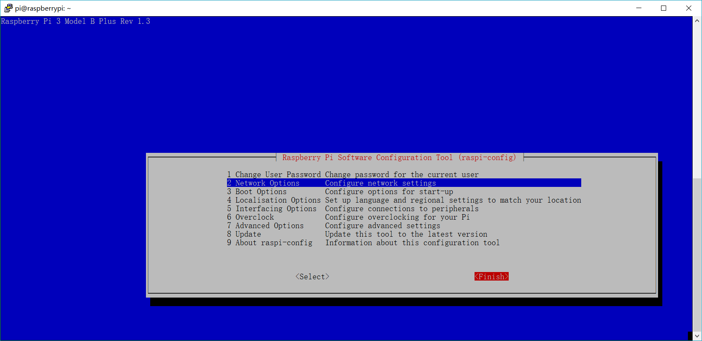
然后选择开机重启自动动画页面GUI_desktop

[这里的四种链接方式]（https://blog.csdn.net/wuli_dear_wang/article/details/84446168）
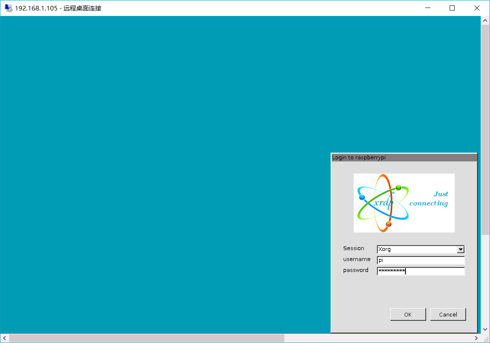
sudo apt-get install xrdp这是最好的最最最方便得设置方法

可以说是很强悍，300+买到一台很强的Linux额外的计算机，同时还能用上正常多点人使用更加方便和别人交流沟通的计算机，很值！

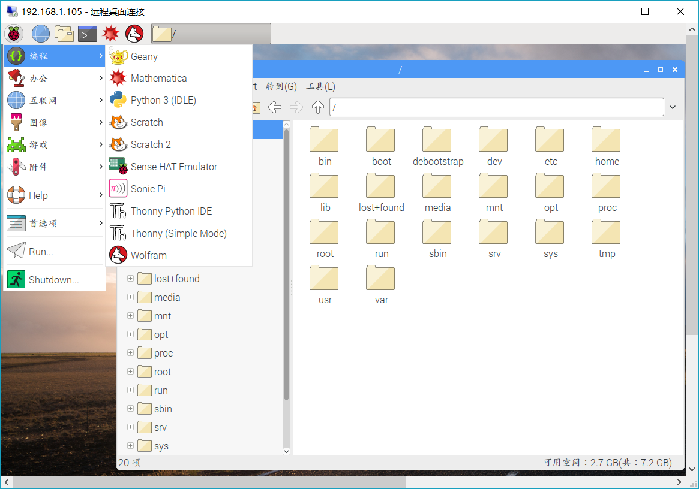

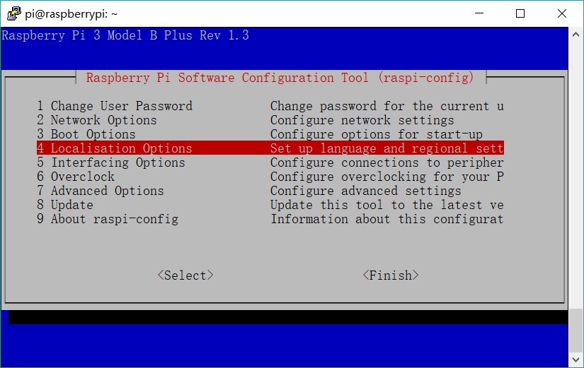

[在这里设计中文等等]（https://blog.csdn.net/A_lPha/article/details/53116767）

[为什么安装Linux发行版选择地理位置上，大陆有重庆和上海，而不是成都、北京、广州等地？]（https://www.zhihu.com/question/21874548）
有趣的又来时区历史遗留问题
作者：Steven Wang
链接：https://www.zhihu.com/question/278932712/answer/403855082
来源：知乎
著作权归作者所有。商业转载请联系作者获得授权，非商业转载请注明出处。

重庆是因为陇蜀时区的原因。中国幅员辽阔，曾划分为5个时区，每个时区/国家组合一般在计算机里都有一个代表城市。当年的陇蜀时区里影响力最大的城市就是重庆了吧。同样中原时区的代表就是上海了。而且陇蜀时区影响力本来就不亚于中原标准时，在抗战时还一度成为全国统一时区。而db/timezone里的时区要考虑历史时区（比如编译时区时加入了backzone信息）。如果你的时区信息里包含backzone（1970年以前），那么你选重庆时间和上海时间，表面看好像没区别。 2018/01/01 00:00（重庆）和2018/01/01 00:00（上海）转成epoch是一样的，但是你要换成1945/01/01 00:00（重庆）和1945/01/01 00:00（上海）转成epoch就是不一样的了。所以重庆和上海从历史时区的角度看其实是不一样的两个时区。===============================具体的db/timezone资料可以看：List of tz database time zones（注，表格里只标明1970年以后的信息）。历史时区看http://www.iana.org/time-zones/repository/releases/tzdata2017c.tar.gz的backzone文件。这里考虑的是历史时区，即：使用相同的时间设置例：重庆和上海历史上曾经分属不同的时区，所以算不同的历史时区。例：北京和上海历史上一直属于同一时区，所以算同一个历史时区在同一个历史时区内，可以自由地前后调整时间而不用担心时间调整到某个时间点之后时区分裂成多个。https://www.zhihu.com/question/278932712
tz database 中的中国大陆地区划分为五个区域，分别是：Asia/ChongqingAsia/HarbinAsia/KashgarAsia/ShanghaiAsia/Urumqi这五个时区的时间均为中国标准时间（北京时间，UTC+8）。这五个时区来自于曾经的中国时区，是在 1918 年由民国政府划分的：中原（标准）时区：GMT+8陇蜀时区：GMT+7回藏时区（后改为「新藏时区」）：GMT+6昆仑时区：GMT+5:30长白时区：GMT+8:30

作者：peisen
链接：https://www.zhihu.com/question/21874548/answer/34613450
来源：知乎
著作权归作者所有。商业转载请联系作者获得授权，非商业转载请注明出处。
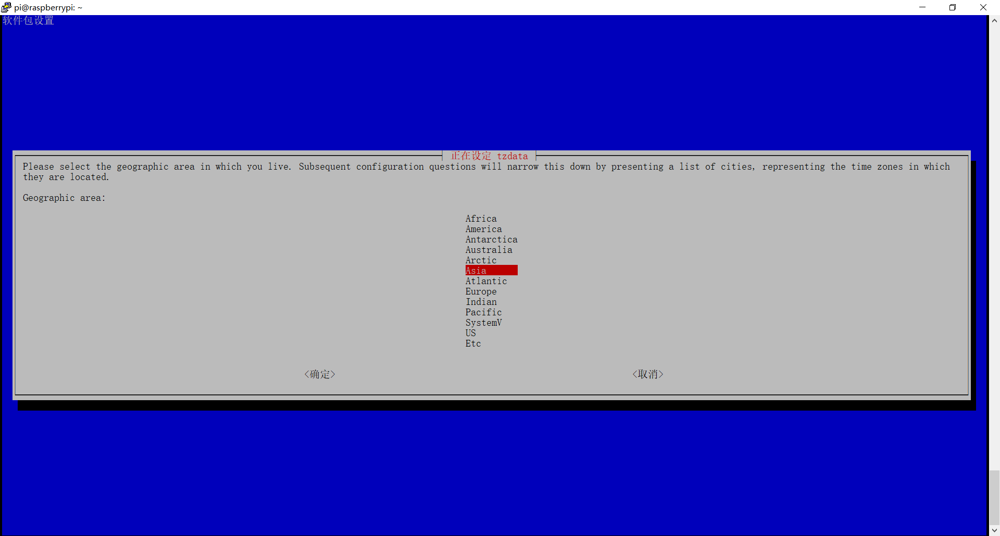
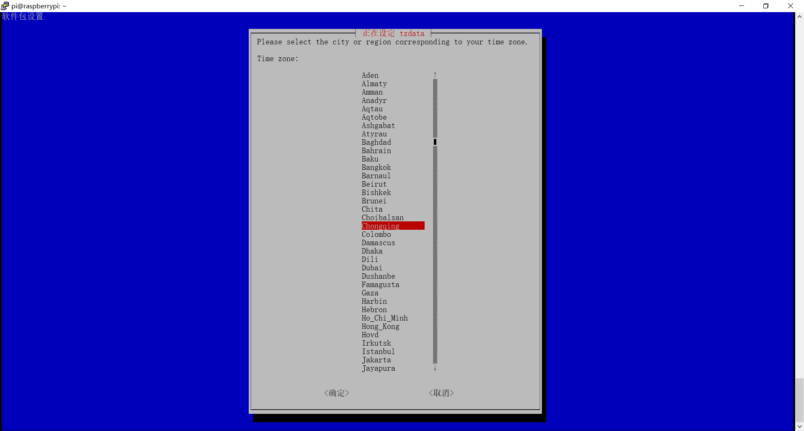
login as: pi
pi@192.168.1.105's password:
Linux raspberrypi 4.14.50-v7+ #1122 SMP Tue Jun 19 12:26:26 BST 2018 armv7l

The programs included with the Debian GNU/Linux system are free software;
the exact distribution terms for each program are described in the
individual files in /usr/share/doc/*/copyright.

Debian GNU/Linux comes with ABSOLUTELY NO WARRANTY, to the extent
permitted by applicable law.
Last login: Fri Jan 25 15:33:13 2019

SSH is enabled and the default password for the 'pi' user has not been changed.
This is a security risk - please login as the 'pi' user and type 'passwd' to set                                                                                                              a new password.

pi@raspberrypi:~ $ sudo apt-get install openbsd-inetd

pi@raspberrypi:~ $ sudo /etc/init.d/openbsd-inetd restart

[ ok ] Restarting openbsd-inetd (via systemctl): openbsd-inetd.service.
pi@raspberrypi:~ $ netstat -a | grep telnet
tcp        0      0 0.0.0.0:telnet          0.0.0.0:*               LISTEN

pi@raspberrypi:~ $ sudo nano /etc/apt/sources.list

pi@raspberrypi:~ $ sudo dpkg-reconfigure locales
Generating locales (this might take a while)...
  zh_CN.UTF-8... done
Generation complete.
pi@raspberrypi:~ $ sudo apt-get install scim-pinyin
正在读取软件包列表... 完成
正在分析软件包的依赖关系树
正在读取状态信息... 完成
scim-pinyin 已经是最新版 (0.5.92-3+b1)。
升级了 0 个软件包，新安装了 0 个软件包，要卸载 0 个软件包，有 175 个软件包未被升级。
pi@raspberrypi:~ $ sudo dpkg-reconfigure tzdata

Current default time zone: 'Asia/Chongqing'
Local time is now:      Fri Jan 25 18:20:30 CST 2019.
Universal Time is now:  Fri Jan 25 10:20:30 UTC 2019.
Current default time zone: 'Asia/Chongqing'
Local time is now:      Fri Jan 25 18:20:30 CST 2019.
Universal Time is now:  Fri Jan 25 10:20:30 UTC 2019.

pi@raspberrypi:~ $ sudo ntpd -s-d
sudo: ntpd：找不到命令
pi@raspberrypi:~ $ date
2019年 01月 25日 星期五 18:22:22 CST
pi@raspberrypi:~ $ sudo dpkg-reconfigure tzdata

#####选择好时区

Current default time zone: 'Asia/Hong_Kong'
Local time is now:      Fri Jan 25 18:24:17 HKT 2019.
Universal Time is now:  Fri Jan 25 10:24:17 UTC 2019.

pi@raspberrypi:~ $ date
2019年 01月 25日 星期五 18:24:20 HKT

[超级用户]（http://outofmemory.cn/code-snippet/2897/shumeipai）
pi@raspberrypi:~ $ sudo passwd root
输入新的 UNIX 密码：
重新输入新的 UNIX 密码：
passwd：已成功更新密码
pi@raspberrypi:~ $ sudo passwd --unlock root
passwd：密码过期信息已更改。
pi@raspberrypi:~ $ su
密码：
root@raspberrypi:/home/pi# exit
exit

[树莓派上QQ微信的解决办法------出错装不上
！](https://www.lulinux.com/archives/1319)
https://github.com/wszqkzqk/deepin-wine-ubuntu

pi@raspberrypi:~ $ cd /home/pi/Downloads
pi@raspberrypi:~/Downloads $ sudo dpkg -i deepin.com.wechat_2.6.2.31deepin0_i386.deb
正在选中未选择的软件包 deepin.com.wechat:i386。
(正在读取数据库 ... 系统当前共安装有 119422 个文件和目录。)
正准备解包 deepin.com.wechat_2.6.2.31deepin0_i386.deb  ...
正在解包 deepin.com.wechat:i386 (2.6.2.31deepin0) ...
dpkg: 依赖关系问题使得 deepin.com.wechat:i386 的配置工作不能继续：
 deepin.com.wechat:i386 依赖于 deepin-wine (>= 1.9-11).
 deepin.com.wechat:i386 依赖于 deepin-wine32.
 deepin.com.wechat:i386 依赖于 deepin-wine32-preloader.
 deepin.com.wechat:i386 依赖于 deepin-wine-helper (>= 1.1deepin3).
 deepin.com.wechat:i386 依赖于 fonts-noto-cjk.

dpkg: 处理软件包 deepin.com.wechat:i386 (--install)时出错：
 依赖关系问题 - 仍未被配置
正在处理用于 gnome-menus (3.13.3-9) 的触发器 ...
正在处理用于 desktop-file-utils (0.23-1) 的触发器 ...
正在处理用于 mime-support (3.60) 的触发器 ...
正在处理用于 hicolor-icon-theme (0.15-1) 的触发器 ...
在处理时有错误发生：
 deepin.com.wechat:i386
pi@raspberrypi:~/Downloads $ sudo dpkg -i *.deb
正在选中未选择的软件包 deepin.com.baidu.pan:i386。
(正在读取数据库 ... 系统当前共安装有 119433 个文件和目录。)
正准备解包 deepin.com.baidu.pan_5.7.3deepin0_i386.deb  ...
正在解包 deepin.com.baidu.pan:i386 (5.7.3deepin0) ...
正准备解包 deepin.com.wechat_2.6.2.31deepin0_i386.deb  ...
正在将 deepin.com.wechat:i386 (2.6.2.31deepin0) 解包到 (2.6.2.31deepin0) 上 ...
dpkg: 依赖关系问题使得 deepin.com.baidu.pan:i386 的配置工作不能继续：
 deepin.com.baidu.pan:i386 依赖于 deepin-wine (>= 2.18-0).
 deepin.com.baidu.pan:i386 依赖于 deepin-wine32.
 deepin.com.baidu.pan:i386 依赖于 deepin-wine32-preloader.
 deepin.com.baidu.pan:i386 依赖于 deepin-wine-helper (>= 1.2deepin0).

dpkg: 处理软件包 deepin.com.baidu.pan:i386 (--install)时出错：
 依赖关系问题 - 仍未被配置
dpkg: 依赖关系问题使得 deepin.com.wechat:i386 的配置工作不能继续：
 deepin.com.wechat:i386 依赖于 deepin-wine (>= 1.9-11).
 deepin.com.wechat:i386 依赖于 deepin-wine32.
 deepin.com.wechat:i386 依赖于 deepin-wine32-preloader.
 deepin.com.wechat:i386 依赖于 deepin-wine-helper (>= 1.1deepin3).
 deepin.com.wechat:i386 依赖于 fonts-noto-cjk.

dpkg: 处理软件包 deepin.com.wechat:i386 (--install)时出错：
 依赖关系问题 - 仍未被配置
正在处理用于 gnome-menus (3.13.3-9) 的触发器 ...
正在处理用于 desktop-file-utils (0.23-1) 的触发器 ...
正在处理用于 mime-support (3.60) 的触发器 ...
正在处理用于 hicolor-icon-theme (0.15-1) 的触发器 ...
在处理时有错误发生：
 deepin.com.baidu.pan:i386
 deepin.com.wechat:i386

# 游戏Pygames开发指南（网上都有敬请期待）&Scratch2开发指南&Minecraft树莓派版本（不感兴趣不提）

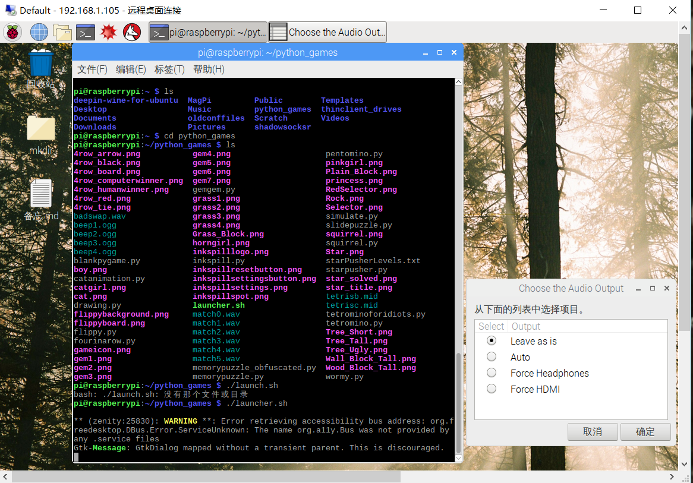

[Making Games with Python & Pygame游戏网站在线教程和图书预览学习在线工具或者下载工具](http://inventwithpython.com/pygame/)

**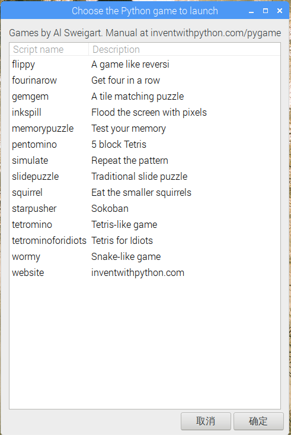**

**问题在这儿**
正在读取软件包列表... 完成
正在分析软件包的依赖关系树       
正在读取状态信息... 完成       
您也许需要运行“apt --fix-broken install”来修正上面的错误。
下列软件包有未满足的依赖关系：
 deepin.com.baidu.pan:i386 : 依赖: deepin-wine:i386 (>= 2.18-0) 但无法安装它
                             依赖: deepin-wine32:i386 但无法安装它
                             依赖: deepin-wine32-preloader:i386 但无法安装它
                             依赖: deepin-wine-helper:i386 (>= 1.2deepin0) 但无法安装它
 deepin.com.wechat:i386 : 依赖: deepin-wine:i386 (>= 1.9-11) 但无法安装它
                          依赖: deepin-wine32:i386 但无法安装它
                          依赖: deepin-wine32-preloader:i386 但无法安装它
                          依赖: deepin-wine-helper:i386 (>= 1.1deepin3) 但无法安装它
                          依赖: fonts-noto-cjk:i386
 gdebi : 依赖: gdebi-core (= 0.9.5.7+nmu1) 但是它将不会被安装
         依赖: gir1.2-vte-2.91 但是它将不会被安装
         推荐: libgtk2-perl 但是它将不会被安装
         推荐: lintian 但是它将不会被安装
E: 有未能满足的依赖关系。请尝试不指明软件包的名字来运行“apt --fix-broken install”(也可以指定一个解决办法)。

# 网页版微信加[百度云盘python]（https://www.douban.com/group/topic/48589513/）
**由于百度PCS API权限限制，程序只能存取百度云端/apps/bypy目录下面的文件和目录。**
https://github.com/houtianze/bypy仓库位置
教程
作为独立程序: 运行 bypy (或者python -m bypy，或者python3 -m bypy）

可以看到命令行支持的全部命令和参数。

作为一个包，在代码中使用: import bypy

简单的图形界面： 运行 bypygui

基本操作
显示使用帮助和所有命令（英文）:

bypy
第一次运行时需要授权，只需跑任何一个命令（比如 bypy info）然后跟着说明（登陆等）来授权即可。授权只需一次，一旦成功，以后不会再出现授权提示.

更详细的了解某一个命令：

bypy help <command>
显示在云盘（程序的）根目录下文件列表：

bypy list
把当前目录同步到云盘：

bypy syncup
or

bypy upload
把云盘内容同步到本地来：

bypy syncdown
or

bypy downdir /
比较本地当前目录和云盘（程序的）根目录（个人认为非常有用）：

bypy compare
更多命令和详细解释请见运行bypy的输出。

调试
运行时添加-v参数，会显示进度详情。
运行时添加-d，会显示一些调试信息。
运行时添加-ddd，还会会显示HTTP通讯信息（警告：非常多）

直接在Python程序中调用
from bypy import ByPy
bp=ByPy()
bp.list() # or whatever instance methods of ByPy class

成功安装为何用不了？
pi@raspberrypi:~ $ pip install bypy
Collecting bypy
  Downloading https://files.pythonhosted.org/packages/c9/c1/3b04879fba0311493a41c1cdd3cd46aa53a6b83d2f92efb4b16e999e2ff4/bypy-1.6.4-py2.py3-none-any.whl (239kB)
    100% |████████████████████████████████| 245kB 20kB/s 
Collecting requests>=2.10.0 (from bypy)
  Downloading https://files.pythonhosted.org/packages/7d/e3/20f3d364d6c8e5d2353c72a67778eb189176f08e873c9900e10c0287b84b/requests-2.21.0-py2.py3-none-any.whl (57kB)
    100% |████████████████████████████████| 61kB 14kB/s 
Collecting requests-toolbelt>=0.8.0 (from bypy)
  Downloading https://files.pythonhosted.org/packages/97/8a/d710f792d6f6ecc089c5e55b66e66c3f2f35516a1ede5a8f54c13350ffb0/requests_toolbelt-0.8.0-py2.py3-none-any.whl (54kB)
    100% |████████████████████████████████| 61kB 15kB/s 
Collecting multiprocess>=0.70.0 (from bypy)
  Downloading https://files.pythonhosted.org/packages/31/60/6d74caa02b54ca43092e745640c7d98f367f07160441682a01602ce00bc5/multiprocess-0.70.7.tar.gz (1.4MB)
    100% |████████████████████████████████| 1.4MB 13kB/s 
Collecting urllib3<1.25,>=1.21.1 (from requests>=2.10.0->bypy)
  Downloading https://files.pythonhosted.org/packages/62/00/ee1d7de624db8ba7090d1226aebefab96a2c71cd5cfa7629d6ad3f61b79e/urllib3-1.24.1-py2.py3-none-any.whl (118kB)
    100% |████████████████████████████████| 122kB 17kB/s 
Collecting idna<2.9,>=2.5 (from requests>=2.10.0->bypy)
  Downloading https://files.pythonhosted.org/packages/14/2c/cd551d81dbe15200be1cf41cd03869a46fe7226e7450af7a6545bfc474c9/idna-2.8-py2.py3-none-any.whl (58kB)
    100% |████████████████████████████████| 61kB 18kB/s 
Collecting chardet<3.1.0,>=3.0.2 (from requests>=2.10.0->bypy)
  Downloading https://files.pythonhosted.org/packages/bc/a9/01ffebfb562e4274b6487b4bb1ddec7ca55ec7510b22e4c51f14098443b8/chardet-3.0.4-py2.py3-none-any.whl (133kB)
    100% |████████████████████████████████| 143kB 14kB/s 
Collecting certifi>=2017.4.17 (from requests>=2.10.0->bypy)
  Downloading https://files.pythonhosted.org/packages/9f/e0/accfc1b56b57e9750eba272e24c4dddeac86852c2bebd1236674d7887e8a/certifi-2018.11.29-py2.py3-none-any.whl (154kB)
    100% |████████████████████████████████| 163kB 22kB/s 
Collecting dill>=0.2.9 (from multiprocess>=0.70.0->bypy)
  Downloading https://files.pythonhosted.org/packages/fe/42/bfe2e0857bc284cbe6a011d93f2a9ad58a22cb894461b199ae72cfef0f29/dill-0.2.9.tar.gz (150kB)
    100% |████████████████████████████████| 153kB 16kB/s 
Building wheels for collected packages: multiprocess, dill
  Running setup.py bdist_wheel for multiprocess ... done
  Stored in directory: /home/pi/.cache/pip/wheels/3a/ed/51/77c833462c3e757ce50c4b2b68bdf53f5d1745542fe567d740
  Running setup.py bdist_wheel for dill ... done
  Stored in directory: /home/pi/.cache/pip/wheels/5b/d7/0f/e58eae695403de585269f4e4a94e0cd6ca60ec0c202936fa4a
Successfully built multiprocess dill
Installing collected packages: urllib3, idna, chardet, certifi, requests, requests-toolbelt, dill, multiprocess, bypy
Successfully installed bypy-1.6.4 certifi-2018.11.29 chardet-3.0.4 dill-0.2.9 idna-2.8 multiprocess-0.70.7 requests-2.21.0 requests-toolbelt-0.8.0 urllib3-1.24.1

# 还没搞定的网站服务器,Raspbain系统的安祖行nginx+apache+MYSQL+LAMP
Apache可以用下面的命令来安装
sudo apt-get install apache2

Apache默认路径是/var/www/

其配置文件路径为： /etc/apache2/

可以通过：sudo vi /etc/apache2/ports.conf修改监听端口号

重启服务生效：sudo service apache2 restart

--------------------- 
作者：老徐拉灯 
来源：CSDN 
原文：https://blog.csdn.net/xdw1985829/article/details/38919495 
版权声明：本文为博主原创文章，转载请附上博文链接！

http://xj22156719.iok.la/内网穿透成为这个，原本是http://127.0.0.1/：80本机电脑，现在变成树莓派192.168.1.105：80，树莓派中的文件地址是：located at /var/www/html/index.html)

The configuration layout for an Apache2 web server installation on Debian systems is as follows:

/etc/apache2/
|\-\- apache2.conf
|       `\-\-  ports.conf
|\-\- mods-enabled
|       |\-\- *.load
|       `\-\- *.conf
|\-\- conf-enabled
|       `\-\- *.conf
|\-\- sites-enabled
|       `\-\- *.conf
          By default, Debian does not allow access through the web browser to any file apart of those located in /var/www, public_html directories (when enabled) and /usr/share (for web applications). If your site is using a web document root located elsewhere (such as in /srv) you may need to whitelist your document root directory in /etc/apache2/apache2.conf.

The default Debian document root is /var/www/html. You can make your own virtual hosts under /var/www. This is different to previous releases which provides better security out of the box.

又看到几个教程https://blog.csdn.net/kxwinxp/article/details/78570115
http://ohmerhe.com/2016/06/10/raspberry_pi_install_php_nginx/失败

错误代码显示如下：

dpkg: 处理软件包 nginx-full (--configure)时出错：
 子进程 已安装 post-installation 脚本 返回错误状态 1
dpkg: 依赖关系问题使得 nginx 的配置工作不能继续：
 nginx 依赖于 nginx-full (<< 1.10.3-1+deb9u2.1~) | nginx-light (<< 1.10.3-1+deb9u2.1~) | nginx-extras (<< 1.10.3-1+deb9u2.1~)；然而：
  软件包 nginx-full 尚未配置。
  未安装软件包 nginx-light。
  未安装软件包 nginx-extras。
 nginx 依赖于 nginx-full (>= 1.10.3-1+deb9u2) | nginx-light (>= 1.10.3-1+deb9u2) | nginx-extras (>= 1.10.3-1+deb9u2)；然而：
  软件包 nginx-full 尚未配置。
  未安装软件包 nginx-light。
  未安装软件包 nginx-extras。

dpkg: 处理软件包 nginx (--configure)时出错：
 依赖关系问题 - 仍未被配置
在处理时有错误发生：
 nginx-full
 nginx

[终于有人搞明白了，需要密码的mysql]（https://www.cnblogs.com/apanly/p/9061803.html）
我以为中间会让我提示输入 数据库root的密码，没想到一帆风顺，直接完成，我要疯了，密码到底是什么了。通过搜索发现，可以使用如下命令，空密码登录

1
$ sudo mysql -u root
设置root密码
use mysql;
update user set plugin='mysql_native_password' where user='root';
UPDATE user SET password=PASSWORD('raspberry') WHERE user='root';
flush privileges;
exit;

显示如下：ERROR 1698 (28000): Access denied for user 'root'@'localhost'
pi@raspberrypi:~ $ sudo mysql -u root
Welcome to the MariaDB monitor.  Commands end with ; or \g.
Your MariaDB connection id is 3
Server version: 10.1.37-MariaDB-0+deb9u1 Raspbian 9.0

Copyright (c) 2000, 2018, Oracle, MariaDB Corporation Ab and others.

Type 'help;' or '\h' for help. Type '\c' to clear the current input statement.

MariaDB [(none)]> use mysql;
Reading table information for completion of table and column names
You can turn off this feature to get a quicker startup with -A

Database changed
MariaDB [mysql]> 
MariaDB [mysql]> update user set plugin='mysql_native_password' where user='root';
Query OK, 1 row affected (0.01 sec)
Rows matched: 1  Changed: 1  Warnings: 0

MariaDB [mysql]> 
MariaDB [mysql]> UPDATE user SET password=PASSWORD('raspberry') WHERE user='root';
Query OK, 1 row affected (0.01 sec)
Rows matched: 1  Changed: 1  Warnings: 0

MariaDB [mysql]> 
MariaDB [mysql]> flush privileges;
Query OK, 0 rows affected (0.00 sec)

MariaDB [mysql]> 

$ mysql -uroot -p
 
use mysql;
GRANT ALL PRIVILEGES ON *.* TO 'root'@'%' IDENTIFIED BY 'root pi raspberry' WITH GRANT OPTION;
flush privileges;
效果
MariaDB [(none)]> use mysql;
Reading table information for completion of table and column names
You can turn off this feature to get a quicker startup with -A

Database changed
MariaDB [mysql]> 
MariaDB [mysql]> GRANT ALL PRIVILEGES ON *.* TO 'root'@'%' IDENTIFIED BY 'root pi raspberry' WITH GRANT OPTION;
Query OK, 0 rows affected (0.01 sec)

MariaDB [mysql]> 
MariaDB [mysql]> flush privileges;
Query OK, 0 rows affected (0.00 sec)
端口号版本号
MariaDB [mysql]> show global variables like 'port';
+---------------+-------+
| Variable_name | Value |
+---------------+-------+
| port          | 3306  |
+---------------+-------+
1 row in set (0.01 sec)

MariaDB [mysql]> select version();
+--------------------------+
| version()                |
+--------------------------+
| 10.1.37-MariaDB-0+deb9u1 |
+--------------------------+

这里有互补的教程
grant all privileges on . to root@"%" identified by "raspberry";

https://www.jianshu.com/p/110e6b714154

这里打开端口3306,但是这说得不能用来设置mysql
https://www.jianshu.com/p/110e6b714154

MariaDB [mysql]> status
--------------
mysql  Ver 15.1 Distrib 10.1.37-MariaDB, for debian-linux-gnueabihf (armv8l) using readline 5.2

Connection id:		17
Current database:	mysql
Current user:		root@localhost
SSL:			Not in use
Current pager:		stdout
Using outfile:		''
Using delimiter:	;
Server:			MariaDB
Server version:		10.1.37-MariaDB-0+deb9u1 Raspbian 9.0
Protocol version:	10
Connection:		Localhost via UNIX socket
Server characterset:	utf8mb4
Db     characterset:	utf8mb4
Client characterset:	utf8mb4
Conn.  characterset:	utf8mb4
UNIX socket:		/var/run/mysqld/mysqld.sock
Uptime:			40 min 25 sec

T**hreads: 3  Questions: 166  Slow queries: 0  Opens: 36  Flush tables: 1  Open tables: 30  Queries per second avg: 0.068
-**-------------
远端连接数据库
https://www.jianshu.com/p/d645956178c7

如何远程访问？
mysql -h你的IP或者花生壳的账户 -uroot -p该数据库的密码
mysql -h192.168.1.105 -uroot -praspberry
**这说的不合理https://blog.csdn.net/kxwinxp/article/details/78570115**
pi@raspberrypi:~ $ sudo apt-get install -y php php-mysql
正在读取软件包列表... 完成
正在分析软件包的依赖关系树
正在读取状态信息... 完成
没有可用的软件包 php5，但是它被其它的软件包引用了。
这可能意味着这个缺失的软件包可能已被废弃，
或者只能在其他发布源中找到

没有可用的软件包 php5-mysql，但是它被其它的软件包引用了。
这可能意味着这个缺失的软件包可能已被废弃，
或者只能在其他发布源中找到

E: 软件包 php5 没有可安装候选
E: 软件包 php5-mysql 没有可安装候选

# 树莓派安装Nodejs
#!/bin/sh
wget https://nodejs.org/dist/v5.2.0/node-v5.2.0-linux-armv7l.tar.gz
tar zxvf node-v5.2.0-linux-armv7l.tar.gz
cd node-v5.2.0-linux-armv7l
sudo cp bin/* /usr/bin/ -r
sudo cp include/ /usr/include/ -r
sudo cp lib/ /usr/lib/ -r
sudo cp share/ /usr/share/ -r
cd ..
node --version

# 树莓派和ShadowSocks
http://www.wuliaole.com/post/raspberry_pi_and_shadowsocks/
http://shumeipai.nxez.com/2014/07/27/build-shadowsocks-under-raspberry-pi-server-tutorial.html

# linux终端上网w3m
https://blog.csdn.net/li282886931/article/details/50207031
pi@raspberrypi:~ $ sudo w3m
w3m version w3m/0.5.3+git20170102, options lang=en,m17n,image,color,ansi-color,mouse,gpm,menu,cookie,ssl,ssl-verify,external-uri-loader,w3mmailer,nntp,gopher,ipv6,alarm,mark,migemo
usage: w3m [options] [URL or filename]
options:
    -t tab           set tab width
    -r               ignore backspace effect
    -l line          # of preserved line (default 10000)
    -I charset       document charset
    -O charset       display/output charset
    -B               load bookmark
    -bookmark file   specify bookmark file
    -T type          specify content-type
    -m               internet message mode
    -v               visual startup mode
    -M               monochrome display
    -N               open URL of command line on each new tab
    -F               automatically render frames
    -cols width      specify column width (used with -dump)
    -ppc count       specify the number of pixels per character (4.0...32.0)
    -ppl count       specify the number of pixels per line (4.0...64.0)
    -dump            dump formatted page into stdout
    -dump_head       dump response of HEAD request into stdout
    -dump_source     dump page source into stdout
    -dump_both       dump HEAD and source into stdout
    -dump_extra      dump HEAD, source, and extra information into stdout
    -post file       use POST method with file content
    -header string   insert string as a header
    +<num>           goto <num> line
    -num             show line number
    -no-proxy        don't use proxy
    -4               IPv4 only (-o dns_order=4)
    -6               IPv6 only (-o dns_order=6)
    -no-mouse        don't use mouse
    -cookie          use cookie (-no-cookie: don't use cookie)
    -graph           use DEC special graphics for border of table and menu
    -no-graph        use ACII character for border of table and menu
    -s               squeeze multiple blank lines
    -W               toggle search wrap mode
    -X               don't use termcap init/deinit
    -title[=TERM]    set buffer name to terminal title string
    -o opt=value     assign value to config option
    -show-option     print all config options
    -config file     specify config file
    -help            print this usage message
    -version         print w3m version
    -reqlog          write request logfile
    -debug           DO NOT USE
w3m的相关帮助文件
　　与vim常用命令vim常用命令集相似，h,j,k,l 可以分别用来做移动键,分别是左，下，上，右。如果你熟习vim操作的话这会是很方便的功能。 < 和 > 用来左右滚屏。
　　按q就会提示你退出！
　　在需要输入的文本框内按回车，下面就会出现TEXT: ，这时你可以输入你要搜索的文字。再按回车就是返回给文本框。这时再把光标移到”百度搜索”的那个按键，回车，就可以开始搜索了！
　　U 重新输入需要打开的网址。
　　B 返回前一个页面。
　　多标签操作！
　　T 按键来打开一个新标签。
　   多个标签内切换使用 { 和 }就可以了！
　　使用 ESC-t 的话会打开标签的菜单让你选择，功能类似系统中的alt-tab功能。
　　C-q用于关于当前标签页。

　　书签
　　C-a 添加书签
　　C-b 查看书签

　　查找
　　/ 向后查找当前页面
　　? 向前查找当前页面
　　n 查找下一个已查找过的关键字
　　N 向前查找已查找过的关键字

　　帮助
　　H 以上的选项在这里都可以看到

# 配置niginx错误

dpkg: 处理软件包 nginx-full (--configure)时出错：
 子进程 已安装 post-installation 脚本 返回错误状态 1
dpkg: 依赖关系问题使得 nginx 的配置工作不能继续：
 nginx 依赖于 nginx-full (<< 1.10.3-1+deb9u2.1~) | nginx-light (<< 1.10.3-1+deb9u2.1~) | nginx-extras (<< 1.10.3-1+deb9u2.1~)；然而：
  软件包 nginx-full 尚未配置。
  未安装软件包 nginx-light。
  未安装软件包 nginx-extras。
 nginx 依赖于 nginx-full (>= 1.10.3-1+deb9u2) | nginx-light (>= 1.10.3-1+deb9u2) | nginx-extras (>= 1.10.3-1+deb9u2)；然而：
  软件包 nginx-full 尚未配置。
  未安装软件包 nginx-light。
  未安装软件包 nginx-extras。
[在报错信息中可以看到配置文件读取失败，当然这个错误也有可能是因为apache占用了80端口，反正预装了Apache，不想管这个为什么了]（https://wanghaichi.github.io/2017/03/10/lemp-Ubantu/）

80端口被占用懒得修改，决定就这样子算了

# 文件操作https://www.cnblogs.com/Berryxiong/p/6193866.html
chmod -R 777空格+取消权限的文件夹名称
755也行
现在不能访问了

pi@raspberrypi:~ $ service httpd restart不能用，根本不一样
==== AUTHENTICATING FOR org.freedesktop.systemd1.manage-units ===
重新启动“httpd.service”需要认证。
Multiple identities can be used for authentication:
 1.  ,,, (pi)
 2.  root
Choose identity to authenticate as (1-2): 1
Password:
==== AUTHENTICATION COMPLETE ===
每下都要验证
chmod 777 /home/pi/www or chrown -R nobody /home/pi/www

        Allow from all
        Require all granted

发现什么都不用理会，直接暴力出奇迹就行，原来只是因为地址选下一层就对了，早知道就不弄那么多层地址了

# 腾讯云认证https            R4lZE0zq        型号：TrustAsia DV SSL CA - G5
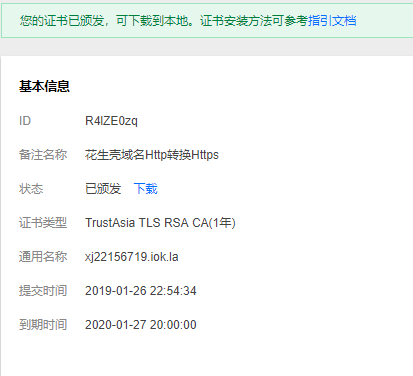
https://console.cloud.tencent.com/ssl/detail/R4lZE0zq

****
域名：xj22156719.iok.la
http://xj22156719.iok.la/
https://xj22156719.iok.la/

地址/home/pi/www/http/html/.wellknown/pki-validation

[腾讯教程官方认证之后备忘]（https://console.cloud.tencent.com/ssl/detail/R4lZE0zq）
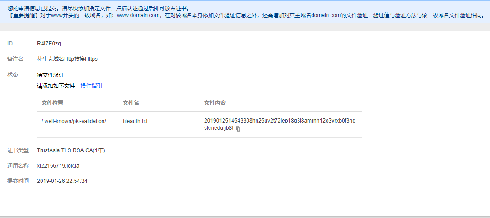

编辑 Apache 根目录下 conf/d.conf 文件，找到 #LoadModule ssl_module modules/mod_ssl.so 和 #Include conf/extra/httpd-ssl.conf，去掉代码前面的 #号。
2）编辑 Apache 根目录下 conf/extra/httpd-ssl.conf 文件，修改成如下内容：

 <VirtualHost 0.0.0.0:443>
    DocumentRoot "/var/www/html"
    ServerName www.domain.com
    SSLEngine on
    SSLCertificateFile /usr/local/apache/conf/2_www.domain.com_cert.crt
    SSLCertificateKeyFile /usr/local/apache/conf/3_www.domain.com.key
    SSLCertificateChainFile /usr/local/apache/conf/1_root_bundle.crt
</VirtualHost>
配置完成后，重启 Apache 即可使用 https://www.domain.com 来访问。

我和官网囧那个不一样
/etc/apache2/sites-enabled/000-default.conf 
还搞到不好使了网络穿透
忘记改了什么导致不能用了,原因在下面：
ppi@raspberrypi:~ $ journalctl -xe
1月 27 00:11:10 raspberrypi apachectl[18667]: allow not allowed here
1月 27 00:11:10 raspberrypi apachectl[18667]: Action 'start' failed.
1月 27 00:11:10 raspberrypi apachectl[18667]: The Apache error log may have more 
1月 27 00:11:10 raspberrypi systemd[1]: apache2.service: Control process exited, 
1月 27 00:11:10 raspberrypi systemd[1]: Failed to start The Apache HTTP Server.
-- Subject: apache2.service 单元已失败
-- Defined-By: systemd
-- Support: https://www.debian.org/support
-- 
-- apache2.service 单元已失败。
-- 
-- 结果为“failed”。
1月 27 00:11:10 raspberrypi systemd[1]: apache2.service: Unit entered failed stat
1月 27 00:11:10 raspberrypi systemd[1]: apache2.service: Failed with result 'exit
1月 27 00:11:10 raspberrypi sudo[18658]: pam_unix(sudo:session): session closed f
1月 27 00:11:45 raspberrypi kernel: w1_master_driver w1_bus_master1: Attaching on
1月 27 00:11:45 raspberrypi kernel: w1_master_driver w1_bus_master1: Family 0 for
1月 27 00:12:37 raspberrypi kernel: w1_master_driver w1_bus_master1: Attaching on
1月 27 00:12:37 raspberrypi kernel: w1_master_driver w1_bus_master1: Family 0 for
1月 27 00:13:04 raspberrypi kernel: w1_master_driver w1_bus_master1: Attaching on
1月 27 00:13:04 raspberrypi kernel: w1_master_driver w1_bus_master1: Family 0 for
1月 27 00:13:53 raspberrypi kernel: w1_master_driver w1_bus_master1: Attaching on
1月 27 00:13:53 raspberrypi kernel: w1_master_driver w1_bus_master1: Family 0 for
lines 2039-2061/2061 (END)
1月 27 00:11:10 raspberrypi apachectl[18667]: allow not allowed here
1月 27 00:11:10 raspberrypi apachectl[18667]: Action 'start' failed.
1月 27 00:11:10 raspberrypi apachectl[18667]: The Apache error log may have more information.
1月 27 00:11:10 raspberrypi systemd[1]: apache2.service: Control process exited, code=exited status=1
1月 27 00:11:10 raspberrypi systemd[1]: Failed to start The Apache HTTP Server.
-- Subject: apache2.service 单元已失败
-- Defined-By: systemd
-- Support: https://www.debian.org/support
-- 
-- apache2.service 单元已失败。
-- 
-- 结果为“failed”。
1月 27 00:11:10 raspberrypi systemd[1]: apache2.service: Unit entered failed state.
1月 27 00:11:10 raspberrypi systemd[1]: apache2.service: Failed with result 'exit-code'.
1月 27 00:11:10 raspberrypi sudo[18658]: pam_unix(sudo:session): session closed for user root
1月 27 00:11:45 raspberrypi kernel: w1_master_driver w1_bus_master1: Attaching one wire slave 00.580000000000 crc 19
1月 27 00:11:45 raspberrypi kernel: w1_master_driver w1_bus_master1: Family 0 for 00.580000000000.19 is not registered.
1月 27 00:12:37 raspberrypi kernel: w1_master_driver w1_bus_master1: Attaching one wire slave 00.d80000000000 crc 95
1月 27 00:12:37 raspberrypi kernel: w1_master_driver w1_bus_master1: Family 0 for 00.d80000000000.95 is not registered.
1月 27 00:13:04 raspberrypi kernel: w1_master_driver w1_bus_master1: Attaching one wire slave 00.380000000000 crc 7c
1月 27 00:13:04 raspberrypi kernel: w1_master_driver w1_bus_master1: Family 0 for 00.380000000000.7c is not registered.
1月 27 00:13:53 raspberrypi kernel: w1_master_driver w1_bus_master1: Attaching one wire slave 00.b80000000000 crc f0
1月 27 00:13:53 raspberrypi kernel: w1_master_driver w1_bus_master1: Family 0 for 00.b80000000000.f0 is not registered.
~~
~
~
~
~
lines 2101-2123/2123 (END)
-- Subject: apache2.service 单元已开始启动
-- Defined-By: systemd
-- Support: https://www.debian.org/support
-- 
-- apache2.service 单元已开始启动。
1月 27 00:27:24 raspberrypi apachectl[31288]: AH00526: Syntax error on line 183 o
1月 27 00:27:24 raspberrypi apachectl[31288]: allow not allowed here
1月 27 00:27:24 raspberrypi apachectl[31288]: Action 'start' failed.
1月 27 00:27:24 raspberrypi apachectl[31288]: The Apache error log may have more 
1月 27 00:27:24 raspberrypi systemd[1]: apache2.service: Control process exited, 
1月 27 00:27:24 raspberrypi systemd[1]: Failed to start The Apache HTTP Server.
-- Subject: apache2.service 单元已失败
-- Defined-By: systemd
-- Support: https://www.debian.org/support
-- 
-- apache2.service 单元已失败。
-- 
-- 结果为“failed”。
1月 27 00:27:24 raspberrypi systemd[1]: apache2.service: Unit entered failed stat
1月 27 00:27:24 raspberrypi systemd[1]: apache2.service: Failed with result 'exit
1月 27 00:27:24 raspberrypi sudo[31279]: pam_unix(sudo:session): session closed f
1月 27 00:27:44 raspberrypi kernel: w1_master_driver w1_bus_master1: Attaching on
1月 27 00:27:44 raspberrypi kernel: w1_master_driver w1_bus_master1: Family 0 for
lines 2101-2123/2123 (END)
-- Subject: apache2.service 单元已开始启动
-- Defined-By: systemd
-- Support: https://www.debian.org/support
-- 
-- apache2.service 单元已开始启动。
1月 27 00:27:24 raspberrypi apachectl[31288]: AH00526: Syntax error on line 183 of /etc/apache2/apache2.conf:
1月 27 00:27:24 raspberrypi apachectl[31288]: allow not allowed here
1月 27 00:27:24 raspberrypi apachectl[31288]: Action 'start' failed.
1月 27 00:27:24 raspberrypi apachectl[31288]: The Apache error log may have more information.
1月 27 00:27:24 raspberrypi systemd[1]: apache2.service: Control process exited, code=exited status=1
1月 27 00:27:24 raspberrypi systemd[1]: Failed to start The Apache HTTP Server.
-- Subject: apache2.service 单元已失败
-- Defined-By: systemd
-- Support: https://www.debian.org/support
-- 
-- apache2.service 单元已失败。
-- 
-- 结果为“failed”。
1月 27 00:27:24 raspberrypi systemd[1]: apache2.service: Unit entered failed state.
1月 27 00:27:24 raspberrypi systemd[1]: apache2.service: Failed with result 'exit-code'.
1月 27 00:27:24 raspberrypi sudo[31279]: pam_unix(sudo:session): session closed for user root
1月 27 00:27:44 raspberrypi kernel: w1_master_driver w1_bus_master1: Attaching one wire slave 00.340000000000 crc df
1月 27 00:27:44 raspberrypi kernel: w1_master_driver w1_bus_master1: Family 0 for 00.340000000000.df is not registered.
~
~
找出来on line 183 of /etc/apache2/apache2.conf:然后发现是之前自己瞎改，导致改错了一行183
#<Directory /srv/>

''' #	Options Indexes FollowSymLinks
''' #	AllowOverride None
        Allow from all
        Require all granted
''' #</Directory>
居然让我插入两行这个？

root@raspberrypi:/home/pi#  journalctl -xe
1月 28 21:52:45 raspberrypi xrdp[9930]: (9930)(1996284608)[DEBUG] Closed socket 11 (AF_INET6 :: port 3389)
1月 28 21:52:45 raspberrypi xrdp[9930]: (9930)(1996284608)[INFO ] Using default X.509 certificate: /etc/xrdp/cert.pem
1月 28 21:52:45 raspberrypi xrdp[9930]: (9930)(1996284608)[INFO ] Using default X.509 key file: /etc/xrdp/key.pem
1月 28 21:52:45 raspberrypi xrdp[9930]: (9930)(1996284608)[DEBUG] Security layer: requested 0, selected 0
1月 28 21:52:45 raspberrypi xrdp[9930]: (9930)(1996284608)[DEBUG] xrdp_000026ca_wm_login_mode_event_00000001
1月 28 21:52:45 raspberrypi xrdp[9930]: (9930)(1996284608)[INFO ] Cannot find keymap file /etc/xrdp/km-00000804.ini
1月 28 21:52:45 raspberrypi xrdp[9930]: (9930)(1996284608)[INFO ] Cannot find keymap file /etc/xrdp/km-00000804.ini
1月 28 21:52:45 raspberrypi xrdp[9930]: (9930)(1996284608)[INFO ] Loading keymap file /etc/xrdp/km-00000409.ini
1月 28 21:52:45 raspberrypi xrdp[9930]: (9930)(1996284608)[WARN ] local keymap file for 0x00000804 found and doesn't match built in keymap, using local keymap file
1月 28 21:52:49 raspberrypi xrdp[9930]: (9930)(1996284608)[DEBUG] Closed socket 12 (AF_INET6 ::ffff:192.168.1.105 port 3389)
1月 28 21:52:49 raspberrypi xrdp[9930]: (9930)(1996284608)[DEBUG] xrdp_mm_module_cleanup
1月 28 21:52:49 raspberrypi xrdp[9930]: (9930)(1996284608)[ERROR] Listening socket is in wrong state, terminating listener
1月 28 21:53:01 raspberrypi kernel: w1_master_driver w1_bus_master1: Attaching one wire slave 00.5b4000000000 crc 60
1月 28 21:53:01 raspberrypi kernel: w1_master_driver w1_bus_master1: Family 0 for 00.5b4000000000.60 is not registered.
1月 28 21:54:05 raspberrypi kernel: w1_master_driver w1_bus_master1: Attaching one wire slave 00.db4000000000 crc ec
1月 28 21:54:05 raspberrypi kernel: w1_master_driver w1_bus_master1: Family 0 for 00.db4000000000.ec is not registered.
1月 28 21:55:21 raspberrypi kernel: w1_master_driver w1_bus_master1: Attaching one wire slave 00.3b4000000000 crc 05
1月 28 21:55:21 raspberrypi kernel: w1_master_driver w1_bus_master1: Family 0 for 00.3b4000000000.05 is not registered.
1月 28 21:56:01 raspberrypi kernel: w1_master_driver w1_bus_master1: Attaching one wire slave 00.bb4000000000 crc 89
1月 28 21:56:01 raspberrypi kernel: w1_master_driver w1_bus_master1: Family 0 for 00.bb4000000000.89 is not registered.
1月 28 21:57:05 raspberrypi kernel: w1_master_driver w1_bus_master1: Attaching one wire slave 00.7b4000000000 crc 43
1月 28 21:57:05 raspberrypi kernel: w1_master_driver w1_bus_master1: Family 0 for 00.7b4000000000.43 is not registered.
1月 28 21:58:08 raspberrypi kernel: w1_master_driver w1_bus_master1: Attaching one wire slave 00.fb4000000000 crc cf
1月 28 21:58:08 raspberrypi kernel: w1_master_driver w1_bus_master1: Family 0 for 00.fb4000000000.cf is not registered.
1月 28 21:58:20 raspberrypi kernel: w1_master_driver w1_bus_master1: Attaching one wire slave 00.074000000000 crc 18
1月 28 21:58:20 raspberrypi kernel: w1_master_driver w1_bus_master1: Family 0 for 00.074000000000.18 is not registered.
1月 28 21:58:50 raspberrypi systemd[1]: Stopping The Apache HTTP Server...
-- Subject: apache2.service 单元已开始停止操作
-- Defined-By: systemd
-- Support: https://www.debian.org/support
-- 
-- apache2.service 单元已开始停止操作。
1月 28 21:58:50 raspberrypi apachectl[14574]: AH00558: apache2: Could not reliably determine the server's fully qualified domain name, using 127.0.1.1. Set the 'ServerName' directive globally to suppress this message
1月 28 21:58:50 raspberrypi systemd[1]: Stopped The Apache HTTP Server.
-- Subject: apache2.service 单元已结束停止操作
-- Defined-By: systemd
-- Support: https://www.debian.org/support
-- 
-- apache2.service 单元已结束停止操作。
1月 28 21:58:50 raspberrypi systemd[1]: Starting The Apache HTTP Server...
-- Subject: apache2.service 单元已开始启动
-- Defined-By: systemd
-- Support: https://www.debian.org/support
-- 
-- apache2.service 单元已开始启动。
1月 28 21:58:50 raspberrypi apachectl[14581]: AH00558: apache2: Could not reliably determine the server's fully qualified domain name, using 127.0.1.1. Set the 'ServerName' directive globally to suppress this message
1月 28 21:58:50 raspberrypi systemd[1]: Started The Apache HTTP Server.
-- Subject: apache2.service 单元已结束启动
-- Defined-By: systemd
-- Support: https://www.debian.org/support
-- 
-- apache2.service 单元已结束启动。
-- 
-- 启动结果为“done”。
1月 28 21:59:12 raspberrypi kernel: w1_master_driver w1_bus_master1: Attaching one wire slave 00.874000000000 crc 94
1月 28 21:59:12 raspberrypi kernel: w1_master_driver w1_bus_master1: Family 0 for 00.874000000000.94 is not registered.
1月 28 22:00:17 raspberrypi kernel: w1_master_driver w1_bus_master1: Attaching one wire slave 00.474000000000 crc 5e
1月 28 22:00:17 raspberrypi kernel: w1_master_driver w1_bus_master1: Family 0 for 00.474000000000.5e is not registered.
1月 28 22:01:06 raspberrypi kernel: w1_master_driver w1_bus_master1: Attaching one wire slave 00.c74000000000 crc d2
1月 28 22:01:06 raspberrypi kernel: w1_master_driver w1_bus_master1: Family 0 for 00.c74000000000.d2 is not registered.
1月 28 22:02:24 raspberrypi kernel: w1_master_driver w1_bus_master1: Attaching one wire slave 00.274000000000 crc 3b
1月 28 22:02:24 raspberrypi kernel: w1_master_driver w1_bus_master1: Family 0 for 00.274000000000.3b is not registered.
1月 28 22:03:16 raspberrypi kernel: w1_master_driver w1_bus_master1: Attaching one wire slave 00.a74000000000 crc b7
1月 28 22:03:16 raspberrypi kernel: w1_master_driver w1_bus_master1: Family 0 for 00.a74000000000.b7 is not registered.
lines 1243-1306/1306 (END)
1月 28 21:52:45 raspberrypi xrdp[9930]: (9930)(1996284608)[DEBUG] Closed socket 1
1月 28 21:52:45 raspberrypi xrdp[9930]: (9930)(1996284608)[INFO ] Using default X
1月 28 21:52:45 raspberrypi xrdp[9930]: (9930)(1996284608)[INFO ] Using default X
1月 28 21:52:45 raspberrypi xrdp[9930]: (9930)(1996284608)[DEBUG] Security layer:
1月 28 21:52:45 raspberrypi xrdp[9930]: (9930)(1996284608)[DEBUG] xrdp_000026ca_w
1月 28 21:52:45 raspberrypi xrdp[9930]: (9930)(1996284608)[INFO ] Cannot find key
1月 28 21:52:45 raspberrypi xrdp[9930]: (9930)(1996284608)[INFO ] Cannot find key
1月 28 21:52:45 raspberrypi xrdp[9930]: (9930)(1996284608)[INFO ] Loading keymap 
1月 28 21:52:45 raspberrypi xrdp[9930]: (9930)(1996284608)[WARN ] local keymap fi
1月 28 21:52:49 raspberrypi xrdp[9930]: (9930)(1996284608)[DEBUG] Closed socket 1
1月 28 21:52:49 raspberrypi xrdp[9930]: (9930)(1996284608)[DEBUG] xrdp_mm_module_
1月 28 21:52:49 raspberrypi xrdp[9930]: (9930)(1996284608)[ERROR] Listening socke
1月 28 21:53:01 raspberrypi kernel: w1_master_driver w1_bus_master1: Attaching on
1月 28 21:53:01 raspberrypi kernel: w1_master_driver w1_bus_master1: Family 0 for
1月 28 21:54:05 raspberrypi kernel: w1_master_driver w1_bus_master1: Attaching on
1月 28 21:54:05 raspberrypi kernel: w1_master_driver w1_bus_master1: Family 0 for
1月 28 21:55:21 raspberrypi kernel: w1_master_driver w1_bus_master1: Attaching on
1月 28 21:55:21 raspberrypi kernel: w1_master_driver w1_bus_master1: Family 0 for
1月 28 21:56:01 raspberrypi kernel: w1_master_driver w1_bus_master1: Attaching on
1月 28 21:56:01 raspberrypi kernel: w1_master_driver w1_bus_master1: Family 0 for
1月 28 21:57:05 raspberrypi kernel: w1_master_driver w1_bus_master1: Attaching on
1月 28 21:57:05 raspberrypi kernel: w1_master_driver w1_bus_master1: Family 0 for
1月 28 21:58:08 raspberrypi kernel: w1_master_driver w1_bus_master1: Attaching on
lines 1243-1265/1306 98%
1月 28 21:52:45 raspberrypi xrdp[9930]: (9930)(1996284608)[DEBUG] Closed socket 11 (AF_INET6 :: port 3389)
1月 28 21:52:45 raspberrypi xrdp[9930]: (9930)(1996284608)[INFO ] Using default X.509 certificate: /etc/xrdp/cert.pem
1月 28 21:52:45 raspberrypi xrdp[9930]: (9930)(1996284608)[INFO ] Using default X.509 key file: /etc/xrdp/key.pem
1月 28 21:52:45 raspberrypi xrdp[9930]: (9930)(1996284608)[DEBUG] Security layer: requested 0, selected 0
1月 28 21:52:45 raspberrypi xrdp[9930]: (9930)(1996284608)[DEBUG] xrdp_000026ca_wm_login_mode_event_00000001
1月 28 21:52:45 raspberrypi xrdp[9930]: (9930)(1996284608)[INFO ] Cannot find keymap file /etc/xrdp/km-00000804.ini
1月 28 21:52:45 raspberrypi xrdp[9930]: (9930)(1996284608)[INFO ] Cannot find keymap file /etc/xrdp/km-00000804.ini
1月 28 21:52:45 raspberrypi xrdp[9930]: (9930)(1996284608)[INFO ] Loading keymap file /etc/xrdp/km-00000409.ini
1月 28 21:52:45 raspberrypi xrdp[9930]: (9930)(1996284608)[WARN ] local keymap file for 0x00000804 found and doesn't match built in keymap, using local keymap file
1月 28 21:52:49 raspberrypi xrdp[9930]: (9930)(1996284608)[DEBUG] Closed socket 12 (AF_INET6 ::ffff:192.168.1.105 port 3389)
1月 28 21:52:49 raspberrypi xrdp[9930]: (9930)(1996284608)[DEBUG] xrdp_mm_module_cleanup
1月 28 21:52:49 raspberrypi xrdp[9930]: (9930)(1996284608)[ERROR] Listening socket is in wrong state, terminating listener
1月 28 21:53:01 raspberrypi kernel: w1_master_driver w1_bus_master1: Attaching one wire slave 00.5b4000000000 crc 60
1月 28 21:53:01 raspberrypi kernel: w1_master_driver w1_bus_master1: Family 0 for 00.5b4000000000.60 is not registered.
1月 28 21:54:05 raspberrypi kernel: w1_master_driver w1_bus_master1: Attaching one wire slave 00.db4000000000 crc ec
1月 28 21:54:05 raspberrypi kernel: w1_master_driver w1_bus_master1: Family 0 for 00.db4000000000.ec is not registered.
1月 28 21:55:21 raspberrypi kernel: w1_master_driver w1_bus_master1: Attaching one wire slave 00.3b4000000000 crc 05
1月 28 21:55:21 raspberrypi kernel: w1_master_driver w1_bus_master1: Family 0 for 00.3b4000000000.05 is not registered.
1月 28 21:56:01 raspberrypi kernel: w1_master_driver w1_bus_master1: Attaching one wire slave 00.bb4000000000 crc 89
1月 28 21:56:01 raspberrypi kernel: w1_master_driver w1_bus_master1: Family 0 for 00.bb4000000000.89 is not registered.
1月 28 21:57:05 raspberrypi kernel: w1_master_driver w1_bus_master1: Attaching one wire slave 00.7b4000000000 crc 43
1月 28 21:57:05 raspberrypi kernel: w1_master_driver w1_bus_master1: Family 0 for 00.7b4000000000.43 is not registered.
1月 28 21:58:08 raspberrypi kernel: w1_master_driver w1_bus_master1: Attaching one wire slave 00.fb4000000000 crc cf
1月 28 21:58:08 raspberrypi kernel: w1_master_driver w1_bus_master1: Family 0 for 00.fb4000000000.cf is not registered.
1月 28 21:58:20 raspberrypi kernel: w1_master_driver w1_bus_master1: Attaching one wire slave 00.074000000000 crc 18
1月 28 21:58:20 raspberrypi kernel: w1_master_driver w1_bus_master1: Family 0 for 00.074000000000.18 is not registered.
1月 28 21:58:50 raspberrypi systemd[1]: Stopping The Apache HTTP Server...
-- Subject: apache2.service 单元已开始停止操作
-- Defined-By: systemd
-- Support: https://www.debian.org/support
-- 
-- apache2.service 单元已开始停止操作。
1月 28 21:58:50 raspberrypi apachectl[14574]: AH00558: apache2: Could not reliably determine the server's fully qualified domain name, using 127.0.1.1. Set the 'ServerName' directive globally to suppress this message
1月 28 21:58:50 raspberrypi systemd[1]: Stopped The Apache HTTP Server.
-- Subject: apache2.service 单元已结束停止操作
-- Defined-By: systemd
-- Support: https://www.debian.org/support
-- 
-- apache2.service 单元已结束停止操作。
1月 28 21:58:50 raspberrypi systemd[1]: Starting The Apache HTTP Server...
-- Subject: apache2.service 单元已开始启动
-- Defined-By: systemd
-- Support: https://www.debian.org/support
-- 
-- apache2.service 单元已开始启动。
1月 28 21:58:50 raspberrypi apachectl[14581]: AH00558: apache2: Could not reliably determine the server's fully qualified domain name, using 127.0.1.1. Set the 'ServerName' directive globally to suppress this message
1月 28 21:58:50 raspberrypi systemd[1]: Started The Apache HTTP Server.
-- Subject: apache2.service 单元已结束启动
-- Defined-By: systemd
-- Support: https://www.debian.org/support
-- 
-- apache2.service 单元已结束启动。
-- 
-- 启动结果为“done”。
1月 28 21:59:12 raspberrypi kernel: w1_master_driver w1_bus_master1: Attaching one wire slave 00.874000000000 crc 94
1月 28 21:59:12 raspberrypi kernel: w1_master_driver w1_bus_master1: Family 0 for 00.874000000000.94 is not registered.
1月 28 22:00:17 raspberrypi kernel: w1_master_driver w1_bus_master1: Attaching one wire slave 00.474000000000 crc 5e
1月 28 22:00:17 raspberrypi kernel: w1_master_driver w1_bus_master1: Family 0 for 00.474000000000.5e is not registered.
1月 28 22:01:06 raspberrypi kernel: w1_master_driver w1_bus_master1: Attaching one wire slave 00.c74000000000 crc d2
1月 28 22:01:06 raspberrypi kernel: w1_master_driver w1_bus_master1: Family 0 for 00.c74000000000.d2 is not registered.
1月 28 22:02:24 raspberrypi kernel: w1_master_driver w1_bus_master1: Attaching one wire slave 00.274000000000 crc 3b
1月 28 22:02:24 raspberrypi kernel: w1_master_driver w1_bus_master1: Family 0 for 00.274000000000.3b is not registered.
1月 28 22:03:16 raspberrypi kernel: w1_master_driver w1_bus_master1: Attaching one wire slave 00.a74000000000 crc b7
1月 28 22:03:16 raspberrypi kernel: w1_master_driver w1_bus_master1: Family 0 for 00.a74000000000.b7 is not registered.

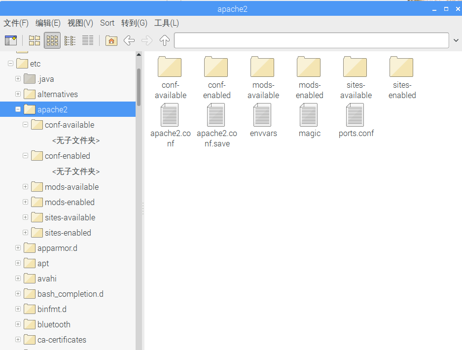

这个不会是因为其实树莓派的小伙伴吧？我不服！
所以我决定，开启最新型TC3.6精神扰乱装置，莺莺狂吠！
我又看了看云主机服务器下Ubuntu的,
又看了看我自己电脑的根目录，好吧，你们这是看不起树莓派吗？

根据腾讯云文档，发现并没有在httpd.conf中找到 LoadModule ssl_module modules/mod_ssl.so 这句东西，conf目录下也没 httpd-ssl.conf，树莓派甚至链conf目录都没有。先把模块装上 yum install mod_ssl openssl。这时候在conf下面有了ssl.conf。只是命名不同而已。而且在ssl.conf中加载了mod_ssl模块（LoadModule ssl_module modules/mod_ssl.so）。Apache的配置文件里面有一句 Include conf.d/*.conf，所以ssl.conf也就包含进来了，没毛病。剩下的就是把刚刚申请的key配置一下。这里的配置跟文档是一样的，就是文件的路径不一样如 /etc/httpd/conf/1_root_bundle.crt、/etc/httpd/conf/2_www.xxx.com.crt、/etc/httpd/conf/3_www.xxx.com.key

作者：dovebottle
链接：https://www.jianshu.com/p/6ac2429c0d7b
來源：简书
简书著作权归作者所有，任何形式的转载都请联系作者获得授权并注明出处。

pi@raspberrypi:/etc/apache2 $ tree
.
├── apache2.conf
├── apache2.conf.save
├── conf-available
│   ├── charset.conf
│   ├── javascript-common.conf
│   ├── localized-error-pages.conf
│   ├── other-vhosts-access-log.conf
│   ├── security.conf
│   └── serve-cgi-bin.conf
├── conf-enabled
│   ├── charset.conf -> ../conf-available/charset.conf
│   ├── localized-error-pages.conf -> ../conf-available/localized-error-pages.conf
│   ├── other-vhosts-access-log.conf -> ../conf-available/other-vhosts-access-log.conf
│   ├── security.conf -> ../conf-available/security.conf
│   └── serve-cgi-bin.conf -> ../conf-available/serve-cgi-bin.conf
├── envvars
├── magic
├── mods-available
│   ├── access_compat.load
│   ├── actions.conf
│   ├── actions.load
│   ├── alias.conf
│   ├── alias.load
│   ├── allowmethods.load
│   ├── asis.load
│   ├── auth_basic.load
│   ├── auth_digest.load
│   ├── auth_form.load
│   ├── authn_anon.load
│   ├── authn_core.load
│   ├── authn_dbd.load
│   ├── authn_dbm.load
│   ├── authn_file.load
│   ├── authn_socache.load
│   ├── authnz_fcgi.load
│   ├── authnz_ldap.load
│   ├── authz_core.load
│   ├── authz_dbd.load
│   ├── authz_dbm.load
│   ├── authz_groupfile.load
│   ├── authz_host.load
│   ├── authz_owner.load
│   ├── authz_user.load
│   ├── autoindex.conf
│   ├── autoindex.load
│   ├── buffer.load
│   ├── cache_disk.conf
│   ├── cache_disk.load
│   ├── cache.load
│   ├── cache_socache.load
│   ├── cern_meta.load
│   ├── cgid.conf
│   ├── cgid.load
│   ├── cgi.load
│   ├── charset_lite.load
│   ├── data.load
│   ├── dav_fs.conf
│   ├── dav_fs.load
│   ├── dav.load
│   ├── dav_lock.load
│   ├── dbd.load
│   ├── deflate.conf
│   ├── deflate.load
│   ├── dialup.load
│   ├── dir.conf
│   ├── dir.load
│   ├── dump_io.load
│   ├── echo.load
│   ├── env.load
│   ├── expires.load
│   ├── ext_filter.load
│   ├── file_cache.load
│   ├── filter.load
│   ├── headers.load
│   ├── heartbeat.load
│   ├── heartmonitor.load
│   ├── http2.load
│   ├── ident.load
│   ├── imagemap.load
│   ├── include.load
│   ├── info.conf
│   ├── info.load
│   ├── lbmethod_bybusyness.load
│   ├── lbmethod_byrequests.load
│   ├── lbmethod_bytraffic.load
│   ├── lbmethod_heartbeat.load
│   ├── ldap.conf
│   ├── ldap.load
│   ├── log_debug.load
│   ├── log_forensic.load
│   ├── lua.load
│   ├── macro.load
│   ├── mime.conf
│   ├── mime.load
│   ├── mime_magic.conf
│   ├── mime_magic.load
│   ├── mpm_event.conf
│   ├── mpm_event.load
│   ├── mpm_prefork.conf
│   ├── mpm_prefork.load
│   ├── mpm_worker.conf
│   ├── mpm_worker.load
│   ├── negotiation.conf
│   ├── negotiation.load
│   ├── php7.0.conf
│   ├── php7.0.load
│   ├── proxy_ajp.load
│   ├── proxy_balancer.conf
│   ├── proxy_balancer.load
│   ├── proxy.conf
│   ├── proxy_connect.load
│   ├── proxy_express.load
│   ├── proxy_fcgi.load
│   ├── proxy_fdpass.load
│   ├── proxy_ftp.conf
│   ├── proxy_ftp.load
│   ├── proxy_hcheck.load
│   ├── proxy_html.conf
│   ├── proxy_html.load
│   ├── proxy_http2.load
│   ├── proxy_http.load
│   ├── proxy.load
│   ├── proxy_scgi.load
│   ├── proxy_wstunnel.load
│   ├── ratelimit.load
│   ├── reflector.load
│   ├── remoteip.load
│   ├── reqtimeout.conf
│   ├── reqtimeout.load
│   ├── request.load
│   ├── rewrite.load
│   ├── sed.load
│   ├── session_cookie.load
│   ├── session_crypto.load
│   ├── session_dbd.load
│   ├── session.load
│   ├── setenvif.conf
│   ├── setenvif.load
│   ├── slotmem_plain.load
│   ├── slotmem_shm.load
│   ├── socache_dbm.load
│   ├── socache_memcache.load
│   ├── socache_shmcb.load
│   ├── speling.load
│   ├── ssl.conf
│   ├── ssl.load
│   ├── status.conf
│   ├── status.load
│   ├── substitute.load
│   ├── suexec.load
│   ├── unique_id.load
│   ├── userdir.conf
│   ├── userdir.load
│   ├── usertrack.load
│   ├── vhost_alias.load
│   └── xml2enc.load
├── mods-enabled
│   ├── access_compat.load -> ../mods-available/access_compat.load
│   ├── alias.conf -> ../mods-available/alias.conf
│   ├── alias.load -> ../mods-available/alias.load
│   ├── auth_basic.load -> ../mods-available/auth_basic.load
│   ├── authn_core.load -> ../mods-available/authn_core.load
│   ├── authn_file.load -> ../mods-available/authn_file.load
│   ├── authz_core.load -> ../mods-available/authz_core.load
│   ├── authz_host.load -> ../mods-available/authz_host.load
│   ├── authz_user.load -> ../mods-available/authz_user.load
│   ├── autoindex.conf -> ../mods-available/autoindex.conf
│   ├── autoindex.load -> ../mods-available/autoindex.load
│   ├── deflate.conf -> ../mods-available/deflate.conf
│   ├── deflate.load -> ../mods-available/deflate.load
│   ├── dir.conf -> ../mods-available/dir.conf
│   ├── dir.load -> ../mods-available/dir.load
│   ├── env.load -> ../mods-available/env.load
│   ├── filter.load -> ../mods-available/filter.load
│   ├── mime.conf -> ../mods-available/mime.conf
│   ├── mime.load -> ../mods-available/mime.load
│   ├── mpm_prefork.conf -> ../mods-available/mpm_prefork.conf
│   ├── mpm_prefork.load -> ../mods-available/mpm_prefork.load
│   ├── negotiation.conf -> ../mods-available/negotiation.conf
│   ├── negotiation.load -> ../mods-available/negotiation.load
│   ├── php7.0.conf -> ../mods-available/php7.0.conf
│   ├── php7.0.load -> ../mods-available/php7.0.load
│   ├── reqtimeout.conf -> ../mods-available/reqtimeout.conf
│   ├── reqtimeout.load -> ../mods-available/reqtimeout.load
│   ├── setenvif.conf -> ../mods-available/setenvif.conf
│   ├── setenvif.load -> ../mods-available/setenvif.load
│   ├── socache_shmcb.load -> ../mods-available/socache_shmcb.load
│   ├── ssl.conf -> ../mods-available/ssl.conf
│   ├── ssl.load -> ../mods-available/ssl.load
│   ├── status.conf -> ../mods-available/status.conf
│   └── status.load -> ../mods-available/status.load
├── ports.conf
├── sites-available
│   ├── 000-default.conf
│   └── default-ssl.conf
└── sites-enabled
    └── 000-default.conf -> ../sites-available/000-default.conf

6 directories, 191 files

[神仙操作？算了，不相关管了，能用就行，到时候1年免费的腾讯的过期之后试试这个，或者用其他免费的方式混一下](http://111.230.31.157/post/79.html)

# 创建快捷方式文件访问链接
https://blog.csdn.net/qq_28657577/article/details/80825322

pi@raspberrypi:~ $ systemctl status
● raspberrypi
    State: degraded
     Jobs: 0 queued
   Failed: 1 units
    Since: Thu 1970-01-01 08:00:03 HKT; 49 years 0 months ago
   CGroup: /
           ├─user.slice
           │ └─user-1000.slice
           │   ├─session-c3.scope
           │   │ ├─  464 /usr/sbin/xrdp-sesman
           │   │ ├─ 2079 /usr/sbin/xrdp-sessvc 2081 2080
           │   │ ├─ 2080 /usr/sbin/xrdp-sesman
           │   │ ├─ 2081 /usr/lib/xorg/Xorg :10 -auth .Xauthority -config xrdp/x
           │   │ ├─ 2088 /usr/bin/lxsession -s LXDE-pi -e LXDE
           │   │ ├─ 2092 xrdp-chansrv
           │   │ ├─ 2171 /usr/bin/ssh-agent /usr/bin/im-launch x-session-manager
           │   │ ├─ 2204 /usr/lib/arm-linux-gnueabihf/scim-1.0/scim-panel-gtk --
           │   │ ├─ 2206 /usr/lib/arm-linux-gnueabihf/scim-1.0/scim-launcher -d 
           │   │ ├─ 2216 openbox --config-file /home/pi/.config/openbox/lxde-pi-
           │   │ ├─ 2221 lxpanel --profile LXDE-pi
           │   │ ├─ 2223 pcmanfm --desktop --profile LXDE-pi
           │   │ ├─ 2243 /usr/bin/ssh-agent -s
           │   │ ├─ 2265 /usr/lib/menu-cache/menu-cached /run/user/1000/menu-cac
           │   │ ├─ 3040 lxterminal
           │   │ ├─ 3041 gnome-pty-helper
           │   │ ├─ 3042 bash
           │   │ ├─ 3055 scim-im-agent
           │   │ ├─17504 leafpad /etc/apache2/apache2.conf
           │   │ ├─19785 systemctl status
           │   │ └─19786 pager
           │   ├─user@1000.service
           │   │ ├─gvfs-gphoto2-volume-monitor.service
           │   │ │ └─978 /usr/lib/gvfs/gvfs-gphoto2-volume-monitor
           │   │ ├─dbus.service
           │   │ │ └─668 /usr/bin/dbus-daemon --session --address=systemd: --nof
           │   │ ├─gvfs-udisks2-volume-monitor.service
           │   │ │ └─932 /usr/lib/gvfs/gvfs-udisks2-volume-monitor
           │   │ ├─gvfs-mtp-volume-monitor.service
           │   │ │ └─992 /usr/lib/gvfs/gvfs-mtp-volume-monitor
           │   │ ├─gvfs-goa-volume-monitor.service
           │   │ │ └─988 /usr/lib/gvfs/gvfs-goa-volume-monitor
           │   │ ├─gvfs-afc-volume-monitor.service
           │   │ │ └─969 /usr/lib/gvfs/gvfs-afc-volume-monitor
           │   │ ├─init.scope
           │   │ │ ├─650 /lib/systemd/systemd --user
           │   │ │ └─654 (sd-pam)
           │   │ └─gvfs-daemon.service
           │   │   ├─ 775 /usr/lib/gvfs/gvfsd
           │   │   ├─ 780 /usr/lib/gvfs/gvfsd-fuse /run/user/1000/gvfs -f -o big
           │   │   └─1022 /usr/lib/gvfs/gvfsd-trash --spawner :1.4 /org/gtk/gvfs
           │   ├─session-c1.scope
           │   │ ├─641 lightdm --session-child 14 17
           │   │ ├─659 /usr/bin/lxsession -s LXDE-pi -e LXDE
           │   │ ├─719 /usr/bin/ssh-agent /usr/bin/im-launch x-session-manager
           │   │ ├─764 /usr/lib/arm-linux-gnueabihf/scim-1.0/scim-launcher -d -c
           │   │ ├─797 /usr/lib/arm-linux-gnueabihf/scim-1.0/scim-helper-manager
           │   │ ├─798 /usr/lib/arm-linux-gnueabihf/scim-1.0/scim-panel-gtk --di
           │   │ ├─800 /usr/lib/arm-linux-gnueabihf/scim-1.0/scim-launcher -d -c
           │   │ ├─857 openbox --config-file /home/pi/.config/openbox/lxde-pi-rc
           │   │ ├─859 lxpolkit
           │   │ ├─863 lxpanel --profile LXDE-pi
           │   │ ├─864 pcmanfm --desktop --profile LXDE-pi
           │   │ ├─870 /usr/bin/ssh-agent -s
           │   │ ├─872 sh /etc/xdg/lxsession/LXDE-pi/sshpwd.sh
           │   │ ├─878 zenity --warning --width=400 --text=SSH is enabled and th
           │   │ └─938 /usr/lib/menu-cache/menu-cached /run/user/1000/menu-cache
           │   └─session-c2.scope
           │     ├─ 1620 sshd: pi [priv]
           │     ├─ 1721 sshd: pi@pts/0
           │     ├─ 1724 -bash
           │     ├─11807 su
           │     └─11877 bash
           ├─init.scope
           │ └─1 /sbin/init splash
           └─system.slice
             ├─lightdm.service
             │ ├─438 /usr/sbin/lightdm
             │ └─580 /usr/lib/xorg/Xorg :0 -seat seat0 -auth /var/run/lightdm/ro
             ├─systemd-timesyncd.service
             │ └─313 /lib/systemd/systemd-timesyncd
             ├─vncserver-x11-serviced.service
             │ ├─428 /usr/bin/vncserver-x11-serviced -fg
             │ ├─459 /usr/bin/vncserver-x11-core -service
             │ ├─593 /usr/bin/vncagent service 14
             │ ├─884 /usr/bin/vncserverui service 15
             │ └─931 /usr/bin/vncserverui -statusicon 7
             ├─dbus.service
             │ └─330 /usr/bin/dbus-daemon --system --address=systemd: --nofork -
             ├─hciuart.service
             │ └─741 /usr/bin/hciattach /dev/serial1 bcm43xx 3000000 flow - b8:2
             ├─udisks2.service
             │ └─940 /usr/lib/udisks2/udisksd --no-debug
             ├─ssh.service
             │ └─486 /usr/sbin/sshd -D
             ├─xrdp.service
             │ ├─ 483 /usr/sbin/xrdp
             │ └─1982 /usr/sbin/xrdp
             ├─avahi-daemon.service
             │ ├─321 avahi-daemon: running [raspberrypi.local]
             │ └─341 avahi-daemon: chroot helper
             ├─phserver.service
             │ ├─  902 /usr/orayapp/oraysl -a 127.0.0.1 -p 16062 -s phsle01.oray
             │ ├─  903 /usr/orayapp/oraynewph -s 0.0.0.0 -c /var/log/phddns/core
             │ ├─  904 /bin/bash /usr/orayapp/phdaemon
             │ └─19774 sleep 1
             ├─system-serial\x2dgetty.slice
             │ └─serial-getty@ttyS0.service
             │   └─446 /sbin/agetty --keep-baud 115200,38400,9600 ttyS0 vt220
             ├─system-getty.slice
             │ └─getty@tty1.service
             │   └─443 /sbin/agetty --noclear tty1 linux
             ├─triggerhappy.service
             │ └─327 /usr/sbin/thd --triggers /etc/triggerhappy/triggers.d/ --so
             ├─systemd-logind.service
             │ └─324 /lib/systemd/systemd-logind
             ├─polkit.service
             │ └─879 /usr/lib/policykit-1/polkitd --no-debug
             ├─cron.service
             │ └─351 /usr/sbin/cron -f
             ├─systemd-udevd.service
             │ └─135 /lib/systemd/systemd-udevd
             ├─rsyslog.service
             │ └─328 /usr/sbin/rsyslogd -n
             ├─bluetooth.service
             │ └─746 /usr/lib/bluetooth/bluetoothd
             ├─inetd.service
             │ └─322 /usr/sbin/inetd
             ├─bluealsa.service
             │ └─748 /usr/bin/bluealsa
             ├─systemd-journald.service
             │ └─99 /lib/systemd/systemd-journald
             ├─mariadb.service
             │ └─584 /usr/sbin/mysqld
             └─dhcpcd.service
               ├─378 /sbin/dhcpcd -q -b
               └─498 wpa_supplicant -B -c/etc/wpa_supplicant/wpa_supplicant.conf
lines 114-136/136 (END)

# 修改Apache默认网站根目录，实现更方便https://blog.csdn.net/xin_yu_xin/article/details/44871577
https://blog.csdn.net/zzuzadz/article/details/52836788

省的没下都要管理员身份su密码然后sudo 我的网站文件 
vi /etc/apache2/apache2.conf，把文件里面的/var/www改成你的目标地址。/var/www改成/home/pi/www/http
然后vi /etc/apache2/sites-enabled/000-default.conf，把文件里面的/var/www改成你的目标地址。/var/www/html改成/home/pi/www/http/html
/etc/apache2/sites-available/default-ssl.conf      
不过随apache2的版本不同 文件的放置位置不一样  
输入这个命令 grep -iR DirectoryIndex /etc/apache2
查看 DirectoryIndex 在apache2哪个文件里面。

 grep -iR DirectoryIndex /etc/apache
/etc/apache2/mods-enabled/dir.conf:     DirectoryIndex index.html index.cgi index.pl index.php index.xhtml index.htm
/etc/apache2/mods-available/dir.conf:   DirectoryIndex index.html index.cgi index.pl index.php index.xhtml index.htm

service apache2 restart重开apache2重启
显示又出幺蛾子！！！！！！！！！！！！！
pi@raspberrypi:~/www/http/www/html $ apache2 -krestart
[Sat Jan 26 21:24:21.143726 2019] [core:warn] [pid 31836] AH00111: Config variable ${APACHE_RUN_DIR} is not defined
apache2: Syntax error on line 80 of /etc/apache2/apache2.conf: DefaultRuntimeDir must be a valid directory, absolute or relative to ServerRoot
pi@raspberrypi:~/www/http/www/html $ service apache2 restart
==== AUTHENTICATING FOR org.freedesktop.systemd1.manage-units ===
重新启动“apache2.service”需要认证。
Multiple identities can be used for authentication:
 1.  ,,, (pi)
 2.  root
Choose identity to authenticate as (1-2): 1
Password: Failed to restart apache2.service: 连接超时
See system logs and 'systemctl status apache2.service' for details.
pi@raspberrypi:~/www/http/www/html $ polkit-agent-helper-1: pam_authenticate failed: Authentication failure

apache修改默认目录后访问拒绝https://blog.csdn.net/u012359618/article/details/50748954

bash: yum: 未找到命令
网上找不到解决办法，只能闭着眼睛试试看，sudo apt-get install yum
成功！

# 魔镜高端树莓派显示屏设计一个好看的设备，400+买了一台手机！linux系的手机，还能作为服务器，闹钟，嵌入式，常用常新天天折腾！树莓派好玩！

# 命令行颜色改成记事本一样的存在
默认前景187*3->0*3
变成默认背景0*3->255*3

# 树莓派搭建Djangohttp://111.230.31.157/post/78.html
Django是基于python的一款网络服务器框架，本文将介绍Django在树莓派下进行安装和配置。

1、安装pip
pip是python的一个模块安装工具，利用pip可以快速便捷安装python的模块。

sudo apt-get install python-pip python-dev build-essential

sudo pip install --upgrade pip

2、django安装
sudo pip install django

3、创建django项目
任意目录下，执行如下命令便可以创建一个django项目

django-admin.py startproject hello_site

执行完之后，会看到当前目录下新添了一个hello_site目录。

4、让局域网所有电脑可以访问树莓派的django网站
为了让局域网的所有电脑可以访问树莓派的网站，需要在刚才创建的hello_site项目下的hello_site/settings.py下修改

ALLOWED_HOSTS = [‘192.168.1.10’] （ip地址为树莓派的ip）。然后在hello_site根目录下执行：

python manage.py runserver 0.0.0.0:8000

5、访问树莓派的django网站
在浏览器上输入http://192.168.1.10:8000便可访问hello_site网站，网页显示“It worked!”则为成功

可是我是失败代码：
pi@raspberrypi:~/Desktop/mkdir/hello_site $ python manage.py runserver 0.0.0.0:8000
Traceback (most recent call last):
  File "manage.py", line 22, in <module>
    execute_from_command_line(sys.argv)
  File "/usr/local/lib/python2.7/dist-packages/django/core/management/__init__.py", line 364, in execute_from_command_line
    utility.execute()
  File "/usr/local/lib/python2.7/dist-packages/django/core/management/__init__.py", line 308, in execute
    settings.INSTALLED_APPS
  File "/usr/local/lib/python2.7/dist-packages/django/conf/__init__.py", line 56, in __getattr__
    self._setup(name)
  File "/usr/local/lib/python2.7/dist-packages/django/conf/__init__.py", line 41, in _setup
    self._wrapped = Settings(settings_module)
  File "/usr/local/lib/python2.7/dist-packages/django/conf/__init__.py", line 110, in __init__
    mod = importlib.import_module(self.SETTINGS_MODULE)
  File "/usr/lib/python2.7/importlib/__init__.py", line 37, in import_module
    __import__(name)
  File "/home/pi/Desktop/mkdir/hello_site/hello_site/settings.py", line 28
SyntaxError: Non-ASCII character '\xe2' in file /home/pi/Desktop/mkdir/hello_site/hello_site/settings.py on line 28, but no encoding declared; see http://python.org/dev/peps/pep-0263/ for details

# 树莓派爬虫
https://www.jianshu.com/p/d3c7363be2aa主要按照这个安装环境和爬虫

https://www.jianshu.com/p/4c42aebb9aba

# 什么情况？为什么和教程完全不一样http://111.230.31.157/post/79.html树莓派3B+上apache https配置

Generating RSA private key, 1024 bit long modulus
.....................................+++++
.........................+++++
e is 65537 (0x010001)
Enter pass phrase for server.key:
Verifying - Enter pass phrase for server.key:
pi@raspberrypi:~ $ openssl req -new -key server.key -out server.csr
Enter pass phrase for server.key:
You are about to be asked to enter information that will be incorporated
into your certificate request.
What you are about to enter is what is called a Distinguished Name or a DN.
There are quite a few fields but you can leave some blank
For some fields there will be a default value,
    If you enter '.', the field will be left blank.
-----
Country Name (2 letter code) [AU]:CN
State or Province Name (full name) [Some-State]:GuangDong
Locality Name (eg, city) []:GuangZhou
Organization Name (eg, company) [Internet Widgits Pty Ltd]:JLU
Organizational Unit Name (eg, section) []:Section
Common Name (e.g. server FQDN or YOUR name) []:Tridu
Email Address []:2055969978@qq.com

Please enter the following 'extra' attributes
to be sent with your certificate request
A challenge password []:raspberry
An optional company name []:JLU
pi@raspberrypi:~ $ openssl x509 -req -days 365 -in server.csr -signkey server.key -out server.crt
Signature ok
subject=C = CN, ST = GuangDong, L = GuangZhou, O = JLU, OU = Section, CN = Tridu, emailAddress = 2055969978@qq.com
Getting Private key
Enter pass phrase for server.key:
pi@raspberrypi:~ $ sudo cp server.crt /etc/ssl/certs
pi@raspberrypi:~ $ sudo cp server.key /etc/ssl/private
pi@raspberrypi:~ $ sudo nano /etc/apache2/sites-available/myblog.conf

上面步骤之后新增文件一个/etc/apache2/sites-available/myblog.conf
教程说参考题主的这个，要根据这个改改看

<VirtualHost *:443>
ServerName www.myblog.com
ServerAlias myblog.com
ServerAdmin admin
SSLEngine On
SSLOptions +StrictRequire
SSLCertificateFile /etc/ssl/certs/server.crt
SSLCertificateKeyFile /etc/ssl/private/server.key

<Directory /var/www/html>
Require all granted
</Directory>
</VirtualHost>

结合前面说的这个方法改改看
 sudo nano /etc/apache2/sites-available/myblog.conf我改了这个如下
<VirtualHost 0.0.0.0:443>
    DocumentRoot "/home/pi/www/http/html"
    ServerName xj22156719.iok.la
    SSLEngine on
    SSLCertificateFile /home/pi/www/http/html/Apache/2_xj22156719.iok.la.crt
    SSLCertificateKeyFile /home/pi/www/http/html/Apache/3_xj22156719.iok.la.key
    SSLCertificateChainFile /home/pi/www/http/html/Apache/1_root_bundle.crt

<Directory /home/pi/www/http/html>
Require all granted
</Directory>

</VirtualHost>

下面这步教程不对，估计是因为我的网站不一样而已
pi@raspberrypi:~ $ sudo a2ensite web.conf
ERROR: Site web does not exist!

pi@raspberrypi:~ $  sudo a2ensite
Your choices are: 000-default default-ssl myblog
Which site(s) do you want to enable (wildcards ok)?
myblog
Enabling site myblog.
To activate the new configuration, you need to run:
  systemctl reload apache2
  
pi@raspberrypi:~ $  systemctl reload apache2
==== AUTHENTICATING FOR org.freedesktop.systemd1.manage-units ===
重新载入“apache2.service”需要认证。
Multiple identities can be used for authentication:
 1.  ,,, (pi)
 2.  root
Choose identity to authenticate as (1-2): 1
Password:
==== AUTHENTICATION COMPLETE ===
pi@raspberrypi:~ $ sudo service apache2 restart
完全没有办法？

  的
   39-40行有问题
		SSLCertificateFile	/etc/ssl/certs/ssl-cert-snakeoil.pem
		SSLCertificateKeyFile /etc/ssl/private/ssl-cert-snakeoil.key
前面加上如下
		DocumentRoot /home/pi/www/http/html
		ServerName xj22156719.iok.la
		SSLEngine on
		SSLCertificateFile /home/pi/www/http/html/Apache/2_xj22156719.iok.la.crt
		SSLCertificateKeyFile /home/pi/www/http/html/Apache/3_xj22156719.iok.la.key
		SSLCertificateChainFile /home/pi/www/http/html/Apache/1_root_bundle.crt
		
/etc/apache2/sites-available/000-default.conf对这个文件加了这句话之后，出现像是转机的东西
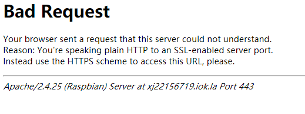http://xj22156719.iok.la/
然后试试看输入新的https还是无法获取文件？？？？？？？？？？？
但是这个文件改回来就不行了？
		#DocumentRoot /home/pi/www/http/html
		#ServerName xj22156719.iok.la
		#SSLEngine on
		#SSLCertificateFile /home/pi/www/http/html/Apache/2_xj22156719.iok.la.crt
		#SSLCertificateKeyFile /home/pi/www/http/html/Apache/3_xj22156719.iok.la.key
		#SSLCertificateChainFile /home/pi/www/http/html/Apache/1_root_bundle.crt
		说明一定就是改这个文件的原因！
难道是花生壳不支持？
不是的，应该是因为没太搞明白树莓派apache2的文件用途和代码结构以及修改原则翻译作用的根本英文意思

超级牛逼的电磁4定律

**出现转机的教程文件**（https://blog.csdn.net/qq_37968132/article/details/82431868）
安装过程中踩的坑：
 域名要写常用的。如果要使用https://www.example.com访问网页，域名选项-d 的参数一定要写www.example.com，如果申请证书和访问的域名不完全一致，访问时会提示不安全“访问的网站使用的安全证书域名错误”。
如果配置参数出错，最好只安装不要再申请。因为申请次数有限制。同一域名，每周最多申请10个证书，每周刷新。
安装证书时，--key-file和--fullchain-file的参数是你想要把证书安装在的位置，而不是之前申请到的证书的位置。这个位置会在配置apache时使用到。
如果过了一段时间出现了类似**NET :: ERR_CERT_AUTHORITY_INVALID**的错误，请检查是不是设置了证书链SSLCertificateChainFile。
开启后请把所有网站的链接替换为https，尤其是图片链接等。推荐写链接时用//www.example.com而不是https://www.example.com，这种写法会优先使用HTTPS而且不会禁止HTTP。
记得打开443端口
--------------------- 
作者：时梦 
来源：CSDN 
原文：https://blog.csdn.net/qq_37968132/article/details/82431868 
版权声明：本文为博主原创文章，转载请附上博文链接！

####  这里说的很强势，很棒的树莓派安装ssl服务https://alexlee.cn/%E4%B8%BA%E6%A0%91%E8%8E%93%E6%B4%BEraspberry-pi%E7%9A%84apache%E9%85%8D%E7%BD%AEssl%E6%90%AD%E5%BB%BAhttps%E6%9C%8D%E5%8A%A1%E5%99%A8/
#  这个绝壁是突破口！为树莓派

« 树莓派Raspberry Pi安装ownCloud搭建私有云服务器树莓派Raspberry Pi安装MLDonkey搭建电骡下载机 »
为树莓派Raspberry Pi的Apache配置SSL搭建HTTPS服务器
Published 四月 29, 2015
Share the post "为树莓派Raspberry Pi的Apache配置SSL搭建HTTPS服务器"
架设好私有云ownCloud后，下一个需要注意的就是安全问题。从客户端往服务器端传输信息，包括文档、相片等等，是有可能会在用户不在意的时候被截获的。翻译成人话就是：好比我们在大路上运输物资，路人是能看到我们运的是什么的。这时如果我们使用SSL建立隧道，再与自己的服务通讯，这样就会安全很多。人话：好比我们自己挖个隧道再运输物资。

至于具体什么是SSL，各位朋友可自行百度。开源的有OpenSSL，商业的就更多了。下没有免费的午餐，免费使用着OpenSSL的产品同时，为他们做广告是理所当然的，大家可参考一下这篇较为煽情的文章，还有另一篇知乎上关于锤子科技捐款给OpenSSL的讨论。

好进入正题，首先确认一下系统是否已安装OpenSSL：

which openssl
如果有，系统会返回OpenSSL的路径，比如“/usr/bin/openssl”；如果没有，也不会报错，就直接跳到下一行。

没有的话，就输入命令安装吧：

sudo apt-get install openssl
安装好后先新建一个目录，用来存放证书文件：

sudo mkdir /etc/apache2/ssl
然后生成一个新的证书，假设限期为3年（1095天），证书和密钥存放在刚才新建的目录中

sudo openssl req -x509 -nodes -days 1095 -newkey rsa:2048 -out /etc/apache2/ssl/server.crt -keyout /etc/apache2/ssl/server.key
这时openssl会以交互形式配置证书，终端会显示类似下面的提示：

Generating a 2048 bit RSA private key
............................................+++
.....................+++
writing new private key to '/etc/apache2/ssl/server.key'
-----
You are about to be asked to enter information that will be incorporated
into your certificate request.
What you are about to enter is what is called a Distinguished Name or a DN.
There are quite a few fields but you can leave some blank
For some fields there will be a default value,
If you enter '.', the field will be left blank.
-----
Country Name (2 letter code) [AU]:CN #双字母国别码，按需要填写即可；
State or Province Name (full name) [Some-State]:Guangdong #州名或省名；
Locality Name (eg, city) []:Guangzhou #地区或城市名；
Organization Name (eg, company) [Internet Widgits Pty Ltd]:OrganizationName #组织/公司/机构名；
Organizational Unit Name (eg, section) []:DepartmentName #部门名；
Common Name (e.g. server FQDN or YOUR name) []:your.domain.name #域名，这个最好填写互联网上能访问的地址；
Email Address []:your@email.com #邮箱地址；
完成后，为Apache安装SSL模块：

sudo a2enmod ssl
然后要在Apache配置文件中做一点改动，在sites-enabled目录中放置一个名为000-default-ssl的传送门，指向sites-available目录下的default-ssl：

sudo ln -s /etc/apache2/sites-available/default-ssl /etc/apache2/sites-enabled/000-default-ssl
这时我们来编辑一下这个文件的内容：

sudo nano /etc/apache2/sites-enabled/000-default-ssl
找到下面两行，按上面的路径修改，如果行头有注释用的“#”号，删了：

SSLCertificateFile    /etc/apache2/ssl/server.crt
SSLCertificateKeyFile    /etc/apache2/ssl/server.key
编辑好后按下Ctrl+X退出nano，nano提示询问是否保存，再按Y确认保存。

这个时候我们重启Apache：

sudo service apache2 restart
用openssl为Apache配置SSL至此就完成了。现在ownCloud还不是以SSL方式连接的，要以管理员身份登入ownCloud，再设置强制用户以SSL连接。

https://xj22156719.iok.la/不能加载网页文件
https://192.168.1.105/这个可以加载？但是好像也不是真正的加载更加可以说是没有链接可言

pi@raspberrypi:~/Desktop/mkdir/apache2备份 $ grep -rn "index.html"
mods-available/dir.conf:2:	DirectoryIndex index.html index.cgi index.pl index.php index.xhtml index.htm

# https://segmentfault.com/a/1190000009251798科学上网

# Root
https://blog.csdn.net/chenxd1101/article/details/53437925树莓派root

su root  

退出 root
 su pi

# 硬件
http://bbs.elecfans.com/jishu_578437_1_1.html

https://www.jianshu.com/p/a255c22b96fa

https://zhuanlan.zhihu.com/p/30890938

shumeipai.nxez.com/2018/12/07/tengine-inference-engine-raspberry-pi-deep-learning.html# Tengine 推断引擎：树莓派也能玩转深度学习自制电池https://github.com/hey-yahei/my_blog/tree/master/RasPi-Tengine/mobilenet_ssd

# 树莓派深度学习安装368M大小还是很多了
[Tengine 推断引擎：树莓派也能玩转深度学习](http://shumeipai.nxez.com/2018/12/07/tengine-inference-engine-raspberry-pi-deep-learning.html)
Tengine 是OPEN AI LAB为嵌入式设备开发的一个轻量级、高性能并且模块化的引擎。
Tengine在嵌入式设备上支持CPU，GPU，DLA/NPU，DSP异构计算的计算框架，实现异构计算的调度器，基于ARM平台的高效的计算库实现，针对特定硬件平台的性能优化，动态规划计算图的内存使用，提供对于网络远端AI计算能力的访问支持，支持多级别并行，整个系统模块可拆卸，基于事件驱动的计算模型，吸取已有AI计算框架的优点，设计全新的计算图表示。
sudo apt-get instal git cmake
-   **git** 是一个版本控制系统，稍后将用来从 [github](http://github.com/) 网站上下载Tengine的源码
-   **cmake** 是一个编译工具，用来产生make过程中所需要的Makefile文件

sudo apt-get install libprotobuf-dev protobuf-compiler libboost-all-dev libgoogle-glog-dev libopencv-dev libopenblas-dev
- 
- protobuf 是一种轻便高效的数据存储格式，这是caffe各种配置文件所使用的数据格式
boost 是一个c++的扩展程序库，稍后Tengine的编译依赖于该库
google-glog 是一个google提供的日志系统的程序库
opencv 是一个开源的计算机视觉库
openblas 是一个开源的基础线性代数子程序库

命令行显示大家伙需要安装：

pi@raspberrypi:~ $ sudo apt-get install git cmake
正在读取软件包列表... 完成
正在分析软件包的依赖关系树
正在读取状态信息... 完成
git 已经是最新版 (1:2.11.0-3+deb9u4)。
将会同时安装下列软件：
  cmake-data libjsoncpp1 libuv1
建议安装：
  codeblocks eclipse ninja-build
下列【新】软件包将被安装：
  cmake cmake-data libjsoncpp1 libuv1
升级了 0 个软件包，新安装了 4 个软件包，要卸载 0 个软件包，有 5 个软件包未被升级。
需要下载 3,771 kB 的归档。
解压缩后会消耗 19.2 MB 的额外空间。
您希望继续执行吗？ [Y/n] Y
获取:1 http://mirrors.zju.edu.cn/raspbian/raspbian stretch/main armhf cmake-data all 3.7.2-1 [1,216 kB]
获取:3 http://archive.raspberrypi.org/debian stretch/main armhf libuv1 armhf 1.18.0-3~bpo9+1 [86.3 kB]
获取:2 http://mirrors.zju.edu.cn/raspbian/raspbian stretch/main armhf libjsoncpp1 armhf 1.7.4-3 [66.2 kB]
获取:4 http://mirrors.zju.edu.cn/raspbian/raspbian stretch/main armhf cmake armhf 3.7.2-1 [2,402 kB]
已下载 3,771 kB，耗时 24秒 (155 kB/s)
正在选中未选择的软件包 cmake-data。
(正在读取数据库 ... 系统当前共安装有 127216 个文件和目录。)
正准备解包 .../cmake-data_3.7.2-1_all.deb  ...
正在解包 cmake-data (3.7.2-1) ...
正在选中未选择的软件包 libjsoncpp1:armhf。
正准备解包 .../libjsoncpp1_1.7.4-3_armhf.deb  ...
正在解包 libjsoncpp1:armhf (1.7.4-3) ...
正在选中未选择的软件包 libuv1:armhf。
正准备解包 .../libuv1_1.18.0-3~bpo9+1_armhf.deb  ...
正在解包 libuv1:armhf (1.18.0-3~bpo9+1) ...
正在选中未选择的软件包 cmake。
正准备解包 .../cmake_3.7.2-1_armhf.deb  ...
正在解包 cmake (3.7.2-1) ...
正在设置 libuv1:armhf (1.18.0-3~bpo9+1) ...
正在设置 cmake-data (3.7.2-1) ...
正在处理用于 libc-bin (2.24-11+deb9u3) 的触发器 ...
正在处理用于 man-db (2.7.6.1-2) 的触发器 ...
正在设置 libjsoncpp1:armhf (1.7.4-3) ...
正在设置 cmake (3.7.2-1) ...
正在处理用于 libc-bin (2.24-11+deb9u3) 的触发器 ...
pi@raspberrypi:~ $ sudo apt-get install libprotobuf-dev protobuf-compiler libboost-all-dev libgoogle-glog-dev libopencv-dev libopenblas-dev
正在读取软件包列表... 完成
正在分析软件包的依赖关系树
正在读取状态信息... 完成
将会同时安装下列软件：
  autoconf automake autopoint autotools-dev debhelper dh-autoreconf
  dh-strip-nondeterminism gfortran gfortran-6 gir1.2-gtk-2.0 libatk1.0-dev
  libavcodec-dev libavformat-dev libavutil-dev libblas-dev libboost-atomic-dev
  libboost-atomic1.62-dev libboost-atomic1.62.0 libboost-chrono-dev
  libboost-chrono1.62-dev libboost-chrono1.62.0 libboost-context-dev
  libboost-context1.62-dev libboost-context1.62.0 libboost-coroutine-dev
  libboost-coroutine1.62-dev libboost-coroutine1.62.0 libboost-date-time-dev
  libboost-date-time1.62-dev libboost-dev libboost-exception-dev
  libboost-exception1.62-dev libboost-fiber-dev libboost-fiber1.62-dev
  libboost-fiber1.62.0 libboost-filesystem-dev libboost-filesystem1.62-dev
  libboost-graph-dev libboost-graph-parallel-dev
  libboost-graph-parallel1.62-dev libboost-graph-parallel1.62.0
  libboost-graph1.62-dev libboost-graph1.62.0 libboost-iostreams-dev
  libboost-iostreams1.62-dev libboost-locale-dev libboost-locale1.62-dev
  libboost-locale1.62.0 libboost-log-dev libboost-log1.62-dev
  libboost-log1.62.0 libboost-math-dev libboost-math1.62-dev
  libboost-math1.62.0 libboost-mpi-dev libboost-mpi-python-dev
  libboost-mpi-python1.62-dev libboost-mpi-python1.62.0 libboost-mpi1.62-dev
  libboost-mpi1.62.0 libboost-program-options-dev
  libboost-program-options1.62-dev libboost-program-options1.62.0
  libboost-python-dev libboost-python1.62-dev libboost-python1.62.0
  libboost-random-dev libboost-random1.62-dev libboost-random1.62.0
  libboost-regex-dev libboost-regex1.62-dev libboost-regex1.62.0
  libboost-serialization-dev libboost-serialization1.62-dev
  libboost-serialization1.62.0 libboost-signals-dev libboost-signals1.62-dev
  libboost-signals1.62.0 libboost-system-dev libboost-system1.62-dev
  libboost-test-dev libboost-test1.62-dev libboost-test1.62.0
  libboost-thread-dev libboost-thread1.62-dev libboost-timer-dev
  libboost-timer1.62-dev libboost-timer1.62.0 libboost-tools-dev
  libboost-type-erasure-dev libboost-type-erasure1.62-dev
  libboost-type-erasure1.62.0 libboost-wave-dev libboost-wave1.62-dev
  libboost-wave1.62.0 libboost1.62-dev libboost1.62-tools-dev
  libcairo-script-interpreter2 libcairo2-dev libcv-dev libcvaux-dev
  libdc1394-22-dev libfile-stripnondeterminism-perl libfontconfig1-dev
  libgdk-pixbuf2.0-dev libgflags-dev libgflags2v5 libgfortran-6-dev
  libglib2.0-dev libgoogle-glog0v5 libgraphite2-dev libgtk2.0-dev
  libharfbuzz-dev libharfbuzz-gobject0 libhighgui-dev libhwloc-dev
  libhwloc-plugins libhwloc5 libibverbs-dev libibverbs1 libice-dev
  libilmbase-dev libjbig-dev libjpeg-dev libjpeg62-turbo-dev libltdl-dev
  liblzma-dev libmail-sendmail-perl libnl-route-3-200 libopenblas-base
  libopencv-calib3d-dev libopencv-contrib-dev libopencv-contrib2.4v5
  libopencv-core-dev libopencv-features2d-dev libopencv-flann-dev
  libopencv-gpu-dev libopencv-gpu2.4v5 libopencv-highgui-dev
  libopencv-imgproc-dev libopencv-legacy-dev libopencv-legacy2.4v5
  libopencv-ml-dev libopencv-ml2.4v5 libopencv-objdetect-dev libopencv-ocl-dev
  libopencv-ocl2.4v5 libopencv-photo-dev libopencv-photo2.4v5
  libopencv-stitching-dev libopencv-stitching2.4v5 libopencv-superres-dev
  libopencv-superres2.4v5 libopencv-ts-dev libopencv-ts2.4v5
  libopencv-video-dev libopencv-videostab-dev libopencv-videostab2.4v5
  libopencv2.4-java libopencv2.4-jni libopenexr-dev libopenmpi-dev libopenmpi2
  libpango1.0-dev libpcre3-dev libpcre32-3 libpcrecpp0v5 libpixman-1-dev
  libprotobuf-lite10 libprotobuf10 libprotoc10 libpthread-stubs0-dev
  libraw1394-dev libraw1394-tools libsm-dev libswresample-dev libswscale-dev
  libsys-hostname-long-perl libtiff5-dev libtiffxx5 libtool libx11-dev
  libx11-doc libxau-dev libxcb-render0-dev libxcb-shm0-dev libxcb1-dev
  libxcomposite-dev libxcursor-dev libxdamage-dev libxdmcp-dev libxext-dev
  libxfixes-dev libxft-dev libxi-dev libxinerama-dev libxml2-utils
  libxrandr-dev libxrender-dev m4 mpi-default-bin mpi-default-dev
  ocl-icd-libopencl1 opencv-data openmpi-bin openmpi-common po-debconf
  x11proto-composite-dev x11proto-core-dev x11proto-damage-dev
  x11proto-fixes-dev x11proto-input-dev x11proto-kb-dev x11proto-randr-dev
  x11proto-render-dev x11proto-xext-dev x11proto-xinerama-dev
  xorg-sgml-doctools xtrans-dev
建议安装：
  autoconf-archive gnu-standards autoconf-doc dh-make gfortran-doc
  gfortran-6-doc libgfortran3-dbg libcoarrays-dev liblapack-doc-man
  liblapack-doc libboost-doc graphviz libboost1.62-doc gccxml libmpfrc++-dev
  libntl-dev xsltproc doxygen docbook-xml docbook-xsl default-jdk fop
  libcairo2-doc libglib2.0-doc libgtk2.0-doc libhwloc-contrib-plugins
  libice-doc libtool-doc liblzma-doc openmpi-doc imagemagick libpango1.0-doc
  libraw1394-doc libsm-doc gcj-jdk libxcb-doc libxext-doc m4-doc opencl-icd
  libmail-box-perl
下列【新】软件包将被安装：
  autoconf automake autopoint autotools-dev debhelper dh-autoreconf
  dh-strip-nondeterminism gfortran gfortran-6 gir1.2-gtk-2.0 libatk1.0-dev
  libavcodec-dev libavformat-dev libavutil-dev libblas-dev libboost-all-dev
  libboost-atomic-dev libboost-atomic1.62-dev libboost-atomic1.62.0
  libboost-chrono-dev libboost-chrono1.62-dev libboost-chrono1.62.0
  libboost-context-dev libboost-context1.62-dev libboost-context1.62.0
  libboost-coroutine-dev libboost-coroutine1.62-dev libboost-coroutine1.62.0
  libboost-date-time-dev libboost-date-time1.62-dev libboost-dev
  libboost-exception-dev libboost-exception1.62-dev libboost-fiber-dev
  libboost-fiber1.62-dev libboost-fiber1.62.0 libboost-filesystem-dev
  libboost-filesystem1.62-dev libboost-graph-dev libboost-graph-parallel-dev
  libboost-graph-parallel1.62-dev libboost-graph-parallel1.62.0
  libboost-graph1.62-dev libboost-graph1.62.0 libboost-iostreams-dev
  libboost-iostreams1.62-dev libboost-locale-dev libboost-locale1.62-dev
  libboost-locale1.62.0 libboost-log-dev libboost-log1.62-dev
  libboost-log1.62.0 libboost-math-dev libboost-math1.62-dev
  libboost-math1.62.0 libboost-mpi-dev libboost-mpi-python-dev
  libboost-mpi-python1.62-dev libboost-mpi-python1.62.0 libboost-mpi1.62-dev
  libboost-mpi1.62.0 libboost-program-options-dev
  libboost-program-options1.62-dev libboost-program-options1.62.0
  libboost-python-dev libboost-python1.62-dev libboost-python1.62.0
  libboost-random-dev libboost-random1.62-dev libboost-random1.62.0
  libboost-regex-dev libboost-regex1.62-dev libboost-regex1.62.0
  libboost-serialization-dev libboost-serialization1.62-dev
  libboost-serialization1.62.0 libboost-signals-dev libboost-signals1.62-dev
  libboost-signals1.62.0 libboost-system-dev libboost-system1.62-dev
  libboost-test-dev libboost-test1.62-dev libboost-test1.62.0
  libboost-thread-dev libboost-thread1.62-dev libboost-timer-dev
  libboost-timer1.62-dev libboost-timer1.62.0 libboost-tools-dev
  libboost-type-erasure-dev libboost-type-erasure1.62-dev
  libboost-type-erasure1.62.0 libboost-wave-dev libboost-wave1.62-dev
  libboost-wave1.62.0 libboost1.62-dev libboost1.62-tools-dev
  libcairo-script-interpreter2 libcairo2-dev libcv-dev libcvaux-dev
  libdc1394-22-dev libfile-stripnondeterminism-perl libfontconfig1-dev
  libgdk-pixbuf2.0-dev libgflags-dev libgflags2v5 libgfortran-6-dev
  libglib2.0-dev libgoogle-glog-dev libgoogle-glog0v5 libgraphite2-dev
  libgtk2.0-dev libharfbuzz-dev libharfbuzz-gobject0 libhighgui-dev
  libhwloc-dev libhwloc-plugins libhwloc5 libibverbs-dev libibverbs1
  libice-dev libilmbase-dev libjbig-dev libjpeg-dev libjpeg62-turbo-dev
  libltdl-dev liblzma-dev libmail-sendmail-perl libnl-route-3-200
  libopenblas-base libopenblas-dev libopencv-calib3d-dev libopencv-contrib-dev
  libopencv-contrib2.4v5 libopencv-core-dev libopencv-dev
  libopencv-features2d-dev libopencv-flann-dev libopencv-gpu-dev
  libopencv-gpu2.4v5 libopencv-highgui-dev libopencv-imgproc-dev
  libopencv-legacy-dev libopencv-legacy2.4v5 libopencv-ml-dev
  libopencv-ml2.4v5 libopencv-objdetect-dev libopencv-ocl-dev
  libopencv-ocl2.4v5 libopencv-photo-dev libopencv-photo2.4v5
  libopencv-stitching-dev libopencv-stitching2.4v5 libopencv-superres-dev
  libopencv-superres2.4v5 libopencv-ts-dev libopencv-ts2.4v5
  libopencv-video-dev libopencv-videostab-dev libopencv-videostab2.4v5
  libopencv2.4-java libopencv2.4-jni libopenexr-dev libopenmpi-dev libopenmpi2
  libpango1.0-dev libpcre3-dev libpcre32-3 libpcrecpp0v5 libpixman-1-dev
  libprotobuf-dev libprotobuf-lite10 libprotobuf10 libprotoc10
  libpthread-stubs0-dev libraw1394-dev libraw1394-tools libsm-dev
  libswresample-dev libswscale-dev libsys-hostname-long-perl libtiff5-dev
  libtiffxx5 libtool libx11-dev libx11-doc libxau-dev libxcb-render0-dev
  libxcb-shm0-dev libxcb1-dev libxcomposite-dev libxcursor-dev libxdamage-dev
  libxdmcp-dev libxext-dev libxfixes-dev libxft-dev libxi-dev libxinerama-dev
  libxml2-utils libxrandr-dev libxrender-dev m4 mpi-default-bin
  mpi-default-dev ocl-icd-libopencl1 opencv-data openmpi-bin openmpi-common
  po-debconf protobuf-compiler x11proto-composite-dev x11proto-core-dev
  x11proto-damage-dev x11proto-fixes-dev x11proto-input-dev x11proto-kb-dev
  x11proto-randr-dev x11proto-render-dev x11proto-xext-dev
  x11proto-xinerama-dev xorg-sgml-doctools xtrans-dev
升级了 0 个软件包，新安装了 225 个软件包，要卸载 0 个软件包，有 5 个软件包未被升级。
需要下载 66.8 MB 的归档。
解压缩后会消耗 387 MB 的额外空间。

# 树莓派安装tensorflow

https://blog.csdn.net/ha010/article/details/80414997

# 树莓派远程登陆端口映射https://blog.csdn.net/hzwwpgmwy/article/details/78502746
# 允许远程控制树莓派，长期联网开机的我的姐姐的WiFi，和想实现长期外网登陆树莓派的我https://www.cnblogs.com/ziyiang/articles/4336057.html
？怎么操作？汇总整理恢复？

https://www.jianshu.com/p/b053d1df12c1Tplink TL-WR886N路由器设置端口映射

