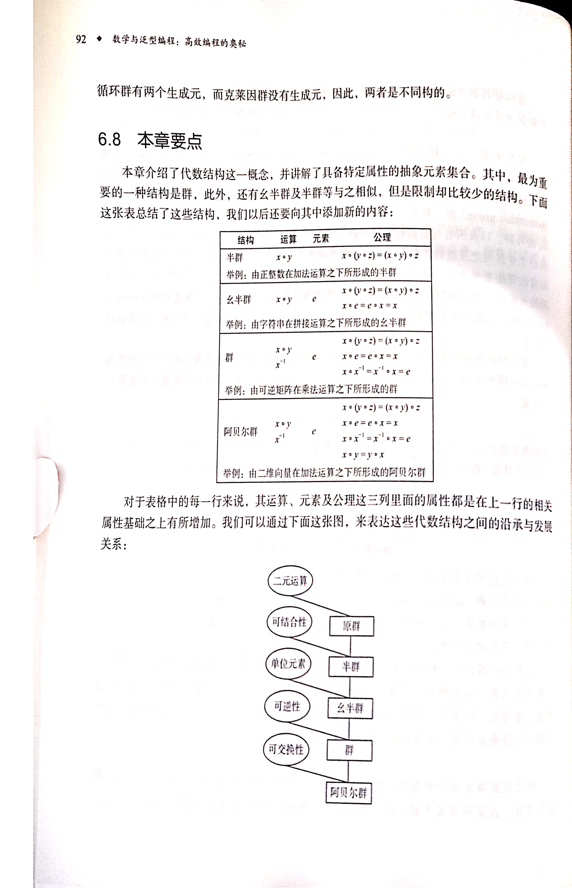
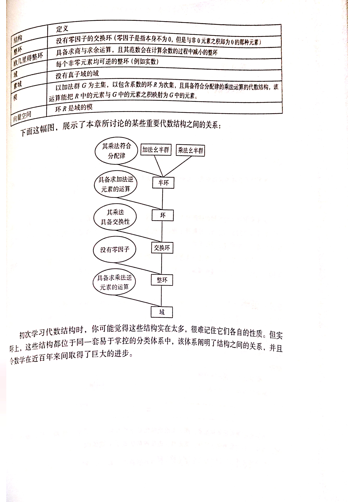
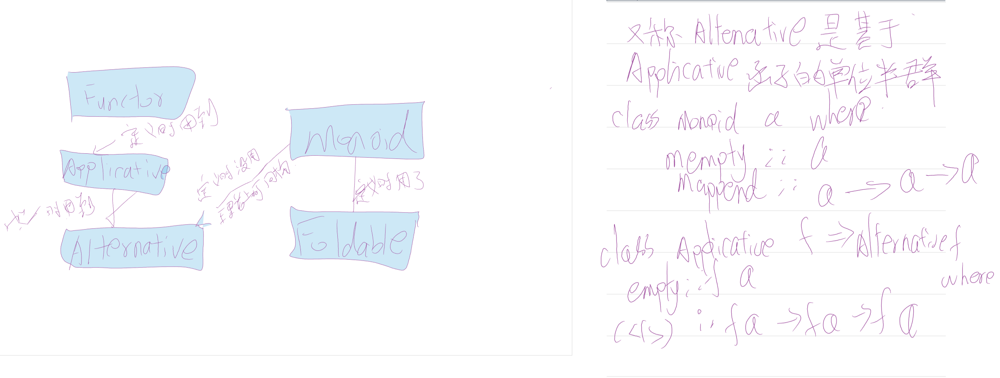

[TOC]

# 从源码一步步才能理解的单子
学monad得先知道他有什么用，神妙在哪儿？
建议看歪果仁这两个博客。

[Monad](http://adit.io/posts/2013-04-17-functors,_applicatives,_and_monads_in_pictures.html)

[三个有用的Monad](http://adit.io/posts/2013-06-10-three-useful-monads.html)


知道Monad大概是什么抽象，怎么用，有什么用，是看后文的前提。


>All told, a monad in X is just a monoid in the category of endofunctors of X, with product × replaced by composition of endofunctors and unit set by the identity endofunctor.

其实“a monad in X is just a monoid in the category of endofunctors of X，what is the matter?”可以当是一句理所应当的废话。

本文其实是我看《魔力haskell》的部分笔记，我觉得他讲Monad的思路很好。





魔力haskell介绍单子挺好的，github开源那几章，我就不班门弄斧了，分享点笔记算了。

Haskell从现实需求到抽象的自动化升格------科学家预见未来，工程师创造未来。

Haskell中一个实现函数常用的思路：先写出你要的函数类型，然后根据类型去推导，利用已知的函数，去一点点拼凑出想要的函数，而这个函数最终的底层实现过程，在函数被实现之后再慢慢分析即可。很多时候，当类型确定的时候，函数的实现就已经确定了。所以在Haskell中，设计类型是编程过程中非常重要的一步，这是其他编程语言很难带来的体验，而编译器强大的类型推断和检查，能够保证你的思路不会出错。


```

instance distance :: Position ->Double->Double
         distance  p1 p1 = 
             case p1 of 
                 MakePosition x1 y1 ->
                     case p2 of
                         MakePosition x2 y2 -> (sqrt(x1-x2)^2+(x1-y2)^2)--这里x1x2另外随便起名字是为了防止词法作用域的？？？如果都是x y，后一个x覆盖前一个x,都得不到距离。


point A ::Postion
point A = MakePosition 0 0


point B ：：Position 
point B = MakePosition 3 4

--导入hs调用：load *.hs
--distance pointA pointB


instance  Eq Position where
    Cartesian x1 y1 == Cartesion x2 y2  =  (x1==x2)&&(y1==y2)
    Polar x1 x2 == Polar  x2 y2         =  (x1==x2)&&(y1==y2)
    Cartesian x y == Polar a r          =      (x == r*cos a)&&(y == r*sin a)
    Polar a r   ==    Cartesian x y     =      (x == r*cos a)&&(y == r*sin a)
--其实可以data  Position = Cartesian Double Double | Polar Double Double  deriving Eq自动推导Eq实例


```


**但凡涉及绑定的都能用模式匹配**

Record Syntax记录语法


haskell的类型类很像 java接口或者C++虚函数
具体区别：

- 面向对象中类是约束对象实例行为，对象实例和其行为通过this指针绑定，类中定义的函数是实力的一部分。
- Haskell中类型类约束类型的行为，和类型对应的值无直接关系，比如《魔力haskell前文》Position类型不需要携带额外信息
- 当试图用Eq a限定类型a时我们才真正用到了实例声明中的函数，关键不同点是编译器自动为我们选择合适的实现，或者传递合适的字典。--重载方法具体实现是编译时静态实现的，无需动态判断减少Bugs。


**补充语法**


高阶函数 柯里化  类似shell的pipe<|应用函数从左往右&|从右往左$,"f $ g $ k  x就是f(g(k x))去括号"  where Let    guard   MutiWayIf{-#LANGUAGE MutiWayIf#-}或者winGHCi中:set -XMutiWayIf使用扩展 
Pointfree伊塔转换可以不写参数，满参数point-full style,空参数point-free style

```haskell
owl :: (a->b->c)->a->(d->b)->d->c
owl (.)$(.)


```
**常用列表操作** map，filter ,fold(foldr,foldl foldl'),scanl/scanr/scanl1/scanr1

##  类型的类型Kind
ADT ，GADT 
张淞(8.10-P160),虚幻类型没看太懂，想来是因缺了什么我还没学会的前置知识

```
data Exp=ValInt 5
        |ValBool Bool
        |Add (Exp a)(Exp a)
        |Equa (Exp a)(Exp a)
        deriving （Eq,Show）
        
```

看这里博客[什么是使用幻影类型的动机](
1. 是无效状态不可重现
2. 携带类型级别的信息
```
不粘贴过来了，感兴趣的自己去看
```


### **Kind**


```
Prelude> data Triple a b c=MakeTriple a b
type role Triple representational representational phantom
{-虚幻类型-}
data Triple a b c = ...
(0.00 secs, 0 bytes)
Prelude> :k Triple --类型构造器/Triple数据类型
Triple --类型构造器/Triple数据类型 :: * -> * -> * -> *
{-这里表示输入三个类型参数表示返回一个自定义类型Triple-}
Prelude> :t MakeTriple --数据构造器/类型构造函数
MakeTriple --数据构造器/类型构造函数 :: a -> b -> Triple a b c
{-这里表示输入两个数据a b返回一个Triple类型的值'Triple a b c'-}
```


# 类型层级结构“函子->应用函子->单子”,
就是一些特殊的类型类加上约束（类似多继承子类父类）

单子是just自函子范畴上的幺半群。Haskell处理这些副作用相关的任务，有一堆针对性的工具类型类，函子->应用函子->单子，函子给出了一个很好的“容器”抽象，我们保存了这个盒子所保存的值（关心的）和标签（类型解码方式）。

```
函数作用在盒子里不同类型的数字-**函子**
---（函数也被装在盒子里）---->
盒子里的函数作用在盒子里的值-**应用函子**----
---（能够提供jion函数的函子类型叫做单子，jion等价=> bindings更常用后者）----->**单子**
                                -----总结自《magic Haskell》
```


**全都是抽象**


- 函子是某种数据结构容器的抽象，所有容器类型构造器均可实现函子类型类。函子两个定律，反身性，分配律。
- semigroup是关于结合律的二元操作的抽象，
- 单位半群monoid是关于单位元和满足结合律从的二元操作的抽象，
- Funtor函子类型类是函子容器中提取值作用在f函数参数映射为另一种类型，然后装回盒子里，返回函子容器（函数）的高阶函数。比如Maybe a->Maybe b
- 可应用函数的函子Applicative （Functor）在Functor基础上+可调用函子容器内的函数，如Maybe类型。单位元，复合定律Composition,homorphism同态,interchange互换定律。
- Alternative类型类，可二选一的，后备的


monad 构成Kleisli范畴


## 函子Functor
```haskell
module Demo where

main :: IO()
main = do
  l <- fmap length getLine
  print l
  
```
函子类型提供了某种了某种类型的容器抽象
getter  setter

## 透镜组Lens

**不不可变数据的更更新⽅方式是基于原有的数据创建新的数据，（模式匹配/记录语法/gettersetter参操作简单的数据结构）创建中间变量然后丢掉的行为浪费时间费劲耗费内存没必要，所以Lens解决嵌套数据结构操作问题**


- view提取
- set设置嵌套变量返回
- over返回坐标变换函数结果

注释：over/set之后show p还是初始值，除非设置之后保存p2保存中间变量或者result_p结果，才能show p2得到计算结果。


lens方便处理潜逃数据结构操作，不用写很多辅助表达式，不用模式匹配/记录语法/getter/setter,方便快捷的lens函数库，


类型别名中大类型在前小类型在后

我们把透镜组中的小类型（Double）称作对应大类型（Position）的focus焦点


```haskell

*Lens Data.List> data Position = Position { positionX :: Double, positionY :: Double }deriving Show
data Position = ...
positionX :: Position -> Double
positionY :: Position -> Double
(0.03 secs, 0 bytes)
*Lens Data.List> p = Position 1 2
p :: Position
(0.00 secs, 0 bytes)
*Lens Data.List> show p
"Position {positionX = 1.0, positionY = 2.0}"
it :: String
(0.01 secs, 180,760 bytes)
*Lens Data.List> positionX p
1.0
it :: Double
(0.00 secs, 103,472 bytes)
*Lens Data.List> p2 = p{positionY =9}
p2 :: Position
(0.02 secs, 0 bytes)
*Lens Data.List> show p
"Position {positionX = 1.0, positionY = 2.0}"
it :: String
(0.00 secs, 180,240 bytes)
*Lens Data.List> show p2
"Position {positionX = 1.0, positionY = 9.0}"


```


## 应用函子applicative Functor

函子抽象提供fmap用来把普通函数升格为可以操作函子容器的函数

应用函子在函子的基础上额外特性：把函子里的函数作用在函子里的值，得到新的包裹在函子里的数或者值（值也是函数）。

被抽象出来的，能提供<*>定义的函子成为应用函子applicative Functor

可应用函数的函子Applicative （Functor）在Functor基础上+可调用函子容器内的函数，如Maybe类型。单位元，复合定律Composition,homorphism同态,interchange互换定律。


**自然升格**


## 幺半群monoid单位半群


## 单子Monad
容器抽象---函子之间的运算。这种类型类捕捉了一类特殊的函子上下文操作：把两层函子合并为一层。这操作使得构造及与汉字上下文的运算变得简单。同时haskell提供有特殊语法帮助书写单子的运算，改变了函数式编程体验，核心抽象类型类！！！


### A monad is just a monoid in the category of endofunctors（自函子范畴上幺半群）

Endo取自“Endomorphism”自映射，Endo单位半群


魔力书介绍“范畴->另一个范畴”很清晰。monad运算前后，还是范畴内部映射，运算前后都被包在箱子“容器”里面。


能提供join函数的函子类型称为单子，haskell相对而言约束较多的函子类型，最为强大的函子类型。任意一个单子必须是应用函子。>>=（粘接bind）函数和join可以相互推导，同构，逻辑等价。


### do语法糖

haskell对计算的通用描述，全部都建立在单子概念的基础上
排版优化，...>>=\param->变成param<-...,汉字包裹里面取出值绑定给param.
关键不是do语法糖看似相同的代码却有不同的计算语义，是因为单子的>>=定义不一样导致的。
注意上下文的类型说明有助于获取信息看懂代码。


```haskell

allArea::[Int]
allArea =
    [1..10]>>=\x->
        [x..10]>>=\y->
            return (x*y)        


```
写成do语法糖
```haskell

allArea = do 
    x<-[1..10]
    y<-[x..10]
    return (x*y)
```

```haskell
Just 3 >>= \n ->
    Just 'x'>>=\x->
        replicate n x


```


Eq2


```haskell
do
    n<-Just 3
    x<-Just 'xyz'
    return $ replicate n x

```

>>=保证副作用的顺序从左往右执行


```haskell
main ::IO()
main=do
    line<-getline
    putStrLnline
    x<-readLn
    y<-readLn
    print  $ x&&y

```
x为False也不会短路定理，还会读取y

```haskell
main ::IO()
main=do
    x<-readLn
    _<-readLn
    print  x

```
_不会被编译器优化失去

```haskell
main ::IO()
main=do
    n<-readLn
    if n<0
        then return ()--什么都不做return()是IO（）最小上下文语义，用（）填充IO函子是因为什么信息都没有
        else print "OK"
```


```haskell
main ::IO()
main=do
    n<-readLn
    when(n<0) print "OK"
```
when,unless函数甚至不要求函子是单子条件因为else分支pure包裹一个()即可


## 对比总结上述函子->应用函子->Monad

很像，针对各种类型的容器，不同实例，相同类型类 ，学过Java多态的能懂。


### 函子


```haskell


Prelude> :k Functor
Functor :: (* -> *) -> Constraint


Prelude> :i Functor
class Functor (f :: * -> *) where
  fmap :: (a -> b) -> f a -> f b
  (<$) :: a -> f b -> f a
  {-# MINIMAL fmap #-}
  	-- Defined in ‘GHC.Base’
instance Functor (Either a) -- Defined in ‘Data.Either’
instance Functor [] -- Defined in ‘GHC.Base’
instance Functor Maybe -- Defined in ‘GHC.Base’
instance Functor IO -- Defined in ‘GHC.Base’
instance Functor ((->) r) -- Defined in ‘GHC.Base’
instance Functor ((,) a) -- Defined in ‘GHC.Base’


```
####   <$>
*Main> :i <$>
(<$>) :: Functor f => (a -> b) -> f a -> f b
  	-- Defined in ‘Data.Functor’
infixl 4 <$>


### 应用函子


```haskell


Prelude> :k Applicative
Applicative :: (* -> *) -> Constraint


Prelude> :i Applicative
class Functor f => Applicative (f :: * -> *) where
  pure :: a -> f a
  (<*>) :: f (a -> b) -> f a -> f b
  GHC.Base.liftA2 :: (a -> b -> c) -> f a -> f b -> f c
  (*>) :: f a -> f b -> f b
  (<*) :: f a -> f b -> f a
  {-# MINIMAL pure, ((<*>) | liftA2) #-}
  	-- Defined in ‘GHC.Base’
instance Applicative (Either e) -- Defined in ‘Data.Either’
instance Applicative [] -- Defined in ‘GHC.Base’
instance Applicative Maybe -- Defined in ‘GHC.Base’
instance Applicative IO -- Defined in ‘GHC.Base’
instance Applicative ((->) a) -- Defined in ‘GHC.Base’
instance Monoid a => Applicative ((,) a) -- Defined in ‘GHC.Base’


Prelude> :i pure
class Functor f => Applicative (f :: * -> *) where
  pure :: a -> f a
  ...
  	-- Defined in ‘GHC.Base’
--pure把数值打包成函子里的数值，提供最小上下文，赋予参数一个函子打包


Prelude> :i <*>--函子应用运算符，升格计算的核心，把包裹在函子的函数+包裹在函子里的值运算，或根据上下文给出结果，然后结果包在函子类型中.
--<*>不仅可以接受包裹在Maybe函子的，包裹在任何函子的函数 f(a->b)均可接受，函子应用运算符。
class Functor f => Applicative (f :: * -> *) where
  ...
  (<*>) :: f (a -> b) -> f a -> f b
  ...
  	-- Defined in ‘GHC.Base’
infixl 4 <*>

*Main> [(*2),(*10),(+50)] <*> [1,2,3]
[2,4,6,10,20,30,51,52,53]

*Main> fmap replicate [1,2,3] <*> ['x','y','z']
["x","y","z","xx","yy","zz","xxx","yyy","zzz"]
--在很多动态规划问题有用

--我们不能抽象出一个是用于任何类型函子f上的函数<*>，反例(<*>) Const a (b->c)->Const a b ->Const a c
--cf <*> cx=???


--计算过程中直接填充函子类型
Prelude> :i <$
class Functor (f :: * -> *) where
  ...
  (<$) :: a -> f b -> f a
  	-- Defined in ‘GHC.Base’
infixl 4 <$

--为什么默认没有？？？？？？？？？

--$>::Functor f=>a -> f b -> f a
--($>)=flip <$自己导入就有，为什么默认没有了？

Prelude> :i $>

<interactive>:1:1: error: Not in scope: ‘$>’

--计算过程中直接使用包裹在函子里的值填充到生成的函子中
Prelude> :i <*
class Functor f => Applicative (f :: * -> *) where
  ...
  (<*) :: f a -> f b -> f a
  	-- Defined in ‘GHC.Base’
infixl 4 <*
Prelude> :i *>
class Functor f => Applicative (f :: * -> *) where
  ...
  (*>) :: f a -> f b -> f b
  ...
  	-- Defined in ‘GHC.Base’
infixl 4 *>


Prelude> :i fmap replicate  
class Functor (f :: * -> *) where
  fmap :: (a -> b) -> f a -> f b
  ...
  	-- Defined in ‘GHC.Base’
replicate :: Int -> a -> [a] 	-- Defined in ‘GHC.List’

Prelude> :t  replicate 
replicate :: Int -> a -> [a]

Prelude> :t fmap replicate  
fmap replicate :: Functor f => f Int -> f (a -> [a])

Prelude> :t fmap replicate (Just 3)   
--令他等于一坨（ fmap replicate (Just 3))replicateThreeF
fmap replicate (Just 3) :: Maybe (a -> [a])

--新建applyMaybe

applyMaybe :: Maybe(a->b)->Maybe a->Maybe b
applyMaybe (Just f)(Just x)=Just $ f x
applyMaybe _ _ =Nothing

applyMaybe fmap (replicate (Just 3)) (Just 'x')
-- 就是applyMaybe replicateThreeF (Just 'x')
-- Just 'xxx'

applyMaybe (fmap (replicate (Nothing)) (Just 'x')
--Nothing


有了applyMaybe可以串联在一起自然升格任何参数的了


addAll :: Int->Int->Int->Int
addAll x y z = x+y +z

 (fmap addAll $ Just 1)`applyMaybe`Just 2`applyMaybe`Just 3
 --Just 6
*Main> :t (fmap addAll $ Just 1)
(fmap addAll $ Just 1) :: Maybe (Int -> Int -> Int)
*Main> :t  (fmap addAll $ Just 1)`applyMaybe`Just 2
(fmap addAll $ Just 1)`applyMaybe`Just 2 :: Maybe (Int -> Int)
*Main> :t  (fmap addAll $ Just 1)`applyMaybe`Just 2`applyMaybe`Just 3
(fmap addAll $ Just 1)`applyMaybe`Just 2`applyMaybe`Just 3
  :: Maybe Int

*Main> :t (fmap addAll)
(fmap addAll) :: Functor f => f Int -> f (Int -> Int -> Int)
*Main> :t  map addAll
map addAll :: [Int] -> [Int -> Int -> Int]


```

### 半群+应用函子
Const a的应用函子

选择应用函子

拉链应用函子


### 单子


haskell对计算通用描述，全部建立在单子基础上

```haskell

Prelude> :k Monad
Monad :: (* -> *) -> Constraint


Prelude> :i join

<interactive>:1:1: error: Not in scope: ‘join’

--自己定义join，去掉多余的盒子塌缩多余上下文，Maybe(Maybe a)变成Maybe a,把[[a]]变成[a]等等


join::Maybe(Maybe a)->Maybe a
join(Just x)=x
join Nothing=Nothing

join::[[a]]=[a]
join=concat
......

--等等自己定义

*Main> :i return
class Applicative m => Monad (m :: * -> *) where
  ...
  return :: a -> m a
  ...
  	-- Defined in ‘GHC.Base’
--能提供join函数的函子类型称为单子，
--join函数和return组合得到很有用的函数‘>>=’粘合函数bing

Prelude> :i >>=
--(bind粘合函数和join同构，单子定义一般用>>=看不见join)
class Applicative m => Monad (m :: * -> *) where
  (>>=) :: m a -> (a -> m b) -> m b
  ...
  	-- Defined in ‘GHC.Base’
infixl 1 >>=

--应用函子最大的限制是我们计算开始之前由参数确定好了容器形状，无法计算中途更改应用函子包含的上下文，这些信息由参数静态决定


Prelude> :i Monad
class Applicative m => Monad (m :: * -> *) where
  (>>=) :: m a -> (a -> m b) -> m b
  (>>) :: m a -> m b -> m b
  return :: a -> m a
  fail :: String -> m a
  {-# MINIMAL (>>=) #-}
  	-- Defined in ‘GHC.Base’
instance Monad (Either e) -- Defined in ‘Data.Either’
instance Monad [] -- Defined in ‘GHC.Base’
instance Monad Maybe -- Defined in ‘GHC.Base’
instance Monad IO -- Defined in ‘GHC.Base’
instance Monad ((->) r) -- Defined in ‘GHC.Base’
instance Monoid a => Monad ((,) a) -- Defined in ‘GHC.Base’


``` 

  单子比应用函子强大，例子：join可以实现<*>，join和>>=同构

```haskell
(<*>)::Monad m=>m(a->b)->m a->m b
mf <*> mx = join $ fmap (\f ->fmap f mx )mf
--假设m是单子类型类约束的类型，那么必然有合适的join函数，通过fmap(\f->... )mf得到包裹在函子里的函数。而在匿名函数中再次使用fmap把函数f作用在函子包裹的fx中，最终结果两层函子的包裹。用join合并一层变成m b

--反过来，
join:: Monad m=>m(m a)->m a
join mmx=mmx>>=id

单子必须是应用函子，所以return=pure
用>>=来表述<*>
ap :: Monad m=>m(a->b)->m a->m b
mf `ap` mx=mf >>=(\f->mx>>=\x->f x)  --使用>>=解开m(a->b)和m a的包裹之后计算出b类型结果并放入原来的函子包裹中
  

```

  

## 后续
学无止境：

单子升格单子变换Monad Transform函数式数据结构数组树各种各样的单子比如IO/State/Writer/Reader/Identity Monad......


### 随机数
熵，真随机数

```
cat /dev/random

cat  /dev/urandom
```


伪随机算法Mersenne Twister法 ，2^19937-1迭代后恢复原数


typefamily类型家族


return 单位态射
 >=>  组合规则


Ps:我是看魔力Haskell学习的，算是笔记心得吧，这部分三章作者已经放进去了github仓库magic-haskell了。韩冬的书（我看完了纸质版）偏应用，张淞（第一版买了纸质版看完了，电子版第二版可能前置不足没看完）的书偏理论，都是很好的书。我看过很多，觉得Monad韩冬的文章最好，来龙去脉讲的最明白。


# 迷雾重重总说纷纭的monad  


## 大家眼中的monad

https://www.zhihu.com/question/311415552/answer/600063213


dev.stephendiehl.com/hask/#monads

https://www.zhihu.com/question/22291305/answer/21333050


https://www.zhihu.com/question/24972880/answer/134078723


## Haskell中的范畴之函子和自然变换

------单子(Monad)就是自函子范畴上的一个幺半群(~_~#，

https://zhuanlan.zhihu.com/p/65449477

https://www.zhihu.com/question/19635359/answer/172074046


怎么理解“一个单子（Monad）说白了不过就是自函子范畴上的一个幺半群而已”? - chris的回答 - 知乎
https://www.zhihu.com/question/282666729/answer/508110678


今天翻了翻。跟个智障一样卡在一个a上，和没资料上，学数学学多了……如果没理解错的话，一个单子就是在给类映射赋值，然后把类作为一个范畴，范畴中为数据。然后这个单子的结果依然是某类数据的元素，所以可以认为是自函子，然后这个幺半群，幺元为回到自身的单子，运算就是复合单子不断映射。

  https://github.com/winterland1989/magic-haskell/issues/18
  
作者：罗密欧与猪过夜  
链接：https://www.zhihu.com/question/282666729/answer/435795734  
来源：知乎  
著作权归作者所有。商业转载请联系作者获得授权，非商业转载请注明出处。


  
作者：Anqur  
链接：https://www.zhihu.com/question/282666729/answer/511773290  
来源：知乎  
著作权归作者所有。商业转载请联系作者获得授权，非商业转载请注明出处。

Monad是一种数学结构，haskell中的Monad意义和数学上的意义是一样的。简单的说单子(Monad)就是自函子范畴上的一个幺半群。这个幺半群的态射是作用在自函子上的自然变换，其单位态射是haskell中class Monad 的return函数(这个实际上是个自然变换)。而这个幺半群的态射的组合操作(composition)则是haskell中class Monad的join函数，也是一个自然变换。  
从几何直观的概念来说，Monad是一个自相似的几何结构，通过自函子的作用和两个自然变换的约束得到一层层嵌套的自相似结构。

  
  
作者：parker liu  
链接：https://www.zhihu.com/question/22291305/answer/21333050  
来源：知乎  
著作权归作者所有。商业转载请联系作者获得授权，非商业转载请注明出处。

这个连接还有很多有价值的回答！


https://zhuanlan.zhihu.com/p/25565309


Haskell中的范畴之积与和

https://zhuanlan.zhihu.com/p/25554114


Monad是一种数学结构，haskell中的Monad意义和数学上的意义是一样的。简单的说单子(Monad)就是自函子范畴上的一个幺半群。这个幺半群的态射是作用在自函子上的自然变换，其单位态射是haskell中class Monad 的return函数(这个实际上是个自然变换)。而这个幺半群的态射的组合操作(composition)则是haskell中class Monad的join函数，也是一个自然变换。  
从几何直观的概念来说，Monad是一个自相似的几何结构，通过自函子的作用和两个自然变换的约束得到一层层嵌套的自相似结构。

  
  
作者：parker liu  
链接：https://www.zhihu.com/question/22291305/answer/21333050  
来源：知乎  
著作权归作者所有。商业转载请联系作者获得授权，非商业转载请注明出处。


“Monad提供了一种对函数计算过程的通用抽象机制，关键是统一形式，统一操作模式，统一概念集合, 复用代码”，“一些程序语言会提供语法糖来方便编写”。设计模式不是还有点用的吗？当然，你可以说我不需要知道这些不也能编吗？我只要知道这些API不就行了吗？ 当然可以！但是，就像是不懂牛顿力学我也能干好搬砖工一样，东西懂多一点不是显得有文化一点吗？说不定还能自制个滑轮，做个杠杆什么的，干活的时候省点劲。

如果只是使用别人已经定义好的Monad, 那当然有没有这个概念无所谓。有的时候自己需要发明点什么的时候，这些概念就有点小用了。


https://zhuanlan.zhihu.com/p/65449477


会用和懂知识轮子


-----------------------------------------------------------------------------------------


 [15 分钟了解 Monad](https://zhuanlan.zhihu.com/p/58514370)

https://www.zhihu.com/question/19635359/answer/172074046
https://www.zhihu.com/question/64207539/answer/217843172
https://www.zhihu.com/search?type=content&q=Monad
https://www.zhihu.com/question/22291305/answer/21333050

https://wiki.haskell.org/Monad_tutorials_timeline


https://en.wikipedia.org/wiki/Monad_%28functional_programming%29


https://www.zhihu.com/question/64207539
有没有对Haskell中理解monad比较好的代码例子？


https://www.zhihu.com/question/22291305/answer/21333050
**单子(Moand)是自函子的Monoidal范畴上的一个幺半群，该Monoidal范畴的张量积（tensor product，⊗:M×M→M）是自函子的复合(composition)，单位元是Id functor。**

https://www.zhihu.com/question/22291305/answer/21333050


Monad是一种数学结构，haskell中的Monad意义和数学上的意义是一样的。简单的说单子(Monad)就是自函子范畴上的一个幺半群。这个幺半群的态射是作用在自函子上的自然变换，其单位态射是haskell中class Monad 的return函数(这个实际上是个自然变换)。而这个幺半群的态射的组合操作(composition)则是haskell中class Monad的join函数，也是一个自然变换。  
从几何直观的概念来说，Monad是一个自相似的几何结构，通过自函子的作用和两个自然变换的约束得到一层层嵌套的自相似结构。

  
  
作者：parker liu  
链接：https://www.zhihu.com/question/22291305/answer/21333050  
来源：知乎  
著作权归作者所有。商业转载请联系作者获得授权，非商业转载请注明出处。

