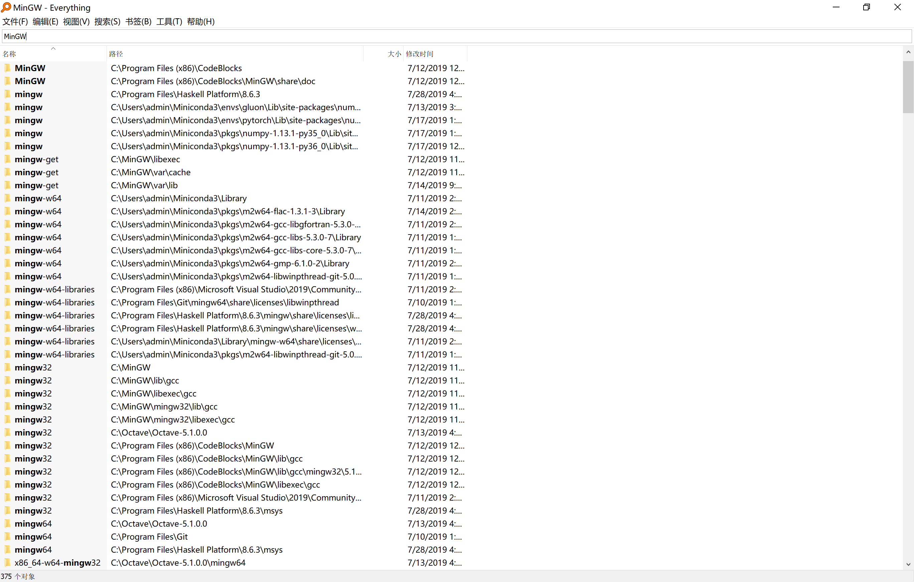

# lambda演算出函数式编程认知学习发展路线

#  呀呀学步---直觉认知
         ------世界运作的本质是“复读机”，Ctrl+cv
[认知科学家写给小白的Lambda演算](
草纸上一步步复制粘贴演算才能理解的λ演算，天呀，原来世界运作的规律本质是“复读机”。
  
  后来我学了《Haskell(张淞的)》学院风比较强，《魔力Haskell》通过代码深入理解，实战靠谱，最妙的是“函子->应用函子->单子”的讲解和范畴学方面的用得上的理论介绍。

我当时看完小白文想进一步推导剩下的λ演算世界的时候，有点迷茫，后来遇到了这个项目，github的λ演算工具包]()，惊为天人，学到了。

Haskell入门如果只是想知道怎么调用已经写好的知识轮子的话，看几篇博客写几行代码就完事儿了。如果想从小孩子都能接受的基础知识开始建立这个技术知识大厦的基石的话，要动笔理解演算，代码实现反思，还要进行实战解决问题Haskell99之类。

coq等函数式编程内核都很小，简直就是那个梗，开局一把刀，然后数据，自己库函数，数据结构，库函数自己定义，甚至能自己找file:///C:/Users/admin/Downloads/arch/Coq/lib/coq/theories 相关源码定义，当然一些用户不关心的打包成预编译文件加速。

**类型即函数，形式即证明**
有了Haskell基础，看一些Isabelle的证明会简单很多《高阶逻辑辅助证明系统Aproof Assistant For higher-Order Logic》。

第一部分，入门还好，简单明了。

第二部分，gamerules规则，我了个草,
                    后面还好，转身往回跑。

第三部分，应用精妙，仰望大佬。

其实中间看过Ice1000千里冰封的[《小册子》](，感觉adag我来用的话只会用“C-r C-l”自动证明策略（别人设计好的知识轮子），但是这不是我想要的，无奈，只能转头回去看《HOL》那本书的推理证明定理规则，这一章节是人工智能逻辑的逻辑推理核心，逃不掉的-_-#(

其实早就看过这个惊为天人的课程简介，[软件基础：逻辑基础+编程语言基础+函数式算法验证+快速测试]( 上课一直没时间看，放假抽空学了第一本，逻辑演算coq证明看看或者训练习，发现isabelle的基础对Coq很有用，当然也可以直接看这个完美课程。
看完第一本第一章我就后悔了，为什么当初刚看完[认知科学家写给小白的Lambda演算]( 没找到这个，完美对接，从理论演算到代码实现，这简直就是太棒了！。

# 再论知识轮子
[编译原理教授](说，新语言只是新约定，因为就旧语言的社区教授PPT课程等经济花费不能支持推倒从来，所以设置一个新语言满足新需求，本质都是调用OS的Api，所有函数都是为了实现吴飞书上说的“用你的大脑去指挥你的电脑，更准确来说，那只是一个会光速做计算的机器”（大概这个意思，原句记不清了）

我觉得吧，语言最重要的还是社区，人总是懒的，多人用Python做好了机器学习的“知识轮子”，那我肯定就用Python框架，Matlab，Octave也有人在用,都能做，但是没必要重头造轮子，想统一起来调用各种语言实现”文学编程“？你可能需要JupyterLab。开发代码是一回事，平台部署又是一回事了，不然Anaconda管理Python包，Stack，yum等等管理包的活儿，在这上面又有乘了网络发展顺风车的java虚拟机，VM虚拟机,Hype-V，WSL和全场最佳MVP（Docker和他的进化版）。讲到网络，大概WASM可能是网络编程字节码腾飞的关键技术。
------说了这么多，我只想表明一点，我认为一个语言除了知识轮子生态比如（hackage或者methematica demonstri.com等等）在开发阶段很重要，在实现阶段的代码平台环境独立打包也很重要。光看tensorflow，pytorch各种安装失败包管理不适配就知道，知识轮子多了，天知道这个轮子依赖的那个轮子有没有打包给我，Docker显神威。环境处理方面，其实Linux比windows软件有优势，Linux目录结构固定，举个MinGW作为例子，

在windwos上，单凡是个编程软件用上gcc都在windows打包个MinGW，因为为了软件可以运行翻译成底层OS代码，天知道用户电脑上用的是什么版本的Gcc或者放在哪个位置？于是Windos使用相对路径无限复制，而Linux只有一个在固定目录下的MinGW,缺的环境变量需要调用的知识轮子yum等自动安装省心省力还没那么多坑！很多开源软件Windows部署困难原因就是这个。编程用Linux,ios系统的多也是这个原因。Andriod建立在linux上却有着很多不同企业的衍生版，统一之路遥遥无期，raspberry等等物联网设备的系统甚至也有不统一的，机器人蜘蛛制造商自己建了个修改过的系统做的机器人，后期维修整理只能找对应厂家，就像特立独行的苹果连充电线接口的钱都不能让别人挣去的原因类似。所以谁都知道统一标准好，那谁来统一标准就谁有钱掌握游戏规则，华为的5G之争也是为了这个而已。卡脖子技术是什么？我感觉是知识轮子的的知识轮子的知识轮子，是所有眼花缭乱的知识中最最最底层的系统知识，是知识大厦的基石，正如马同学或者3b1b那些小孩子也能懂的基础，一步一步地搭建知识大厦最基本的”基石“，一如刘慈欣对基石的看法，理论基础那些抽象概念提取出来的更抽象的数学逻辑概念，才是放诸四海皆通用，不依赖其他知识轮子的限制的”假设全球断电时也能荒野求生的瑞士军刀“。

注释：这里的全球断电说的是计算机计算器等基于电子电路电器电路的设备，但是**图灵机理论，自动机理论，上下文语法语义，Lambda演算等等计算机理论知识**是不会变的”有了它们，~~ 就能和鬼子谈条件了 ~~。呸说错，是造出其他任何知识轮子。光说可能没有什么概念，看看先人在经济基础不太发达，社会发展还没到电子电气时代的   机器时代的巅峰]()  用功耗磨损比较大的机械设备造出积分器，不是梦。但是当然电器只是当前阶段比起光子计算机，生物湿电极计算机更好的选择。就像crash cources计算机导论说的历史，从单极管到集成电路，核心其实没有变，只是“**不变的计算机组成设计逻辑原理不断改变物理实现载体而已**”，

**近世代数，范畴学，群论，分析学，集合几何度量等抽象数学原理**也是不会变的，邓俊辉理解的数据结构第一节课挺有意思的，算法只是图灵机上解决问题的固定步骤，与物理载体也无关。真要说起来，机器学习的理论实现公式只要保存好了，哪怕今天Python说要收费“掐你脖子”，开源的python包要写出来Octave框架也不是难事，更何况也有很多人用matlab做机器学习的。

其实什么计算机语言都能通过语法语义的等价编译转化成其他平台无关的字节码，看过一个很多很多语言转换的项目]()    ，也就释怀了。

**近世代数，范畴学，群论，分析学，集合几何度量，概率论等抽象数学原理**，有了它们这些理论基础，无论什么语言编写的框架，只要是开源的或者基础原理模型有公式的，都能实现。举个实际点的例子，Matlab收费很好用，教授们写的知识轮子m文件被拿来作为一个个专门学科知识库文件库函数直接调用爽歪歪，但是破解版不能商用，为了挣钱，matlab还不做出可以把代码打包交出来的exe，apk,ipa,rpm,deb等脱离平台无关的工具，也可能是逆向文件找需要的轮子辅助出来打包独立出来，挺费劲的没写出来。
反正用户根本不关心这个黑箱子“知识轮子”怎么原理，客户只希望方便调试方便使用。

**声光电热力量子力学等物理世界与运作的规律**也是不会变的，无论你的代码公式表述出来是mathematica demonstration ,jupyterlab ，haskell package，甚至写成bash代码或者windows的bat文件，只要代码对用的理论逻辑公式在，写出代码只是耗费点“水磨功夫”而已。比如项目---octave实现matlab类库]().

>其实这种卖matlab靠技术“知识付费”吃饭的已经是很体面了，还有背地里卖资源的，骗经费的，低买高卖等等资本运作的说法，让“真正生产的人得不到合理的回报，而管理和运营的人获得更多的利益，甚至暴力剥削挣钱手法更恶心人。”不患寡而患不均，不患贫而患不安，古来有之，人们不关心蛋糕做大，关心蛋糕分配，哄抢资源的做法才是最关注的。或者先富带后富的意思是《黑客编程**艺术》（书好像叫这个名字）作者说的，保持贫富差距，用合理的制度让有能力改造世界做大蛋糕的那些人先富起来的同时，相对而言，虽然有一定贫富差距，但是也能让全人类整体都有所改善。比如工业革命前后的世界，人们资本运作和阶级流动。当然，作者并没有讨论无知之幕下，阶级固化人才内卷等问题，毕竟只是技术类书籍的一点吐槽语记。可能这需要找马克思才能有相关讨论的观点。

正如C系列同根同源，不同编程方言只有语法语义解析时候的编译约定不同造成的一些细微差异，甚至对高手来说新语言不应该学，而应该做项目来熟悉+一些特有的DSL的约定。其实C语言是新手不错的编程算法训练工具，兼顾软件硬件发展方向，思维锻炼手段，现成的包调用多了，可能人就玄学了，懒惰了。------简单来说，C系列同根同源，学精通一个就够了。
λ演算系列语言也是，很多都是触类旁通的，不同的为了自己恰当的应用领域加了语法糖或者适当的优化语言特征，当然《7周7语言第二版》说到的有一部分是函数式，也是这么个理儿。我的观点的话，Haskell，对Isabelle，coq很有帮助相互印证，触类旁通！类型系统，类型类，抽象再抽象的概念而已。

值得一提的是，好的工具运算符号计算手段，能帮助你减轻脑力复杂度，辅助思考，比如mathematica优雅整洁地实现各种计算任务，或者说是coq严谨地实现证明。对此，值得注意的是好的语言debug很重要。

C系列编程语言其实有点像“时序电路”，变量追踪debug方面Matlab看矩阵大数据比mathematica方便靠谱。

Lambda系列编程语言有点像逻辑电路，我觉得惰性求值有好有坏，λ演算debug如果能打印出演算过程来debug可能也很难有人看，毕竟这需要很多很多页很长的重复的括号复制粘贴，不过好处是，写出来了就不容易错，而且自带演算证明过程，不行的话，把代码用λ演算写出来一页又一页的纸就证明了。但是问题是，不好想，加上处理IO等状态变化的方法比较难受。

我们学习C的时候习惯用内存盒子输入装进去一个数的二进制编码方式，打上正确的解码标签输出时可以得到我们想要的。难受的是，天知道“恐怖的指针会知道哪儿，或者变成输入输出各种意外实现过程中天知道给出来的一行内存地址中的正确解码方式到底是什么？最最恐怖的是NUll,一如那个大牛说的价值百万的空指针。”
张淞举了一个很有意义的例子，while(x!=0){x:=x-1};当x为小数且小数部分不为零，程序不会停止，即使x为零，也要看等号右边0的类型有关。当x<-2^31，组成原理告诉我们内存溢出，再减一就是正数了，所以程序还是会停。但是这不报错，能编译，但绝对不是程序员想要的结果，甚至只有上线运行，千禧年溢出才能被发现！有个新闻说一个网络转账系统中代码类型Int，当请求数据大于极限值变多了溢出就被损失了上千万。天知道断言出来的程序失误够不够？比如除零？溢出？类型错误？所以我们需要“形式证明”验证操作系统编译原理内核等等。类似的，电路设计原理其实也用上了形式证明，华为就需要这种人。

针对这类时序电路类似的有关状态改变的问题

λ解决办法是万年老梗，单子是just自函子范畴上的幺半群。Haskell处理这些副作用相关的任务，有一堆针对性的工具类型类，函子->应用函子->单子，函子给出了一个很好的“容器”抽象，我们保存了这个盒子所保存的值（关心的）和标签（类型解码方式）。

> 看《魔力Haskell》函子->应用函子->单子

当然“没有银弹”，或者也可以像一些函数式语言一样在处理这种时序状态副作用问题的时候直接用非纯的C的内存做法，也能简单混合解决这类问题，更简单但可能不够安全。

高阶函数自洽，层层嵌套的函子，范畴之间不断映射升格。

haskell作为胶水语言可能更加安全。

还值得一提的是haskell的并行性计算的优越性，操作系统课程讲到进程并行计算时候的“任务流水”相关管理算法，最有意思的是进程锁PV操作之类的做法，复杂而巧妙但可能没必要，因为如果都想haskell一样和时序无关的话，并行管理会简单很多。比如haskell的STM。

实践的话，其实现成发展的包最多最有效的用haskell的是网络编程，相关项目可以看这里](),
或者我们看WASM首先用的测试其他语言的手段就是haskell可见一斑。

# 定理证明
为什么我比较感兴趣这个呢？
问题的计算复杂度如果太大了，人脑处理不过来，所以我们学会打包现有的知识轮子，crash cources计算机导论系列视频说的“a higher level of abstract”,数学定理的公理出发，打包成一个个定理方便搭建更高的知识大厦，但是能否“状态自动机”来从“由数学定理节点组成的复杂图与网络中应用相关智能搜索算法”中找到“证明数学猜想的证明通路？”
正如数学上研究的，几何代数分析不分家，三大方向其实都是对自然定理的很精致的抽象。

# Haskell思考
这里链接haskell大世界的回路。

