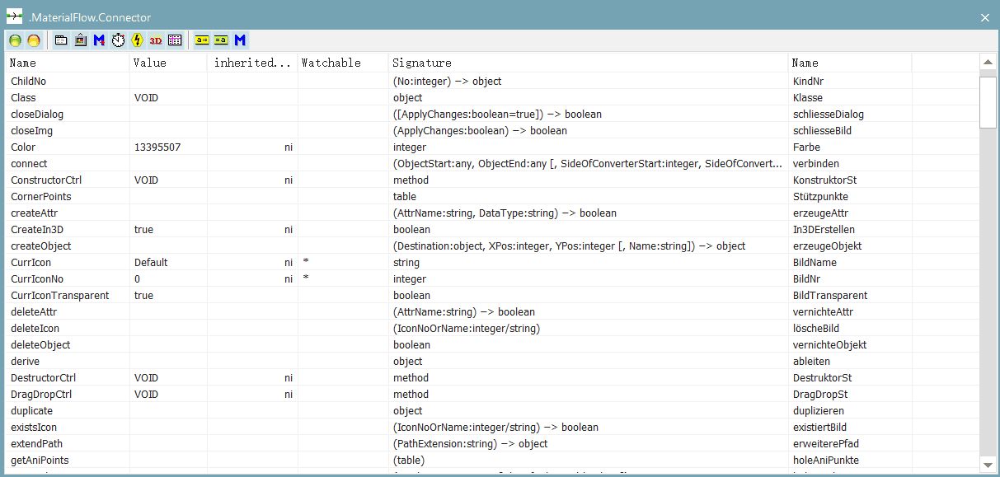
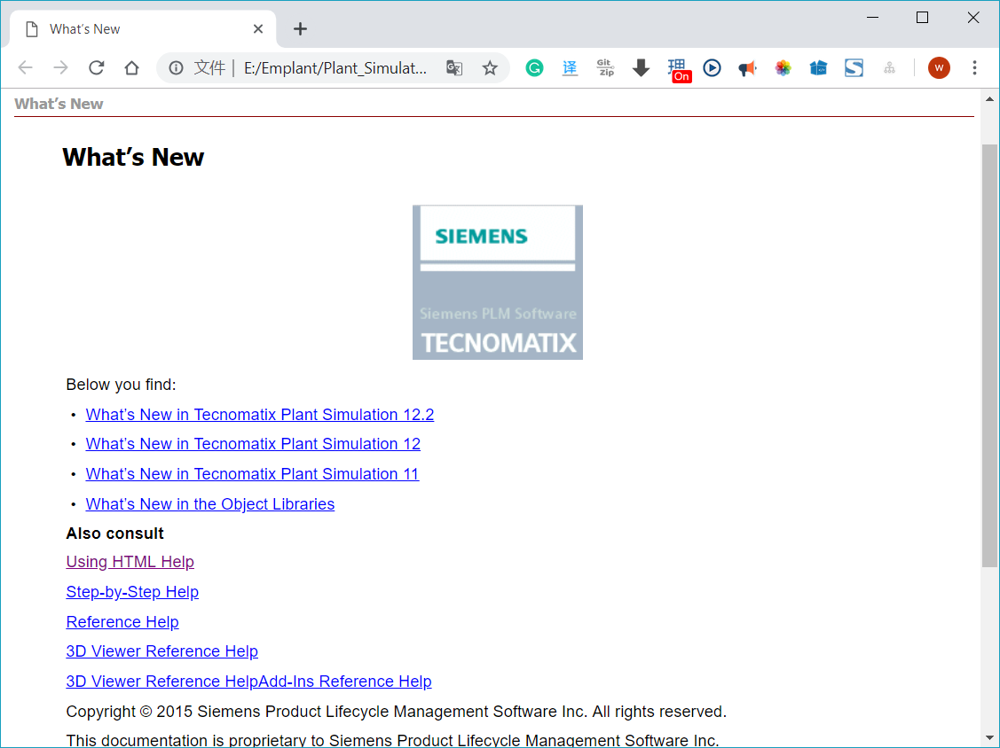
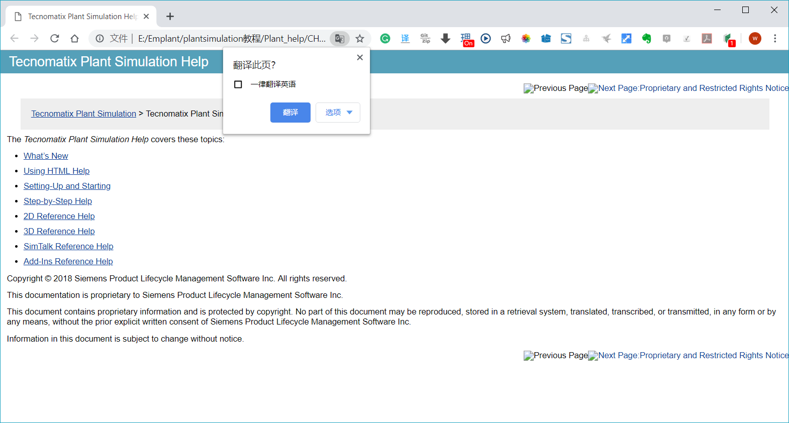
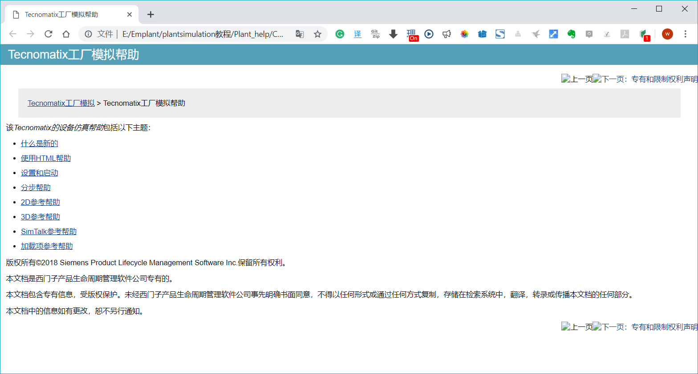

# 正确的学习方法是跑正确的例程

我想用Plant可视化个数据结构算法

想实现一个对象比如常量a指向->另一个常量b

可视化 可以用dialog

a->直接连线Object.create(connector)常量b，

对象的引用就是指针，只要自己创建一个新的用户变量Object,指向下一个对象就行

只要生成树的时候图上的变量的位置能定下来之后，他的对应x,y值就能知道也就能连线了
虽然还不知道怎么连接两个对象，但是我感觉只要生成树的时候图上的变量的位置能定下来之后，他的对应x,y值就能知道也就能连线了。


C接口编程，太流弊了，想到了解决结构体的办法了！


这个例子，相关面向对象费劲的其实完全可以直接封装到C++里混合编程
结构体这样子不就有了吗
把脏活儿扔给C语言，这个软件只干一些体面活儿


# 类型系统示例


方法调用这里看到的关键词搜索Help跑一边源码就能懂了。


想要写代码Method画出来一棵树，一个对象能够选择他的后继前驱连线就好了

录制宏通过点击命令学习对应的实现代码这个功能高绝真的有用，你说反馈到官方新版会不会加这个功能/
你可以自己开发一个库。
有道理，开源社区的意义大概就在这儿吧


核心能力在帮助文件，巧用帮助文档真的很难呢


真希望Plant能像VBA一样录制宏，直接看各种操作的源代码！！！！！！！！！！！！


主要是像用一个数指向另一个数字，构造链表
因为Plant好像也不能写结构体
也不像java能对象引用


```

Plant13软件安装根目录:.
├─3D # 模型库
│  ├─jt-graphics
│  └─s3d-graphics
│      ├─BuffersAndSorters
│      ├─EOM
│      ├─Transporters
│      └─Workers
├─BasicObjects# 模型库
├─C-Interface  #C语言接口使用教程样例
├─Clipart #图标库
│  ├─Chart
│  ├─Misc
│  ├─Movable
│  ├─Schulung
│  └─Training
├─Examples # 各种使用教程样例，超级有用!
│  ├─3D
│  └─Demo#用到什么学什么，看会直接用，模仿做一个
│      └─German
├─Help
│  └─Videos# 视频有点用，就是chm文字版很垃圾，
├─Languages
│  ├─CHS
│  ├─DEU
│  ├─HUN
│  ├─JPN
│  └─RUS
├─Libraries#类库，可以加载管理工程类库
│  ├─Standard
│  │  ├─Free
│  │  └─Licensed
│  │      ├─Assembly
│  │      ├─Process Designer Interface
│  │      ├─Shop
│  │      └─Value Stream Mapping
│  └─Tools
├─License Server Binaries
├─OPC Core Components
├─Teamcenter
│  └─Saxon MPL notices
├─Templates    # Method代码模板------用到相应的代码，复制进去Method改吧改吧就完事儿了
│  ├─English
│  │  ├─Broker
│  │  ├─Code Snippets
│  │  ├─Dialog
│  │  ├─Entrance Control
│  │  ├─Exit Control
│  │  ├─Exporter
│  │  ├─Importer
│  │  ├─Interaction
│  │  ├─Processing Time
│  │  └─Sensor Control
│  └─German#不看
│      ├─Ausgangssteuerungen
│      ├─Bearbeitungszeiten
│      ├─Broker
│      ├─Code-Schnipsel
│      ├─Dialog
│      ├─Eingangssteuerungen
│      ├─Exporter
│      ├─Importer
│      ├─Interaktion
│      └─Sensorsteuerungen
├─Tutorial#  入门必看，先看视频！
├─WIBU Driver
├─wrltojt
└─xt2jt
    └─Schema

```


*.jt,*.s3d
## Examples学习笔记！！！！！！






翻译之后的结果：


闲着有空，你还可以把它翻译成中文chm发布。


# 技巧

扩展启动选项 E:/chm_files/Plant/CHM/id74918.html

F1：打开帮助文档

  

F2：重命名

  

F3：搜索。可搜索根目录下所有对象名、源代码、变量等

  

F4：重命名当前Frame

  

F5：继续运行由于debug或断点中断的程序

  

F6：查看统计信息

  

F8：查看属性

  

F9：添加类断点

  

F10：调试时逐句运行

  

F11：查看当前对象自定义属性

  

F12：查看当前对象控制方法

  

Shift + F9：仅对当前方法添加断点

  

Ctrl + Space：代码自动补全

  

Alt + C：自动缩进

  

Ctrl + Shift+ Q：注释当前语句

  

Ctrl + T：旋转图标

  

  

  

多按下列按钮看着学习：

F8 属性 F4重命名 shift F1对象属性

  

reset Init Endsim

  

# **匿名表达式**

  

•@--表示触发物流对象control的MU

  

• basis--表示 class library

  

• current--表示method所在的frame

  

• ?---表示调用method的实体（物流对象或method)

  

  

Self 执行Method本身

  

Current 执行Method所在Frame

  

Location 正执行的Method所在 Frame，指代正在处理他的物流对象，<Object， >.Location表示正在处理他的物流对象，@.Location返回MU所在物流对象绝对路径

  

~是Location缩写

  

Root 模型顶级Frame，第四章

  

!\[语句是错的\](\_v\_images/语句是错的\_1555672447\_25759.png)

# Simtalk 20

  

/*

param action: string

  

switch action

case "Open"

\-\- TODO: add code for the "Open" action here

\-\- E.g. ?.setCaption("TextBox", "Test")

\-\- E.g. ?.setCheckBox("CheckBox", true)

case "Apply"

\-\- TODO: add code for the "Apply" action here

\-\- E.g. print ?.getValue("TextBox")

\-\- E.g. print ?.GetCheckBox("CheckBox")

case "Close"

\-\- TODO: add code for the "Close" action here

end

(action : string)

*/

  

  

  

www.plantsim.top/simtalk-编程技巧和建议/

## 善用debug

  

在程序运行中，有时会出现意外的情况，但是并不会打断程序执行，如move语句执行失败，程序会继续运行。当出现错误时，问题的根源已难以追溯。debug语句就可以在问题发生时，及时中断程序。下面列举一些debug的适用范围。

  

\- move：move失败错误比较隐蔽，经常会在很长时间之后发生错误。建议使用以下方法：

  

if not move()

  

debug

  

end

  

\- find：如果在一个表中使用find查找一个值，而这个值应该出现在表中。那么如果出现错误，并没有这个值，那么find语句并不会报错，而是返回初始游标位置，找到错误的值。建议使用以下方法：

  

if TableFile.find({*,*}..{*,*},aValue)

else

  

debug

  

end

  

\- if：可以在if语句未涵盖到的部分添加debug，以检验当前程序逻辑。例如：

  

if condition1

  

elseif condition2

  

else

  

debug

  

end


[5] 周金平 
SimTalk 2.0的变化：

Ø  抛弃is……do……end的结构；

Ø  定义变量的方法不同于以前的在is后面添加类似于m：integer，改为var m：integer；

Ø  引用method的语句修改为param n1,n2:real->real（示例为传递两个实数型变量），在低版本中为（n1,n2:real）:real;

Ø  每行结尾不再需要分号。

其他的变化在日后的使用过程，再继续与大家分享。

Tips：

Ø  一些常见的控制结构可以直接在菜单栏“编辑-控制结构”中选择，修改相应条件即可；

Ø  修改某些object的属性，可以选中object，按“F8”键，查看object具有哪些属性；


Ø Tablefile[column，row]，第一个数为列，第二个数为行。

SimTalk 2.0 encompasses:

A line-controlled syntax: You no longer need to type a semicolon (Smiley Wink at the end of each statement. Instead, you can simply enter a single statement into a line. As you still might want to be able to split a statement and distribute it over several lines, the interpreter needs to automatically determine if the statement is incomplete and is being continued in the next line. In addition, you can enter a semicolon to add another statement in the same line.

 

A simplified body syntax: In SimTalk 1.0 the source code requires the keywords is do end. SimTalk 2.0 does not need these keywords. In SimTalk 2.0 you will declare parameters using the keyword param, local variables using the keyword var, and the return value using the keyword -> (hyphen plus right angle bracket).

 

Improved referencing of methods and global variables: In SimTalk 1.0 Methods and Variables are referenced with the reference operator. In SimTalk 2.0 you reference Methods and Variables with a leading & operator, for example: var oSmiley Surprisedbject := &Method.

 

New div/mod operator: In SimTalk 1.0 the // operator represents an integer division and the \\ operator represents an integer modulo operation. In SimTalk 2.0 the keyword div represents an integer division and the keyword mod represents an integer modulo operation.

 

Simplified control flow statements: The control structures which you can insert with the command Insert Control Structure into your source code, reflect this. You can now enter control flow statements using the simplified syntax:

if-else-end instead of if-then-else-end
for-next instead of for-to-loop-next
switch-case-end instead of inspect-when-then-end
while-end instead of while-loop-end
The keyword then in if-statements is optionally allowed.
The keyword loop in loops is optionally allowed.
A changed about equal operator. You now have to use:

~= instead of ==, compare Tolerance for about equal (~=) comparison.
<~= instead of <==
>~= instead of >==
New operators for adding, subtracting, or multiplying a value:

x += y is short for x := x + y
x -= y is short for x := x - y
x *= y is short for x := x * y
An improved list and table syntax: You now only enter list ranges using curly brackets {}. The optional 1.0 syntax using a grave accent `[] is no longer available. (The bracket operator of an empty cell, compare [,] (read the contents of a cell), now returns VOID. In SimTalk 1.0 an empty cell returned the default value of the cell, which usually was 0.)

 

You can read out an element of a one-dimensional list with the bracket operator []. This works for Stacks and Queues as well. You can read and remove an element from a CardFile with the new built-in method remove.

*  When reading the contents of a cell of a CardFile with the bracket operator in SimTalk 1.0, the contents of the designated cell was read and removed. The remaining cells moved up by one position.
When assigning a value to the designated cell with the bracket operator to a CardFile in SimTalk 1.0, this value was inserted into the cell and the existing cells moved down by one position. 

*  When reading the contents of a cell with the bracket operator in SimTalk 2.0, the contents of the designated cell will be read, but will remain in the StackFile, QueueFile, and the CardFile.
When assigning a value to the designated cell with the bracket operator to a CardFile in SimTalk 2.0, this value will just overwrite the contents of the existing cell. This way a CardFile will behave the same way as a TableFile with one column.

________________________________________
--------------------- 


作者：Ronnie666 


来源：CSDN 

# 全局变量
you can access an object **Variable**, which is located in an arbitrary network (object Frame).

For instance:
```

 root.Frame.variable := 10;  
 local n := root.Frame.variable;  
 print n;

```

Note that **root** is your simulation frame, which containes the **Eventcontroller**.

Regards,

Peter


原文：

https://blog.csdn.net/luolandeygy/article/details/70464186 


版权声明：本文为博主原创文章，转载请附上博文链接！


博客

https://blog.csdn.net/cqzhaodaxio/article/details/84854854

微信

学习之路

网站
www.plantsim.top/page/2/
论坛

知乎
https://zhuanlan.zhihu.com/p/30516262

周金平书本

新版本simtalk

遗传算法

Plant Simulation 是面向对象的三维离散事件仿真软件，使您能够快速、直观地构建逼真的物流模型。 您还可以使用高级统计工具执行复杂的生产分析。以下介绍该软件的一些常用命令。

1\. clearConsole: 清空控制台内容。

2.表操作：

is orderlist : table\[string,real\]; do orderlist.create;
   orderlist\[1,1\] := "cans";
   orderlist\[2,1\] := 3000.0;
   orderlist.forget; -- 删除表
   orderlist.create(4); \-\- 重现创建一个4行的表end; 

 3.  When-Then-Else

例1:  is
do @.color := when ?.entranceLocked then "red" else "green"; end;  
例2:  (n : integer) : integer \-\- computes the faculty of n is
do
   return when n > 1 then n * self.execute(n - 1) else 1; end;  
例3:  Method(x, y \+ (when dy > 0 then y+dy else 100));


JT文件格式是Siemens（[西门子](https://www.baidu.com/s?wd=%E8%A5%BF%E9%97%A8%E5%AD%90&tn=SE_PcZhidaonwhc_ngpagmjz&rsv_dl=gh_pc_zhidao)） PLM Software开发的轻型3D模型文件格式，可以使用JT2Go软件打开。  
　　Siemens（[西门子](https://www.baidu.com/s?wd=%E8%A5%BF%E9%97%A8%E5%AD%90&tn=SE_PcZhidaonwhc_ngpagmjz&rsv_dl=gh_pc_zhidao)） PLM Software是全球领先的产品生命周期管理（PLM）软件与服务提供商。JT文件格式设计为一个开放、高效率的、紧凑，持久性存储的产品数据格式；用于产品可视化、协作和CAD数据共享。JT文件格式包括多方面的数据，以及对曲面边界的精准表示，产品和制造业的相关信息，元数据信息，这些信息都可以CAD文件系统导出并可以被产品数据管理(PDM) 系统导入到软件里。


# SimTalk

　　[http://www.itpub.net/viewthread.php?tid=1287272&hinghlight=SinTalk](http://www.itpub.net/viewthread.php?tid=1287272&hinghlight=SinTalk)
　　

http://www.itpub.net/viewthread.php?tid=1452011&extra=page%3D1&frombbs=1

# NP-Complete
Nondeterministic Polynomial Complete Problem


[http://www.itpub.net/thread-1287272-1-1.html](http://www.itpub.net/thread-1287272-1-1.html)


# 备忘

D:\Program Files\Siemens\Tecnomatix Plant Simulation 13

## 利用高效语句

正常的仿真运行对程序效率要求不高，但是当仿真时间较长，需要进行大规模实验的时候，运行效率的问题变得尤为重要。这里列举一些高效的语句供参考。

-   使用switch…case…end (inspect…when…end) 代替 if…elseif…end （条件较多时）
-   使用copyRangeTo / writeRow 等代替循环语句写表，减少表格读取次数。
-   尽量使用局部变量代替全局变量，包括表格。

### 循环语句的终止条件

for循环不涉及该问题，但是while循环和repeat循环极有可能因为终止条件不完善陷入死循环。所以在使用这两种循环时，要注意设置循环次数的限制，添加计数器。例如：

repeat

«loop_statements»  
i+=1

until «exit_condition» or i>1000


www.plantsim.top/simtalk常用函数介绍（四）：数学运算相关函数/


www.plantsim.top/simtalk常用函数介绍（三）：表格操作相关函数/

www.plantsim.top/simtalk常用函数介绍（一）：字符串操作相关函数/


www.plantsim.top/simtalk常用函数介绍（二）：数组操作相关函数/


www.plantsim.top/非整型数值变量使用时需要注意的问题/

# 数据库交互和COM,ActiveX。。。


在这里，您可以使用这些函数访问eM-Plant。

利用DLL可在Plant Simulation 中调用C++函数。
http://www.plantsim.top/%E5%8A%A8%E6%80%81%E9%93%BE%E6%8E%A5%E5%BA%93%EF%BC%88dll%EF%BC%89%E5%BA%94%E7%94%A8/

调用DLL主要涉及四个函数，loadLibrary,  getLoadedLibrary,  callLibrary,  freeLibrary，下面分别说明这四个函数的作用和使用方法。

loadLibrary(NameOfDll:<string>)

加载Dll文件。

传入参数为字符型（string）的Dll文件地址。

返回值为该Dll的句柄（Handle），数据类型为整型（integer）。加载错误时返回  -1

getLoadedLibrary(NameOfDll:<integer>)

根据句柄（Handle）查询加载的Dll文件。

传入参数为整型（integer）句柄。

返回值为字符型（string）Dll文件完整路径。

callLibrary(Handle:<integer>, FunctionName:<string> [,Parameter:<any>, …])

调用Dll文件中的函数。

传入参数为句柄（integer），函数名（string），传入参数（any）。

返回值为函数返回值（any）

freeLibrary(NameOfDll:<integer>)

释放Dll文件

传入参数为需要释放的Dll的句柄（integer）

返回值为是否执行成功（boolean）

示例：
var  Handle:integer:= loadLibrary(to_str(ApplicationHome,”\C-Interface\cinterf.dll”))  //确定Dll文件路径
if  Handle>0

print  getLoadedLibrary(Handle), ” is loaded.”  //加载Dll文件

var  ReturnVal:real := callLibrary(Handle, “calcSin”, PI/6)  //调用Dll函数，函数”calcSin”作用为计算正弦值。
print  ReturnVal  //输出返回值，计算sin(π/6)，值为0.5

print  “Unloading: “, freeLibrary(Handle)  //释放Dll文件

end


# Method 
208
InheritSources Scource Code

****


一般蓝色method不能直接运行，绿色可以。


红 故障
蓝色 暂停
绿色 正常工作
黄色 阻塞
棕色 正常工作准备
灰色 缺乏必要资源而等待
淡蓝 恢复状态


# 


# 开发限制
当您使用C接口链接自己编程的DLL时，此DLL必须编译为64位DLL。

对于ActiveX对象，您需要64位ActiveX控件。

对于ODBC接口，还需要用于ODBC的 64位驱动程序。从Microsoft Office 2010开始，Microsoft为Access，Excel等提供64位ODBC驱动程序。

该OPC接口只能解决OPC服务器的64位版本。


FlowControl VS Exit Strategy属性
133

InterFace层次


## GA

  

  

### Experiments


 p, li { white-space: pre-wrap; } 

F1：打开帮助文档

  

F2：重命名

  

F3：搜索。可搜索根目录下所有对象名、源代码、变量等

  

F4：重命名当前Frame

  

F5：继续运行由于debug或断点中断的程序

  

F6：查看统计信息

  

F8：查看属性

  

F9：添加类断点

  

F10：调试时逐句运行

  

F11：查看当前对象自定义属性

  

F12：查看当前对象控制方法

  

Shift + F9：仅对当前方法添加断点

  

Ctrl + Space：代码自动补全

  

Alt + C：自动缩进

  

Ctrl + Shift+ Q：注释当前语句

  

Ctrl + T：旋转图标

  

上述快捷键为建模时常用快捷键，欢迎更正和补充

  

  

http://www.plantsim.top/simtalk-%E7%BC%96%E7%A8%8B%E6%8A%80%E5%B7%A7%E5%92%8C%E5%BB%BA%E8%AE%AE/

  

  

http://www.plantsim.top/%E5%88%A9%E7%94%A8odbc%E8%AF%BB%E5%8F%96excel%E6%95%B0%E6%8D%AE/

  

  

http://www.plantsim.top/%E4%B8%89%E7%A7%8D%E5%87%BD%E6%95%B0%E8%B0%83%E7%94%A8%E6%96%B9%E6%B3%95%E5%8F%8A%E5%85%B6%E7%89%B9%E7%82%B9/

  

http://www.plantsim.top/category/%E5%9F%BA%E7%A1%80%E6%95%99%E7%A8%8B/

  

http://www.plantsim.top/page/4/

  

  

  

  

  

  

  

  

  

  

  

  

  

  

  

  

  

  

  

  

  

  

  

  

  

  

  

  

  

  

  

  

  

  

  

  

  

  

  

  

  

  

  

  

  

  

  

  

  

  

  

  

  

  

  

  

  

  

  

  

  

  

  

  

  

  

  

  

  

  

  

  

  

# 如果你真的想私下里请教‘大神’问题，

请先复制以下这段话发过去：
——尊敬的***老师您好！久仰您在flexsim仿真行业的大名，在这里真诚地想请教一个问题！如果您没有时间，请恕我抱歉打扰到了您！如果您可以拨冗帮忙，将万分感谢！在此先谢过您！

  


主流的建模仿真软件有Arena、Witness、Quest、Plant\_Simulation、Flexsim、Extend、AutoMod等，看网上用Plant\_Simulation、Flexsim的 比较多，请帮我比较一下这些仿真软件的优缺点，并选择一款软件用于生产线的建模和仿真，谢谢！

  

  

作者：宋伯阳

链接：https://www.zhihu.com/question/275419087/answer/381015510

来源：知乎

著作权归作者所有。商业转载请联系作者获得授权，非商业转载请注明出处。

  

制造系统相关的仿真主要有三种

  

Discrete Event Simulation 离散事件仿真

Agent Based Simulation

System Dynamics simulation 系统动态仿真

  

  

取决于你的问题

  

1 仿真模型是否涉及物理参数。比如你要优化生产线布局layout，那就会涉及物理参数。需要很多视觉演示，比如会代入很多CAD模型，或者机器人动态模型，也会设计到某种程度的物理参数。这种推荐Agent based simulation

  

2 仿真模型是否涉及供应链网络，或者任何复杂的物料或物流网络关系。如果模型涉及供应链，那么你很可能需要System dynamic simulation

  

3 如果主要是流程和产排问题，那么主要用discrete event simulation.包括机器工序安排，生产计划，线平衡问题等。大部分工厂内部需求，都是这类问题。这个类别中，分机器为主的系统，或者人工操作为主的系统，或者混合的。有很多软件只擅长其中一种。

  

这三个问题你清楚了，再去看软件。

  

一个仿真项目还可能考虑这些问题:

  

这个模型是不是演示为主的。做给客户看的，要做得很漂亮，显得你对工厂的运营非常有把握。这种项目后期可能会非常像游戏开发，结合各种VR，AR技术，可能会涉及到游戏开发软件，比如unity. 把客户当玩家，让他们玩了你的模型后不断发出 哇 画面质量真好，真逼真，游戏性真强的感叹，然后对你的工厂产生高大上的感觉，于是把订单交个你

  

这个模型是不是测试为主的。主要内部使用，我只是为了研究某种特定的生产问题。多用于开发新制造系统，或者工厂改造升级项目

  

这个模型是想做asif类型的情景分析，还是回答tobe类型的优化问题。大部分仿真软件都是asif类型的，也就是已经前置了一个情景，你只是去仿真这个情景，然后看看仿真结果是否符合预期。对于复杂系统，很多时候人是很难预计会发生什么情景的，这个时候就需要优化算法，或者更高级的机器学习之类的工具加入，这时你的模型会有很高的运算要求，那用的软件也不一样

  

这个模型是不是一次性的，还是不断迭代，甚至实时仿真。如果你们公司自主开发能力比较强，可以考虑迭代开发和实时仿真。这就不是一个软件可以解决的问题了。还需要生产线上的数据采集，通讯，数据库，前端后端开发等等等等，你可能需要一个强大的IT团队

求一款推荐的仿真软件？ \- 宋伯阳的回答 \- 知乎

https://www.zhihu.com/question/275419087/answer/381015510

  

  

  

  

# 求一款推荐的仿真软件？ \- 宋伯阳的回答 \- 知乎

https://www.zhihu.com/question/275419087/answer/381015510

  

  

  

https://wenku.baidu.com/view/80a91c10a1c7aa00b42acbb3.html不要学flexsim的十大理由

  

  

  

https://www.zhihu.com/question/42209817/answer/284024279

作者：Jing Chen

链接：https://www.zhihu.com/question/42209817/answer/284024279

来源：知乎

著作权归作者所有。商业转载请联系作者获得授权，非商业转载请注明出处。

  

二者都是系统仿真软件。首先说厂家，FlexSim是美国的，em-plant准确说应该叫做plantsimulation（改名了）现在是德国西门子的。前者是通用型仿真，应用的行业更广泛（制造、物流、交通、冶金、医疗），是三维面向对象的离散系统仿真软件，近年版本能够支持VR显示；后者更多用在制造行业，应用的企业更多，特别是德资背景的大型制造商（车厂），也是面向对象的，虽然能够生成三维，但是并非实时三维，建模是二维界面完成再转三维展示，目前还不支持VR。两者都有自己的脚本语言，前者叫做FlexScript（以c++为基础），相较而言FlexScript更好学一些，新版本加入了点语法模式，比较符合潮流的编程模式，支持的SQL语句也越来越多。，后者叫simTalk（以c语言为基础），相对比较“朴素”一些，对计算机编程基础的要求更高一点。前者在物流或者是有众多设备运动结构方面的展示能力更强，如果自己没有编写优化算法的能力需要购买额外的优化模块；后者偏重制造流程，但是后者优化有自带遗传算法，并且与其他算法兼容效果更好。二者与外界通讯的接口都很方便，前者只有一个全功能版本价格约几十万，导入周期短，基本上企业应用的好半年就可以见效，后者则是分模块销售，一个模块就几十万，而且plantsimulation是西门子数字化tecnomatix众多软件中的一员（换句话说你最好上下游配套软件都用西门子的，才能发挥出真正作用），需要较长的投入周期。简单对比一下~

  

  

  

  

  

  

  

  

  

  

  

  

。flexsim是美国flexsim公司的，Plant是德国西门子滴。前者大多数在仓储物流（如京东的立体库房）以及3D可视化广为应用。国内比如赛迪公司就以flexsim为主。后者逻辑应用更为强大，更多在逻辑模型搭建上有更多应用，同时也可以做3D可视化（模型创建稍有困难）。后者是西门子数字化tecnomatix（包括Plant simulation，Process Designer，Process Simulation等 ）中的一员。国内迪基透公司就以plant为主。学习这两款软件，都需要最简单的C语言编程基础，在此基础上，两者再进一步分别有各自的语言。如果是港口物流和地下物流，其实两款软件都可以做。主要是看你们的侧重点以及资源。还有自我编程的能力。本人曾用过plant，对flexsim只是了解，并未实际用过。所以就酱紫吧。

  

作者：Songbo Yao

链接：https://www.zhihu.com/question/42208934/answer/142446509

来源：知乎

著作权归作者所有。商业转载请联系作者获得授权，非商业转载请注明出处。

  

  

离散制造能用的目前我稍微了解的有4款类似的软件。Demo3D、visTable、PlantSimulation、Flexsim。此外还有很多物流模拟仿真软件，面向的行业也很多。

  

1\. eM-plant被收购后叫PlantSimulation西门子的PS有两本书不错，优势在于Teamcenter、Tecnomatix、SimaticIT(CamStar)、balabalabala... 平台化战略

2\. Flexsim学校里学的多。

3\. Demo3D上手快(偷偷告诉你新版有破解版，但是软件本身并不是很好用)，有个优势，可以做西门子ProcessSimulation做的事情，物流干涉啥的。

4\. visTable还在研究，同事国外看过觉得还可以，有没有国内代理商看见我信息给我发个体验版，我这儿项目多，可以帮做个demo宣传。

5\. witness老牌英国软件，航空等公共服务领域用的比工厂多，这个没有了解。

6\. AutoMod是大名鼎鼎的应用材料的，别的离散制造也能用，教育版比较良心！

  

作者：Pablo

链接：https://www.zhihu.com/question/42208934/answer/250062664

来源：知乎

著作权归作者所有。商业转载请联系作者获得授权，非商业转载请注明出处。


#       C-interface


```
	ProjectType="Visual C++"
	Version="9,00"
	Name="cinterf"
	ProjectGUID="{028CF851-1013-4C7C-AD8D-CE63612B8EF3}"
	RootNamespace="cinterf"
	TargetFrameworkVersion="131072"


```
解决方法一：由其sln的后缀可知  这个工程是用 VC++ .net 2003以上版本创建的，它的项目文件是.vcproj（相当于VC6的.dsp），解决方案文件是.sln（相当于VC6的.dsw） 所以需要2003以上的版本打开它，打开.vcproj或.sln都可以。 如何知道到底是哪个版本呢？

用记事本打开.vcproj文件，看他的前几行有一行类似：
   Version="9.00"
   9.00是用VS2008创建的
   8.00是用VS2005创建的
   7.10是用VC++.net 2003创建的

 如果这个工程是用VC++ .net 2003创建的，那么有一个工具可以把它转为VC6的工程。 
http://www.vckbase.com/tools/downtools.asp?id=164 （未试用）


