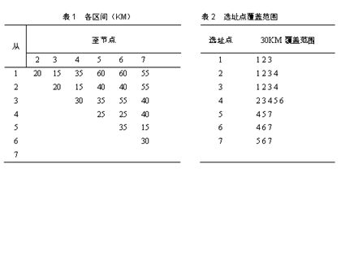
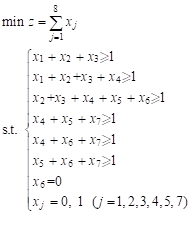
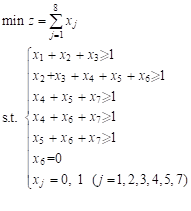

 
覆盖问题示例

A6=0，30范围

决策建议：至少要建多少个救护中心，选址何处？

解：先根据表1整理出救护中心各拟选区车程8min内的覆盖范围，如表2所示。



设0-1变量*xj* =1在该区设救护中心，否则*xj* =0。选址模型（已去掉重复约束）如下：




```
f=[1,1,1,1,1,1,1];

A=[1 2 3 0 0 0 0; 0 2 3 4 5 6 0; 0 0 0 4 5 0 7;0 0 0 4 0 6 7;0 0 0 0 5 6 7];

A=-A;

b=-ones(5,1);

intcon=[1,2,3,4,5,6,7];

Aeq=[0 0 0 0 0 1 0];

beq=[0];%也可以这样，对应ub=ones(7,1)

lb=zeros(7,1);

ub=ones(7,1);

[x,fval,flag] = intlinprog(f,intcon,A,b,Aeq,beq,lb,ub)
```

求解结果
```
x =

 0

 0

 1

 0

 0

 0

 1

fval =

 2

flag =

 1
```
此为0～1整数规划问题，求解结果为X**3**=1,X7=1，即3，7两个区各设一救护中心