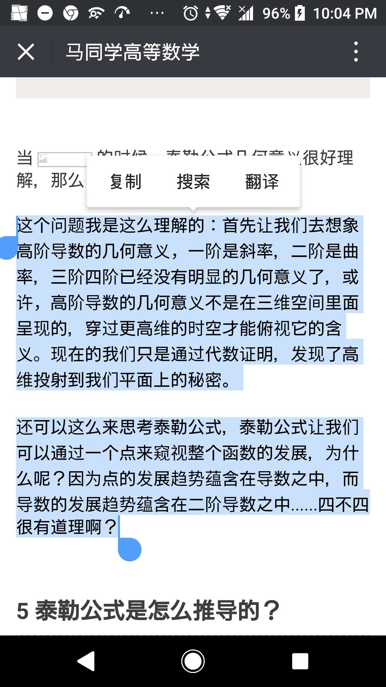
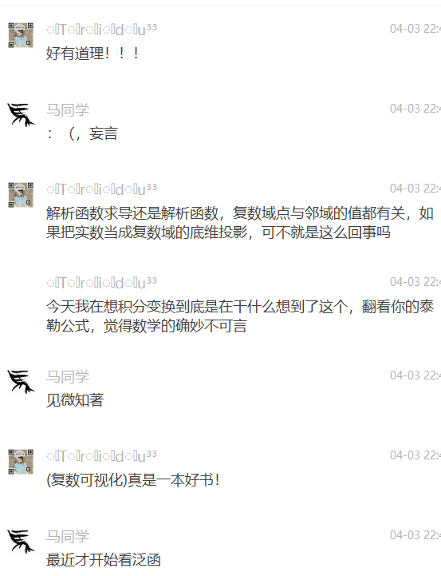

#自然哲学中的数学物理

如果我们改变运动方向矩形变成平行四边形因此面积也会相应改变（为了描述这样的物理现象（也可能是力矩或者角动量，反正我感觉叉乘就是为了描述类似右手定则的自然规律而定义出来的一种数学运算），定义出叉乘这个数学运算，其实我感觉翻译成数学方言中的普通话"代数"就是类似行列式的运算）
理解数学，说到底其实就是只有几条路，从小孩子认识世界或者说是大牛描述世界最开始的建模方式出发，从定义本身出发找这个数学语言描述的“自然物理世界中的具体体现”，找到这个定义最本质是从哪儿来的，这样定义是为了方便还是只是一种约定而已，毕竟现在的科学语言的表述很多都是历史遗留问题。还有的就是“翻译”，把代数翻译成几何，把几何翻译成分析之类的。比如画个图形象理解线性代数，比如计算机画出来具体向量场解释旋度散度梯度之类的。或者用3维向量表述出来复变场。
（代数矩阵运算）用矩阵表示一种变换，（几何向量运算拓扑微分流形）用算子表示一种变换，（分析符号运算函数泛函复分析积分微分方程）用函https://www.douban.com/note/246430462/数求微分等梯度表是一种操作，（用用统计学概率论线性回归最小二乘法计算方法数值分析机器学习元胞自动机等等仿生的手段也不得不让人拍手称绝）用计算机各种语言描述的世界还是很多的毕竟世界因为是为的不同而美丽，四元数可能是描述世界最好的工具也不一定。同样的道理而已。人工产生的\lambdda倒是有趣得很/。机器进化也许能赶上人的速度也不一定

我其实非常喜欢数学，因为数学是生动形象的，数学描绘的是现实生活中的事物，就像当我高数的时候学到了其实是因为单纯地喜欢。但是，可能，这就是一个门外汉好高骛远，眼高手低，偷窥数学大厦的美的门外汉吧。我有些总与有一天能够登堂入室，进去数学殿堂的憧憬。可能是处于同样的原因，看过有人说的一句话，计算机的人都习惯性跪舔学数学的人，深以为然。可能不是爱敲代码的Ie工程师不是好的数学家吧

扩展定义，面向对象，“找不到对象”Objecton可以是研究对象里面很多的翻译，因为月抽象高级，预热需要相信的语言一样，数学见们新创建了了一些词，或者旧词新义扩展定义

路口ihi和见面会v斤斤计较急急急急急急急急急急急急急急急

653156468543896465655555555555555555555555555555

Gitbook我的生命哲学，中英。究极人工智能聪明病小说。被窝历险记。上传各种B站视频。Haskell因而学lamnda表达式演算。MC游戏录屏做动画片，ppt析出mp4动画，超低成本做动画，想法是最重要的。程序员们已经贴心滴为你铺好了路。你可以通过各种软件做学习视频。比如用火星游戏录屏做的剧情的火星剧情简介。比如用游戏建模介绍物理电磁学4公式。比起用MC做的我的三体。比如用python自己撸代码出来视频的3b1b，甚至是MIT课程各种mathematics析出的数学物理笔记本，马同学等利用数学绘图软件做的公众号动图，比如学渣乐园用的绘图板。或者说是乐学高考，的大电影，看广告式的学习视频，，，，，，。教育事业是一块大蛋糕，已经很多人在做了，联手大思教育超强记忆术做个教学漫画之类的。

有些时候，可能不是找不到饭撤，而是价值观不对，精神足够的物质没有得到满足而已。谁不想发财？可是有些事真的不挣钱，一些搞基础科学的，领先时代太久，太抽象，没有实际工程应用挣不了钱，也还是没办法的。高铭《天才在左疯子在右》说过一个观点，人类社会运作像一个蚂蚁群，整体可以看做一个生物，每个人类个体都只是一个细胞。我们都有自己的价值体现，哪怕是(;东野圭吾笔下的恶女，也在传递着自己的价值观)

TaoZheXuan博客

比如阿狸教我神奇的矩阵，玄度散度梯度的pdf和那个台湾人讲授的博客

因为很多时候在一下数学群能看到一些人学习的时候怀着和我相同的疑问，总是觉呃很开心

有时候看书自己思考比问大牛好，跟比听课灌输知识强。高人点波，才是最难能可贵的

只有你做出一点事情，让别人看到你的利用价值，世界才会待你温柔。当然，初学者敢于当伸手党也是合理的

好的政治制度，应该是让每个人都有私心，并且在趋利避害的谋利过程中互惠互利

到时候，可能每个人在！！！用中学！！！才是最有限的学习方法，需要什么知识学什么知识，触手可得。这样，如果大家都发挥自己的主观能动性，积极做好自己的贡献，未尝不是一个人类命运共同体的(工作细胞)

实体大学，可能就不存在了，只有幕课，在线深入浅出触及知识本质的云上资料

感觉其他学科在线知识共享还不够，也许等程序员们做出更方便你们懂数学，懂物理的各个学科的人，能想上面所说的各种知识传播方式一样，把只是传播给更多的人手里。那时候，可能学习成本会下降很多，知识也不存在壁垒，更多人能随心所欲学习东西的时代会来临

感谢开源知识分享，比如最近看到的一个动手学深度学习的项目，真是让我深有感触，牛逼哄哄糊我一脸

为什么本文像疯子一样原创开源？因为github真是一个完美的网站。可能是因为刚好跟计算机熟悉，所以你会发现计算机方面的在线教程要多少有多少，而且要多精美又多精美，什么菜鸟教程，博客选csdn.W3cschool.实验楼，源码，而且写框架的，造轮子的大佬要多少有多少

学会考研数学学习笔记公布

对了，基于离散的计算机和连续可微的自然不一样，但是可以通过很小的差分分当做微分来用（这算不算一个个量子，，，鬼扯），其实是因为，美妙的数值积分，积分变换，计算方法等理论。至于想哲学一样的实分析，陶哲轩告诉我们，其实是在用最严谨，最正确的思维方式告诉我们为什么那些数学定理是对的，有什么假设条件，如何正确认识数学从逻辑学层面上讲的合理性。难怪我最敬佩的褚铭数学老师告诉我说，数学好的仅仅代表他逻辑推理严密，和其他情商智商无关。至于奥数刷题什么的，我自己的观点来看，其实是一种跳脱高考外的新途径选拔人才吧。虽然也有一些有条件的人上奥数补习班刷真题学套路什么的。但是，数学研究，计算的算理明白，计算直觉可能就是这样做题刷出来的呢。因为有些运算，真是手熟而已。;数学，能动笔计算的人真的牛逼。

为什么没有三元数而有四元数？坦白说，我不知道。克莱因说黎曼那种物理数学大一统的互相辅助学习才是真正的学习方法。

正是因为降维自恰，学数学越往上学越发现原有的定理只是更好等级的数学的抽象降维截面，比如复变函数实轴截面就是实数，再比如复数区间内处处=解析函数，可以对应着傅里叶变化或者高斯变换的用同族曲线作为最基本的向量去表示其曲线，就是三维想二维塌缩，濡化，就像是三体里面的…二向箔攻击，笑。:解析函数无穷区间内处处可积分对应着积分对应的其实是实变函数所描述的几何里面的泰勒展开公式！！！而欧拉公式链接着复变函数和实变函数的桥梁，其实就是因为滴卡尔坐标系描述自然所用的数学语言，和轴坐标系下描述的数学语言之间必然的转化关系。于是有的大牛干脆搞个复数，i代表旋转90°，用和谐的二元数来表示高维空间，其实我觉得完全可以把复数看作是一个二元向量，1，i分别是他的单位正交线性无关向量组，因此，物理描述磁电场，描述几何图形变换的数学语言非他莫属，(复分析可视化)，了解一下。在这，如果真的喜欢，还可以看看(趣味数学相关的知识，数学其实是一种现实抽象出来的语言，用来描述真真切切的真实世界自然哲理)。比如三大数学常数中等，e蕴含着的无穷分割区间没固定速率自增的规律也是对应着很有意思的自然哲学。数学很多研究的东西都是:发现:！而不是创造。只是发现了自然哲学而已！！！但是，威力无穷

真好。
学习理所应当接受已有结论把他记住，是一种嘎效率的考试技巧，但是不能不说，专研一下知识来源，真的有意思，理所应当的没妙不可言。《欧姆社学习漫画》好书！

3b1b,马同学，，，，，，，越来越多人更加地传递他们学到的知识，技术爆炸，知识膨胀的时代，可能现在知识越来越透明了，越来越多人传播着这个希望。学习数学这事儿有多么地有意思

让你看到数学真真切切描述自然哲学的美妙，当然，有个PDF我觉得讲的很好的。还有就是，推荐一个Pdf讲解散度旋度的。统计就更加有意思了，现实生活中基本用得最多的就是统计了，统计之都了解一下。

让你在真真切切地知道这是什么现实实物问题抽象出来的数学概念

黎曼的数学物理大统一学习是真的有趣，比如学校高超的课程设计，让我们在学习物理电磁学的时候接触到数学里面的旋度，散度

最有趣的是什么呢？看过一篇文章，利用数学建模学习自然哲学，虽然槽点满满，但是数学建模的确是一个好东西。实际问题抽象提炼，用数学语言描述，落实到已知的模型算法，从而借助计算机解决实际问题。其实，科学工程项目的解决，可以说都是，数学建模吧

因为数学是描述自然的抽象化语言，物理，则是利用数学语言描述自然哲学的规律。而计算机，拉近你我，计算机的模拟可以说是以光速做实验，比如matlab的数学实验，看到mathamatica画的物理图，python等编程机器需要实现解决现实问题。

数学大厦博大精深，我只能说自己是兴趣广泛的门外汉，跨学科一方面是优势一方面也是劣势。

学的好的成绩不是一定会100分，但是100分的一定不会学得差，起码说明那是聪明人，懂用什么学什么，更有适应性，更努力，努力也知道正确的方向，而不是看到什么平均着力拼命死磕为什么。也许，筛选出来才是最适应的。考试，其实相对公平，不完美，但是是现在的方案里面相对而言最好的

注意，极致功利主义些这个说法没有任何贬义的意思，反而是懂得学到什么程度为当下阶段足够用！这说法，其实是表达我心中的佩服钦敬！！。懂什么时候停下来，才是不会陷进去数学的深渊的里面，不可自拔，痛并快乐着。

说故事天下无敌，做不能有心无力呀

但是有细节，方便别人实现，也防止学术造假呀

为什么cnki不要求源码？算法固然重要，语言只是工具。但是细节不影响加深认知呀，更方便改进反思。
我想，不是因为数学完美诠释自然哲学而美不胜收吗？
知乎有回答说只有新手强调数学美，高手觉得理所应当。
其实我不同意这个观点的，理所当然地从自然中抽象出来，猫叔自然的数学语言，不是很强大吗？不是很美吗？书中自有颜如玉，说的应该就是，数学公式本质上其实是一个很好的具体事物的抽象。举个例子，我的拙作------[事故树建模，逻辑数学抽象下的数学语言，代数==几何，知识抽象的角度不一样而已，所以欧高黎嘉陈中的陈景生先生说，数形结合翅膀双飞]()
《高中数理化》《高中数学》《江苏那本杂志都是好东西》，如果你喜欢的话。

看书学习最快

只有看书和圣人聊天，仿佛面提耳命，是最有用的

其实自己只有自己算过一遍，去体悟才有收获。

碎片话知识让你看到别的总结精华误以为自己懂了

想做的太多

都只是谋生村，太难了，时间有限，什么都想学？怎么办？只能做出舍弃一部分

没人关系知识本身是什么

那意味着$_$，好工作

我发现越是没文化，如我妈，越看中考试成绩

虽然背后改造看书，但是碎片话知识能融入他人认识，方便你看书入门学习

知乎微信也是程序员改变世界的利益，李小龙，知乎上面主动搜索能得到有价值的认识答案

或者物理科普达人写得各种书，刘昌海的物理博客bala，美翻了

感谢网络时代，让知识触手可及！！！1美不胜收。

