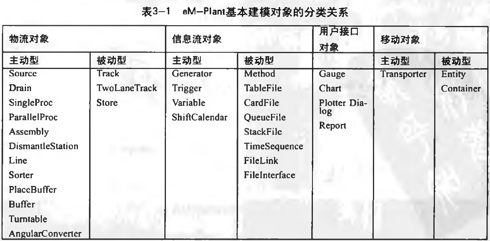
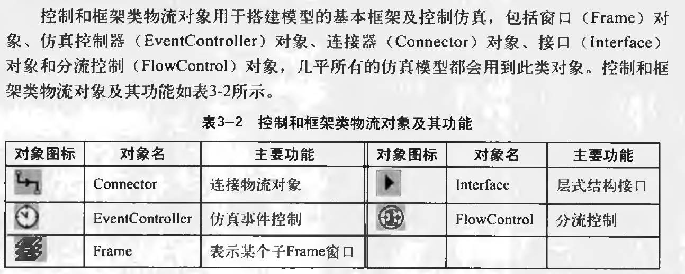

JT文件格式是Siemens（[西门子](https://www.baidu.com/s?wd=%E8%A5%BF%E9%97%A8%E5%AD%90&tn=SE_PcZhidaonwhc_ngpagmjz&rsv_dl=gh_pc_zhidao)） PLM Software开发的轻型3D模型文件格式，可以使用JT2Go软件打开。  
　　Siemens（[西门子](https://www.baidu.com/s?wd=%E8%A5%BF%E9%97%A8%E5%AD%90&tn=SE_PcZhidaonwhc_ngpagmjz&rsv_dl=gh_pc_zhidao)） PLM Software是全球领先的产品生命周期管理（PLM）软件与服务提供商。JT文件格式设计为一个开放、高效率的、紧凑，持久性存储的产品数据格式；用于产品可视化、协作和CAD数据共享。JT文件格式包括多方面的数据，以及对曲面边界的精准表示，产品和制造业的相关信息，元数据信息，这些信息都可以CAD文件系统导出并可以被产品数据管理(PDM) 系统导入到软件里。

# SimTalk

　　[http://www.itpub.net/viewthread.php?tid=1287272&hinghlight=SinTalk](http://www.itpub.net/viewthread.php?tid=1287272&hinghlight=SinTalk)
　　

http://www.itpub.net/viewthread.php?tid=1452011&extra=page%3D1&frombbs=1

# NP-Complete
Nondeterministic Polynomial Complete Problem

[http://www.itpub.net/thread-1287272-1-1.html](http://www.itpub.net/thread-1287272-1-1.html)

# 备忘

D:\Program Files\Siemens\Tecnomatix Plant Simulation 13

# 技巧
扩展启动选项 E:/chm_files/Plant/CHM/id74918.html

多按下列按钮看着学习：
F8  属性  F4重命名   shift F1对象属性

reset Init Endsim

**匿名表达式**

@   MU对象

？ 调用当前Method的物流对象

Self 执行Method本身

Current   执行Method所在Frame

Location  正执行的Method所在 Frame，指代正在处理他的物流对象，<Object， >.Location表示正在处理他的物流对象，@.Location返回MU所在物流对象绝对路径

~是Location缩写

Root 模型顶级Frame，第四章

# Simtalk   200

/*
param action: string

switch action
case "Open"
	-- TODO: add code for the "Open" action here
	-- E.g. ?.setCaption("TextBox", "Test")
	-- E.g. ?.setCheckBox("CheckBox", true)
case "Apply"
	-- TODO: add code for the "Apply" action here
	-- E.g. print ?.getValue("TextBox")
	-- E.g. print ?.GetCheckBox("CheckBox")
case "Close"
	-- TODO: add code for the "Close" action here
end
(action : string)
*/
# Method 
208
InheritSources Scource Code

****

一般蓝色method不能直接运行，绿色可以。

红 故障
蓝色 暂停
绿色 正常工作
黄色 阻塞
棕色 正常工作准备
灰色 缺乏必要资源而等待
淡蓝 恢复状态

# 

# 开发限制
当您使用C接口链接自己编程的DLL时，此DLL必须编译为64位DLL。

对于ActiveX对象，您需要64位ActiveX控件。

对于ODBC接口，还需要用于ODBC的 64位驱动程序。从Microsoft Office 2010开始，Microsoft为Access，Excel等提供64位ODBC驱动程序。

该OPC接口只能解决OPC服务器的64位版本。

FlowControl VS Exit Strategy属性
133

InterFace层次

